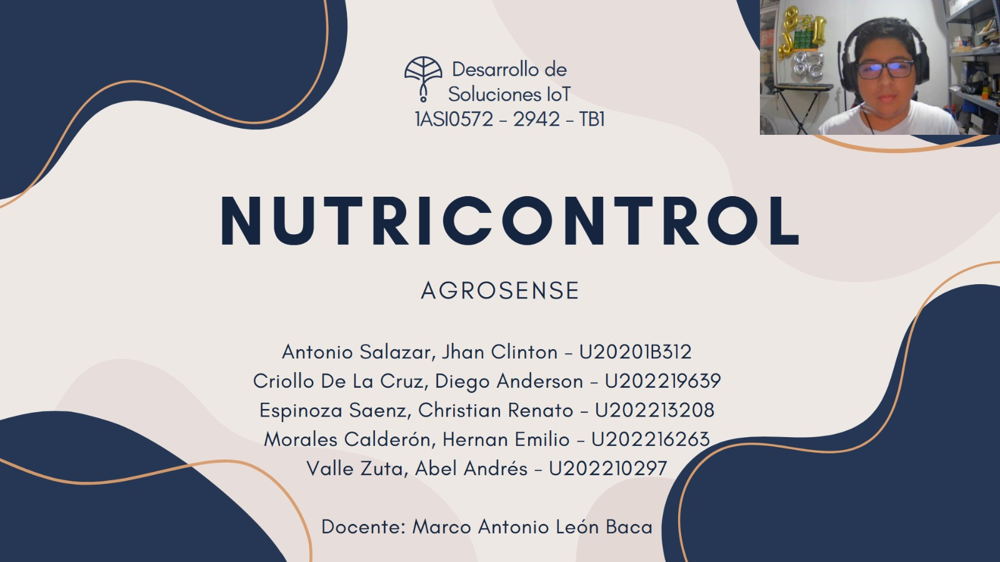
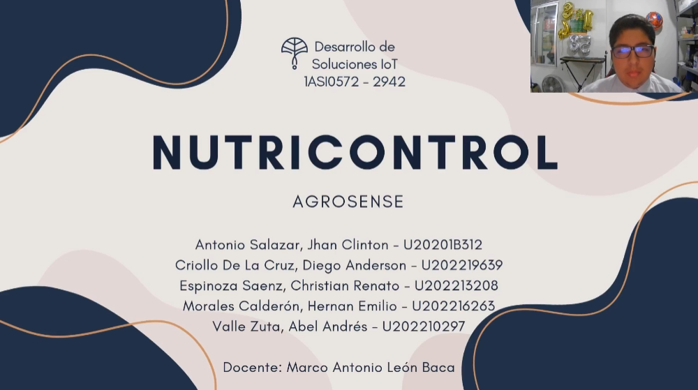

<p align="center">
    <strong>Universidad Peruana de Ciencias Aplicadas</strong><br>
    <br></img><br>
    <br>
    <strong>Ingeniería de Software - 2025-01</strong><br>
    <br>
    <strong>1ASI0572 - Desarrollo de Soluciones IoT - 2942</strong><br>  
    <br>
    <strong>Profesor: Marco Antonio León Baca</strong><br>
    <br> <strong>INFORME DE TB2</strong> 
</p>
<p align="center">
    <strong>Startup: AgroSense</strong><br>
    <strong>Producto: NutriControl</strong>
</p>

<h3 align="center" >Team Members:</h3>
<div>
    <table align="center">
        <tr>
            <th style="text-align:center;">Miembro</th>
            <th style="text-align:center;">Código</th>
        </tr>
        <tr>
            <td>Antonio Salazar, Jhan Clinton</td>
            <td>U20201B312</td>
        </tr>
        <tr>
            <td>Criollo De La Cruz, Diego Anderson</td>
            <td>U202219639</td>
        </tr>
        <tr>
            <td>Espinoza Saenz, Christian Renato</td>
            <td>U202213208</td>
        </tr>
        <tr>
            <td>Morales Calderón, Hernan Emilio</td>
            <td>U202216263</td>
        </tr>
        <tr>
            <td>Valle Zuta, Abel Andrés</td>
            <td>U202210297</td>
        </tr>
    </table>
</div>
<br>
<p align="center">
    <strong>MAYO 2025 </strong>
</p>
<br>

---

<div style="page-break-after: always;"></div>

# Registro de Versiones del Informe

<div align="center">

| Versión |   Fecha    | Autor | Descripción de modificación | 
|:-------:|:----------:|:-----:|:----------------------------| 
|TB1| 20/04/2025 |Antonio Salazar Jhan Clinton|  Capítulo I: Introducción, Capítulo II: Requirement Elicitation & Analysis, Capítulo III: Requirements Specification, Capítulo IV: Solution Software Design |
|TB1| 20/04/2025 |Criollo De La Cruz, Diego Anderson| Capítulo I: Introducción, Capítulo II: Requirement Elicitation & Analysis, Capítulo III: Requirements Specification, Capítulo IV: Solution Software Design |
|TB1| 20/04/2025 |Espinoza Saenz, Christian Renato| Capítulo I: Introducción, Capítulo II: Requirement Elicitation & Analysis, Capítulo III: Requirements Specification, Capítulo IV: Solution Software Design |
|TB1| 20/04/2025 |Morales Calderón, Hernan Emilio| Capítulo I: Introducción, Capítulo II: Requirement Elicitation & Analysis, Capítulo III: Requirements Specification, Capítulo IV: Solution Software Design |
|TB1| 20/04/2025 |Valle Zuta, Abel Andrés| Capítulo I: Introducción, Capítulo II: Requirement Elicitation & Analysis, Capítulo III: Requirements Specification, Capítulo IV: Solution Software Design |
|TP1| 08/05/2025 |Antonio Salazar Jhan Clinton|  Capítulo V: Solution UI/UX Design, Capítulo VI: Product Implementation, Validation & Deployment |
|TP1| 08/05/2025 |Criollo De La Cruz, Diego Anderson|  Capítulo V: Solution UI/UX Design, Capítulo VI: Product Implementation, Validation & Deployment |
|TP1| 08/05/2025 |Espinoza Saenz, Christian Renato|  Capítulo V: Solution UI/UX Design, Capítulo VI: Product Implementation, Validation & Deployment |
|TP1| 08/05/2025 |Morales Calderón, Hernan Emilio|  Capítulo V: Solution UI/UX Design, Capítulo VI: Product Implementation, Validation & Deployment |
|TP1| 08/05/2025 |Valle Zuta, Abel Andrés|  Capítulo V: Solution UI/UX Design, Capítulo VI: Product Implementation, Validation & Deployment |
|TB2| 20/06/2025 |Antonio Salazar Jhan Clinton| Capítulo VI: Product Implementation, Validation & Deployment |
|TB2| 20/06/2025 |Criollo De La Cruz, Diego Anderson|  Capítulo VI: Product Implementation, Validation & Deployment |
|TB2| 20/06/2025 |Espinoza Saenz, Christian Renato|  Capítulo VI: Product Implementation, Validation & Deployment |
|TB2| 20/06/2025 |Morales Calderón, Hernan Emilio|  Capítulo VI: Product Implementation, Validation & Deployment |
|TB2| 20/06/2025 |Valle Zuta, Abel Andrés|  Capítulo VI: Product Implementation, Validation & Deployment |
</div>

---

<div style="page-break-after: always;"></div>

# Project Report Collaboration Insights

<div align="justify">

**TB1:**

<div align="center">

  

</div>

<div align="center">

  

</div>

**TP1:**

<div align="center">

  

</div>

<div align="center">

  

</div>


</div>

<div style="page-break-after: always;"></div>

# Contenido
## Tabla de Contenidos
### [Registro de versiones del informe](#registro-de-versiones-del-informe)
### [Project Report Collaboration Insights](#project-report-collaboration-insights)
### [Contenido](#contenido)
### [Student Outcome](#student-outcome-1)
### [Capítulo I: Introducción](#capítulo-i-introducción-1)
- [1.1. Startup Profile](#11-startup-profile)
    - [1.1.1. Descripción de la Startup](#111-descripción-de-la-startup)
    - [1.1.2. Perfiles de integrantes del equipo](#112-perfiles-de-integrantes-del-equipo)
- [1.2. Solution Profile](#12-solution-profile)
    - [1.2.1. Antecedentes y problemática](#121-antecedentes-y-problemática)
    - [1.2.2. Lean UX Process](#122-lean-ux-process)
        - [1.2.2.1. Lean UX Problem Statements](#1221-lean-ux-problem-statements)
        - [1.2.2.2. Lean UX Assumptions](#1222-lean-ux-assumptions)
        - [1.2.2.3. Lean UX Hypothesis Statements](#1223-lean-ux-hypothesis-statements)
        - [1.2.2.4. Lean UX Canvas](#1224-lean-ux-canvas)
- [1.3. Segmentos objetivo](#13-segmentos-objetivo)

### [Capítulo II: Requirements Elicitation & Analysis](#capítulo-ii-requirements-elicitation-&-analysis-1)
- [2.1. Competidores](#21-competidores)
    - [2.1.1. Análisis competitivo](#211-análisis-competitivo)
    - [2.1.2. Estrategias y tácticas frente a competidores](#212-estrategias-y-tácticas-frente-a-competidores)
- [2.2. Entrevistas](#22-entrevistas)
    - [2.2.1. Diseño de entrevistas](#221-diseño-de-entrevistas)
    - [2.2.2. Registro de entrevistas](#222-registro-de-entrevistas)
    - [2.2.3. Análisis de entrevistas](#223-análisis-de-entrevistas)
- [2.3. Needfinding](#23-needfinding)
    - [2.3.1. User Personas](#231-user-personas)
    - [2.3.2. User Task Matrix](#232-user-task-matrix)
    - [2.3.3. User Journey Mapping](#233-user-journey-mapping)
    - [2.3.4. Empathy Mapping](#234-empathy-mapping)
    - [2.3.5. As-is Scenario Mapping](#235-as-is-scenario-mapping)
- [2.4. Ubiquitous Language](#24-ubiquitous-language)

### [Capítulo III: Requirements Specification](#capítulo-iii-requirements-specification-1)
- [3.1. To-Be Scenario Mapping](#31-to-be-scenario-mapping)
- [3.2. User Stories](#32-user-stories)
- [3.3. Impact Mapping](#33-impact-mapping)
- [3.4. Product Backlog](#34-product-backlog)

### [Capítulo IV: Solution Software Design](#capítulo-iv-solution-software-design-1)
- [4.1. Strategic-Level Domain-Driven Design](#41-strategic-level-domain-driven-design)
    - [4.1.1. EventStorming](#411-eventstorming)
        - [4.1.1.1. Candidate Context Discovery](#4111-candidate-context-discovery)
        - [4.1.1.2. Domain Message Flows Modeling](#4112-domain-message-flows-modeling)
        - [4.1.1.3. Bounded Context Canvases](#4113-bounded-context-canvases)
    - [4.1.2. Context Mapping](#412-context-mapping)
    - [4.1.3. Software Architecture](#413-software-architecture)
        - [4.1.3.1. Software Architecture System Landscape Diagram](#4131-software-architecture-system-landscape-diagram)        
        - [4.1.3.2. Software Architecture Context Level Diagrams](#4132-software-architecture-context-level-diagrams)
        - [4.1.3.3. Software Architecture Container Level Diagrams](#4133-software-architecture-container-level-diagrams)
        - [4.1.3.4. Software Architecture Deployment Diagrams](#4134-software-architecture-deployment-diagrams)
        - [4.1.3.5. Software Architecture Components Level Diagrams](#4135-software-architecture-components-level-diagrams)
- [4.2. Tactical-Level Domain-Driven Design](#42-tactical-level-domain-driven-design)
    - [4.2.1. Bounded Context: <Bounded Context Name>](#421-bounded-context-1)
        - [4.2.1.1. Domain Layer](#4211-domain-layer)
        - [4.2.1.2. Interface Layer](#4212-interface-layer)
        - [4.2.1.3. Application Layer](#4213-application-layer)
        - [4.2.1.4. Infrastructure Layer](#4214-infrastructure-layer)
        - [4.2.1.5. Bounded Context Software Architecture Component Level Diagrams](#4215-bounded-context-software-architecture-component-level-diagrams)
        - [4.2.1.6. Bounded Context Software Architecture Code Level Diagrams](#4216-bounded-context-software-architecture-code-level-diagrams)
            - [4.2.1.6.1. Bounded Context Domain Layer Class Diagrams](#42161-bounded-context-domain-layer-class-diagrams)
            - [4.2.1.6.2. Bounded Context Database Design Diagram](#42162-bounded-context-database-design-diagram)

### [Capítulo V: Solution UI/UX Design](#capítulo-v-solution-uiux-design-1)
- [5.1. Style Guidelines](#51-style-guidelines)  
    - [5.1.1. General Style Guidelines](#511-general-style-guidelines)  
    - [5.1.2. Web, Mobile and IoT Style Guidelines](#512-web-mobile-and-iot-style-guidelines)  
- [5.2. Information Architecture](#52-information-architecture)  
    - [5.2.1. Organization Systems](#521-organization-systems)  
    - [5.2.2. Labeling Systems](#522-labeling-systems)  
    - [5.2.3. SEO Tags and Meta Tags](#523-seo-tags-and-meta-tags)  
    - [5.2.4. Searching Systems](#524-searching-systems)  
    - [5.2.5. Navigation Systems](#525-navigation-systems)  
- [5.3. Landing Page UI Design](#53-landing-page-ui-design)  
    - [5.3.1. Landing Page Wireframe](#531-landing-page-wireframe)  
    - [5.3.2. Landing Page Mock-up](#532-landing-page-mock-up)  
- [5.4. Applications UX/UI Design](#54-applications-uxui-design)  
    - [5.4.1. Applications Wireframes](#541-applications-wireframes)  
    - [5.4.2. Applications Wireflow Diagrams](#542-applications-wireflow-diagrams)  
    - [5.4.3. Applications Mock-ups](#543-applications-mock-ups)  
    - [5.4.4. Applications User Flow Diagrams](#544-applications-user-flow-diagrams)  
- [5.5. Applications Prototyping](#55-applications-prototyping)

### [Capítulo VI: Product Implementation, Validation & Deployment](#capítulo-vi-product-implementation-validation--deployment-1)
- [6.1. Software Configuration Management](#61-software-configuration-management)  
    - [6.1.1. Software Development Environment Configuration](#611-software-development-environment-configuration)  
    - [6.1.2. Source Code Management](#612-source-code-management)  
    - [6.1.3. Source Code Style Guide & Conventions](#613-source-code-style-guide--conventions)  
    - [6.1.4. Software Deployment Configuration](#614-software-deployment-configuration)  
- [6.2. Landing Page, Services & Applications Implementation](#62-landing-page-services--applications-implementation)  
    - [6.2.1. Sprint 1](#621-sprint-1)  
        - [6.2.1.1. Sprint Planning 1](#6211-sprint-planning-1)  
        - [6.2.1.2. Aspect Leaders and Collaborators](#6212-aspect-leaders-and-collaborators)  
        - [6.2.1.3. Sprint Backlog 1](#6213-sprint-backlog-1)  
        - [6.2.1.4. Development Evidence for Sprint Review](#6214-development-evidence-for-sprint-review)  
        - [6.2.1.5. Testing Suite Evidence for Sprint Review](#6215-testing-suite-evidence-for-sprint-review)  
        - [6.2.1.6. Execution Evidence for Sprint Review](#6216-execution-evidence-for-sprint-review)  
        - [6.2.1.7. Services Documentation Evidence for Sprint Review](#6217-services-documentation-evidence-for-sprint-review)  
        - [6.2.1.8. Software Deployment Evidence for Sprint Review](#6218-software-deployment-evidence-for-sprint-review)  
        - [6.2.1.9. Team Collaboration Insights during Sprint](#6219-team-collaboration-insights-during-sprint)

    - [6.2.2. Sprint 2](#622-sprint-2)  
        - [6.2.2.1. Sprint Planning 2](#6221-sprint-planning-2)  
        - [6.2.2.2. Aspect Leaders and Collaborators](#6222-aspect-leaders-and-collaborators)  
        - [6.2.2.3. Sprint Backlog 2](#6223-sprint-backlog-2)  
        - [6.2.2.4. Development Evidence for Sprint Review](#6224-development-evidence-for-sprint-review)  
        - [6.2.2.5. Testing Suite Evidence for Sprint Review](#6225-testing-suite-evidence-for-sprint-review)  
        - [6.2.2.6. Execution Evidence for Sprint Review](#6226-execution-evidence-for-sprint-review)  
        - [6.2.2.7. Services Documentation Evidence for Sprint Review](#6227-services-documentation-evidence-for-sprint-review)  
        - [6.2.2.8. Software Deployment Evidence for Sprint Review](#6228-software-deployment-evidence-for-sprint-review)  
        - [6.2.2.9. Team Collaboration Insights during Sprint](#6229-team-collaboration-insights-during-sprint)

    - [6.3. Validation Interviews](#63-validation-interviews)  
        - [6.3.1. Diseño de entrevistas](#631-diseño-de-entrevistas)
        - [6.3.2. Registro de entrevistas](#632-registro-de-entrevistas)
        - [6.3.3. Evaluación según heurísticas](#633-evaluación-según-heurísticas)  
    - [6.4. Video About-the-product](#64-video-about-the-product)

### [Conclusiones](#conclusiones-1)
### [Bibliografía](#bibliografía-1)
### [Anexos](#anexos-1)
---
<div style="page-break-after: always;"></div>

# Student Outcome

**ABET – EAC – Student Outcome 5**

<div align="justify">
    Criterio: La capacidad de funcionar efectivamente en un equipo cuyos miembros
juntos proporcionan liderazgo, crean un entorno de colaboración e inclusivo,
establecen objetivos, planifican tareas y cumplen objetivos.<br><br>

En el siguiente cuadro se describe las acciones realizadas y enunciados de
conclusiones por parte del grupo, que permiten sustentar el haber alcanzado el logro
del ABET – EAC - Student Outcome 5.
</div>    

<div align="justify">
</div>    

<div align="justify">
<table>
  <tr>
    <th>Criterio Específico</th>
    <th>Acciones Realizadas</th>
    <th>Conclusiones</th>
  </tr>
  <tr>
    <td>Trabaja en equipo para proporcionar liderazgo en forma conjunta.</td>
    <td>
      <strong>TB1:</strong><br><br>
      Antonio Salazar, Jhan Clinton<br>
      En el desarrollo del TB1, asumí un rol activo dentro del equipo, participando principalmente en la realización de entrevistas y la elaboración de presentaciones en PowerPoint. Estas actividades me permitieron contribuir a la organización del trabajo y 
      colaborar estrechamente con mis compañeros, asegurando que todas las perspectivas fueran tomadas en cuenta. Considero que, a través de estas acciones, apoyé al equipo en su liderazgo conjunto, ayudando a que todos los miembros trabajaran de manera coordinada 
      para alcanzar los objetivos propuestos.
      <br><br>
      <strong>TP1:</strong><br><br>
      Antonio Salazar, Jhan Clinton<br>
      En el TP1, colaboré activamente en la sistematización de aprendizajes del sprint, consolidando reflexiones conjuntas del equipo en el apartado 6.2.1.9 Team Collaboration Insights during Sprint. Participé también en la documentación de los servicios como parte de las revisiones del sprint.Estas acciones fortalecieron la colaboración continua y permitieron detectar oportunidades de mejora en tiempo real.
      <br><br>
	<strong>TB2:</strong><br><br>
Antonio Salazar, Jhan Clinton<br>
Durante el TB2, asumí un rol activo en la coordinación para la grabación y edición del video del equipo y el producto, asegurando que cada miembro tuviera claridad en sus intervenciones y que el mensaje fuera coherente con los objetivos del proyecto. Además, apoyé en la integración de los servicios entre backend y las aplicaciones web y móvil, participando en sesiones de pruebas cruzadas y resolución de errores. Estas acciones promovieron un entorno colaborativo y fortalecieron el liderazgo conjunto del equipo, permitiendo un avance técnico alineado con la planificación del Sprint 2.
	          <br><br>
      <strong>TB1:</strong><br><br>
      Criollo de la Cruz, Diego Anderson<br>
      En el desarrollo del TB1, asumí un rol activo dentro del equipo encargándome principalmente de la elaboración de la documentación técnica y la corrección de errores en el desarrollo general del proyecto. Estas tareas me permitieron no solo aportar a la     
      organización y claridad del trabajo en grupo, sino también apoyar a mis compañeros identificando y solucionando problemas técnicos de manera colaborativa. Considero que, a través de estas acciones, contribuí al liderazgo conjunto del equipo, asegurando que 
      avanzáramos de forma coordinada hacia los objetivos planteados.
      <br><br>
      <strong>TP1:</strong><br><br>
      Criollo de la Cruz, Diego Anderson<br>
      En el TP1, asumí responsabilidades clave relacionadas con el control de versiones del código fuente y con la configuración de despliegue del software, lo cual permitió mantener una línea de desarrollo ordenada y replicable para todos los integrantes. También apoyé en la estructuración del Sprint Backlog  y en la validación del sistema a través de pruebas funcionales. Considero que estas actividades fueron cruciales para garantizar la calidad del producto y la estabilidad del ciclo de desarrollo.
      <br><br>
	    <strong>TB2:</strong><br><br>
Criollo de la Cruz, Diego Anderson<br>
En el TB2, continué apoyando en la conexión de los servicios backend con las plataformas web y mobile, asegurando que las rutas de la API respondieran correctamente a los requerimientos del sistema. Además, participé en el diseño funcional y la documentación de los dispositivos IoT simulados, colaborando en la planificación técnica y el aseguramiento de la calidad del desarrollo. También apoyé en la estructura técnica del guion del video del producto. Estas actividades fortalecieron la integración entre los equipos de trabajo y aseguraron la coherencia del sistema.
      <br><br>
       <strong>TB1:</strong><br><br>
      Espinoza Saenz, Christian Renato<br>
      Durante la implementación del software como propuesta de solución para la problemática encontrada, asumí la responsabilidad de coordinar las sesiones de trabajo y distribuir tareas equitativamente. Esto incluyó planificar reuniones, moderar discusiones y asegurar que cada integrante tuviera claridad sobre sus objetivos. Esta experiencia no solo fortaleció el liderazgo compartido, sino que también promovió un ambiente de trabajo inclusivo y eficiente.
      <br><br>
      <strong>TP1:</strong><br><br>
       Espinoza Saenz, Christian Renato<br>
      Durante el TP1, me concentré en el desarrollo del backend, asegurando su avance técnico conforme a los requerimientos funcionales. Participé directamente en la generación de evidencia del desarrollo  y en la configuración de la ejecución del sistema para revisión de sprint . Asimismo, trabajé en la guía de estilos y convenciones para el código fuente , promoviendo la coherencia en la escritura del código entre los integrantes. Estas tareas fortalecieron la arquitectura interna del sistema y facilitaron una integración eficiente con el frontend.
      <br><br>
	    <strong>TB2:</strong><br><br>
Espinoza Saenz, Christian Renato<br>
Durante el TB2, coordiné con el equipo el despliegue de los servicios en la nube para que fueran accesibles desde las aplicaciones web y móvil. Lideré la integración y validación de los dispositivos IoT desarrollados, asegurando su conexión estable con los servicios backend. También colaboré activamente en la planificación y edición del video del equipo, asegurando una narrativa clara y representativa del trabajo realizado. Estas acciones reflejan una gestión técnica activa y comprometida con el cumplimiento de los objetivos del sprint.
      <br><br>
      <strong>TB1:</strong><br><br>
      Morales Calderón, Hernan Emilio<br>
      Durante este TB1, desempeñé un rol de liderazgo rotativo, donde alterné responsabilidades con mis compañeros para garantizar una toma de decisiones equitativa. Mi enfoque se centró en la gestión del tiempo y la priorización de tareas críticas, lo que permitió al equipo completar con éxito el primer alcance del proyecto dentro del plazo establecido, fomentando la confianza mutua y la colaboración.
      <br><br>
      <strong>TP1:</strong><br><br>
       Morales Calderón, Hernan Emilio<br>
      Durante el TP1, desempeñé un rol de liderazgo rotativo, coordinando tareas clave en el avance del equipo. Estuve a cargo de facilitar la organización de responsabilidades por aspecto y de coordinar la entrega de evidencia de despliegue del software , asegurando que cada componente estuviera funcional y operativo. Asimismo, participé en la validación visual de la landing page, aportando a una presentación clara e intuitiva para los usuarios. Mi participación se centró en fomentar un flujo de trabajo ágil y bien distribuido.
      <br><br>
<strong>TB2:</strong><br><br>
Morales Calderón, Hernan Emilio<br>
Durante este TB2, apoyé activamente en la organización del cronograma para la producción del video del equipo y producto, coordinando tiempos, recursos y contenidos. Además, trabajé en la integración funcional entre las interfaces frontend y los servicios backend, ejecutando pruebas funcionales y levantando observaciones para su corrección. Estas contribuciones facilitaron la sincronización del equipo y el avance ordenado de los componentes claves del proyecto.
      <br><br>
      <strong>TB1:</strong><br><br>
      Valle Zuta, Abel Andrés<br>
      En la primera entrega del presente proyecto, lideré la organización de un cronograma semanal que permitió al equipo balancear sus responsabilidades. También proporcioné retroalimentación sobre avances individuales, promoviendo una dinámica de aprendizaje grupal y asegurando que el liderazgo se ejerciera de manera conjunta, enfocándonos siempre en cumplir los objetivos establecidos.
      <br><br>
      <strong>TP1:</strong><br><br>
       Valle Zuta, Abel Andrés<br>
      Durante el desarrollo del TP1, participé activamente en la configuración del entorno de desarrollo  y en la construcción de la página del proyecto. Estas tareas iniciales fueron fundamentales para dar forma a la base técnica y visual del sistema. Además, colaboré en la planificación de las actividades del sprint  y en la elaboración de documentación de servicios, garantizando una visión clara del avance técnico. Mi participación permitió consolidar una base sólida y funcional para el desarrollo posterior del sistema.
	       <br><br>
<strong>TB2:</strong><br><br>
Valle Zuta, Abel Andrés<br>
Durante el TB2, lideré la definición de la estructura narrativa y técnica del video del equipo, planificando sus secciones para mostrar tanto el producto como el proceso colaborativo detrás del desarrollo. También participé en la verificación y validación del funcionamiento de los dispositivos IoT integrados al sistema, así como en la revisión de los servicios conectados con las aplicaciones. Estas acciones permitieron consolidar la comunicación del equipo y cumplir con los objetivos del Sprint 2 de forma organizada.   
    </td>
    <td>
      <strong>TB1:</strong><br><br>
      La experiencia acumulada durante el desarrollo del TB1 refleja un compromiso sólido con el liderazgo compartido y el trabajo en equipo. A través de roles diversos como la documentación técnica, la coordinación de tareas, la moderación de discusiones, y la gestión del tiempo, se promovió un ambiente de colaboración inclusivo y eficiente. Estas acciones no solo garantizaron el cumplimiento de los objetivos del proyecto dentro de los plazos establecidos, sino que también fortalecieron la comunicación, la confianza mutua y el aprovechamiento de las fortalezas individuales de los integrantes. En conjunto, estas contribuciones destacaron la importancia de un liderazgo rotativo y equitativo para alcanzar resultados exitosos.
      <br><br>
      <strong>TP1:</strong><br><br>
      El trabajo realizado durante el TP1 muestra un avance significativo en el desarrollo del proyecto, con un enfoque equilibrado entre la gestión del código, la implementación de la landing page, y la coordinación entre frontend y backend. La colaboración efectiva y la asignación clara de roles facilitaron la integración de los diferentes componentes, asegurando la calidad del software y el cumplimiento de los objetivos dentro de los tiempos previstos. Estas acciones reforzaron la comunicación y el trabajo en equipo, destacando la importancia de una gestión organizada y un liderazgo compartido para el éxito del proyecto.
	    <br><br>
<strong>TB2:</strong><br><br>
Durante el TB2, el equipo consolidó importantes avances en la integración de servicios entre las aplicaciones web, móvil y los dispositivos IoT. Se trabajó de manera coordinada en la conexión técnica de los módulos desarrollados, así como en la planificación y producción del video del equipo y producto. La colaboración entre los miembros fue clave para resolver desafíos técnicos y organizativos, manteniendo una comunicación efectiva y un liderazgo compartido. Estas acciones reflejan un entorno de trabajo maduro, donde cada integrante asumió responsabilidades concretas y contribuyó al cumplimiento exitoso de los objetivos del Sprint 2.
    	    <br><br>
    </td>
    
  </tr>
  <tr>
    <td>Crea un entorno colaborativo e inclusivo, establece metas, planifica tareas y cumple objetivos.</td>
    <td>
      <strong>TB1:</strong><br><br>
      Antonio Salazar, Jhan Clinton<br>
      Durante el desarrollo del TB1, me enfoqué en crear un entorno colaborativo e inclusivo dentro del equipo, fomentando la comunicación abierta y el intercambio de ideas. Mi contribución se centró en establecer metas claras, planificar las tareas de manera 
      eficiente y asegurarme de que cada miembro del equipo tuviera un rol bien definido. A través de un enfoque estructurado, ayudé a coordinar los esfuerzos del equipo, garantizando que todos cumplieran con los objetivos establecidos y se mantuvieran alineados con 
      el progreso del proyecto.
      <br><br>
      <strong>TP1:</strong><br><br>
      Antonio Salazar, Jhan Clinton<br>
      Durante el avance del TP1, lideré la configuración del entorno de desarrollo, asegurando que todos los integrantes trabajaran con herramientas y versiones homogéneas. Planifiqué las tareas del Sprint 1, estableciendo metas claras y asignando responsabilidades para garantizar un avance ordenado y coordinado. Promoví un ambiente colaborativo mediante la facilitación de reuniones efectivas y la comunicación constante con el equipo.
      <br><br>
	    <strong>TB2:</strong><br><br>
Antonio Salazar, Jhan Clinton<br>
Durante el TB2, trabajé activamente en la organización de tareas para el Sprint 2, asegurándome de que las metas fueran claras y alcanzables para todos los miembros del equipo. Colaboré en la estructuración del backlog y en la distribución equitativa de responsabilidades, fomentando un entorno de trabajo inclusivo. Además, apoyé en la coordinación de la grabación del video del equipo, manteniendo una planificación efectiva que permitió cumplir con los plazos establecidos sin comprometer la calidad del contenido.
      <br><br>
      <strong>TB1:</strong><br><br>
      Criollo de la Cruz, Diego Anderson<br>
      Durante el desarrollo del TB1, me encargué de redactar la documentación del proyecto, asegurándome de que la información técnica estuviera presentada de forma clara, ordenada y objetiva. Me enfoqué en que los resultados y decisiones del equipo pudieran ser 
      comprendidos tanto por personas con formación técnica como por aquellas de otras áreas. Esta experiencia me permitió mejorar mi capacidad de comunicar ideas por escrito de manera efectiva, adaptando el lenguaje según el público y manteniendo siempre un enfoque 
      profesional y comprensible para todos los niveles jerárquicos involucrados.
      <br><br>
      <strong>TP1:</strong><br><br>
      Criollo de la Cruz, Diego Anderson<br>
      Durante el avance del TP1, elaboré la documentación técnica relacionada con el diseño UI/UX y la implementación de los servicios. Organicé la información para que fuera comprensible para todos los miembros del equipo y los stakeholders, asegurando que las tareas estuvieran bien definidas y alineadas con los objetivos del Sprint 1. Esto permitió una ejecución más efectiva y controlada.
      <br><br>
	    <strong>TB2:</strong><br><br>
Criollo de la Cruz, Diego Anderson<br>
En el TB2, me encargué de asegurar que la documentación técnica relacionada con los servicios conectados y las aplicaciones estuviera bien estructurada y fuera comprensible para todo el equipo. También planifiqué la validación de la integración entre plataformas web, móvil e IoT, promoviendo un entorno de trabajo ordenado. Estas tareas facilitaron el seguimiento de objetivos comunes y garantizaron una ejecución alineada con la planificación general del Sprint.
	          <br><br>
      <strong>TB1:</strong><br><br>
      Espinoza Saenz, Christian Renato<br>
      Durante este primer avance, elaboré un informe técnico que resumía los avances y resultados del proyecto. Este documento estaba estructurado para ser comprensible tanto para los miembros técnicos del equipo como para la dirección general. Me enfoqué en utilizar un lenguaje preciso y acompañar la explicación con gráficos y tablas que facilitaran la comprensión, asegurando que el mensaje fuera claro para todos los destinatarios.
      <br><br>
      <strong>TP1:</strong><br><br>
      Espinoza Saenz, Christian Renato<br>
      Durante el avance del TP1, me enfoqué en la implementación y desarrollo del backend, avanzando en la estructura de la base de datos y la lógica del servidor. Colaboré estrechamente con el equipo de frontend para asegurar la correcta integración de los servicios, fomentando un ambiente de trabajo inclusivo y comunicativo que permitió resolver desafíos técnicos de manera conjunta y eficiente.
      <br><br>
	    <strong>TB2:</strong><br><br>
Espinoza Saenz, Christian Renato<br>
Durante el TB2, me enfoqué en establecer objetivos técnicos claros para la integración de los servicios y dispositivos IoT, y en coordinar el flujo de trabajo entre backend y frontend. Fomenté un entorno de trabajo inclusivo al brindar asistencia técnica a los compañeros que enfrentaban dificultades y facilitar reuniones breves para resolver bloqueos. Estas acciones aseguraron que las metas del sprint fueran cumplidas dentro de los tiempos estipulados y con una comunicación continua.
	          <br><br>
      <strong>TB1:</strong><br><br>
      Morales Calderón, Hernan Emilio<br>
      Como parte de esta primera entrega, preparé una presentación escrita para los stakeholders del proyecto, detallando las metodologías empleadas, los resultados obtenidos y las recomendaciones futuras. Adapté el contenido según las necesidades del público, utilizando un lenguaje accesible para personas sin conocimientos técnicos y terminología especializada para quienes requerían un mayor nivel de detalle técnico.
      <br><br>
      <strong>TP1:</strong><br><br>
      Morales Calderón, Hernan Emilio<br>
      Durante el avance del TP1, coordiné la documentación del proceso de despliegue del software, detallando cada paso para facilitar su reproducción y mantenimiento. Fomenté la comunicación fluida entre el equipo y los stakeholders, asegurando que las metas del sprint fueran comprendidas y alcanzadas, lo que contribuyó a un desarrollo ordenado y colaborativo.
      <br><br>
	    <strong>TB2:</strong><br><br>
Morales Calderón, Hernan Emilio<br>
Durante este TB2, organicé tareas clave del equipo dentro del cronograma establecido para Sprint 2, verificando que los objetivos estuvieran alineados entre áreas técnicas y creativas. También propicié espacios para retroalimentación constante, permitiendo ajustes a tiempo y asegurando que todos los miembros se sintieran escuchados y representados. Mi participación promovió un entorno colaborativo y orientado al cumplimiento eficiente de metas.
	<br><br>
      <strong>TB1:</strong><br><br>
      Valle Zuta, Abel Andrés<br>
      Durante la primera entrega del presente proyecto, lideré la elaboración del reporte del proyecto que contiene los puntos clave del proyecto, la arquitectura que este tendrá y el alcance que planeamos para el software. Utilicé diagramas y esquemas para complementar el texto, garantizando que tanto aspectos técnicos como estratégicos fueran entendidos por audiencias con diferentes especialidades y roles jerárquicos.
      <br><br>
      <strong>TP1:</strong><br><br>
      Valle Zuta, Abel Andrés<br>
      Durante el avance del TP1, lideré la integración de la documentación general, incluyendo aspectos de diseño, implementación y validación. Utilicé diagramas y esquemas para complementar el texto, garantizando que tanto el equipo técnico como los responsables estratégicos comprendieran claramente el alcance y progreso del proyecto, facilitando la planificación y seguimiento del Sprint.
	    <br><br>
	    <strong>TB2:</strong><br><br>
Valle Zuta, Abel Andrés<br>
Durante el TB2, coordiné la planificación de tareas relacionadas con la validación de las aplicaciones IoT y su integración con el sistema. También estructuré la organización del guion técnico para el video del equipo, permitiendo una ejecución ordenada y coherente con los objetivos generales. Fomenté un ambiente inclusivo al recoger aportes de todos los integrantes y asegurar su incorporación en la planificación, logrando un avance conjunto y equilibrado.
	    <br><br>
    </td>
    <td>
      <strong>TB1:</strong><br><br>
      En este primer avance del proyecto, logramos trabajar en diferentes entornos colaborativos e inclusivos, elaborando diversos documentos técnicos y presentaciones adaptadas a diferentes audiencias con el fin de cumplir las metas establecidas. Nos aseguramos de que la información estuviera estructurada de manera clara, utilizando gráficos, tablas y esquemas para facilitar la comprensión de los aspectos técnicos y estratégicos. Esta experiencia no solo fortaleció nuestra capacidad para redactar contenidos accesibles tanto para especialistas como para personas de otras áreas, sino que también consolidó la habilidad para transmitir ideas complejas de manera profesional y efectiva, asegurando que todos los niveles jerárquicos involucrados comprendieran el alcance, las metodologías y los resultados del proyecto.
      <br><br>
      <strong>TP1:</strong><br><br>
      En este avance del TP1, fortalecimos un entorno colaborativo e inclusivo donde cada miembro del equipo pudo aportar desde su área de especialización. Establecimos metas claras y planificamos las tareas de manera organizada para asegurar el cumplimiento de los objetivos dentro de los tiempos estipulados. La comunicación fluida y el trabajo conjunto permitieron superar desafíos técnicos y mantener al equipo alineado con el progreso del proyecto. Esta experiencia consolidó nuestras habilidades para coordinar esfuerzos, fomentar la participación activa y garantizar resultados efectivos en un ambiente de respeto y colaboración.
	    <br><br>
<strong>TB2:</strong><br><br>
Durante el TB2, el equipo logró consolidar un entorno colaborativo e inclusivo en el que cada integrante participó activamente en la planificación y cumplimiento de los objetivos del Sprint 2. Se establecieron metas claras, se organizaron tareas de forma eficiente y se promovió la comunicación constante entre los miembros. La coordinación de actividades técnicas, como la integración de servicios y la implementación de dispositivos IoT, junto con la producción del video institucional, reflejó una gestión equilibrada del tiempo y los recursos. Estas acciones permitieron alcanzar los entregables propuestos con calidad, cohesión y compromiso grupal.
    </td>
  </tr>
</table>


</div>

<div style="page-break-after: always;"></div>


# Capítulo I: Introducción

## 1.1. Startup Profile
### 1.1.1. Descripción de la Startup
<div align="justify">
    AgroSense es una startup enfocada en transformar radicalmente el sector agroindustrial mediante el diseño e implementación de soluciones tecnológicas inteligentes. Con un enfoque innovador en la agricultura de precisión, la automatización de procesos y el aprovechamiento del Internet de las Cosas (IoT), desarrollamos herramientas avanzadas que permiten monitorear, analizar y actuar sobre variables críticas del entorno agrícola, como el clima, la humedad del suelo, el estado de los cultivos y otros factores determinantes, todo ello con el fin de maximizar la eficiencia productiva, reducir el uso innecesario de insumos y promover una toma de decisiones basada en datos reales y en tiempo real. En AgroSense creemos en una agricultura conectada, sostenible y centrada en el bienestar del productor, por lo que buscamos democratizar el acceso a la tecnología agro-inteligente, permitiendo que productores de todos los tamaños gestionen sus cultivos desde cualquier lugar y en cualquier momento. Nuestra visión del futuro agrícola es clara: un ecosistema donde cada hectárea cultivada represente una oportunidad para producir más con menos impacto ambiental, donde cada decisión esté respaldada por datos y donde la tecnología sea una aliada estratégica frente a los desafíos del cambio climático y la seguridad alimentaria global.
    <br><br>
    
  <div align="center">

  <div align="center">

  

  </div>

  </div>

</div>
<div align="justify">
    <ul>
        <li>
            <b>Misión:</b>
        </li> 
Impulsar la transformación profunda del sector agroindustrial a través de soluciones tecnológicas innovadoras, accesibles y sostenibles que permitan a los agricultores monitorear, analizar y actuar con precisión sobre sus cultivos. 
	    <br><br>
	<li>
            <b>Visión:</b>
        </li>
Ser líderes globales en innovación agroindustrial, reconocidos por transformar la manera en que se cultiva la tierra mediante tecnologías que integran inteligencia, automatización y sostenibilidad. Aspiramos a construir un ecosistema agrícola más eficiente, transparente y conectado.
    </ul>
<br>
</div>

<div style="page-break-after: always;"></div>

### 1.1.2. Perfiles de integrantes del equipo

### Los integrantes que conforman parte de nuestro startup son:
<div align="justify">

| Integrante                | Perfil                                                                                                                                                                                                                                                                                                                                                                                                                                                                                                                                                                                                                                                                                                                                                                                              | Foto                                                |
|---------------------------|-----------------------------------------------------------------------------------------------------------------------------------------------------------------------------------------------------------------------------------------------------------------------------------------------------------------------------------------------------------------------------------------------------------------------------------------------------------------------------------------------------------------------------------------------------------------------------------------------------------------------------------------------------------------------------------------------------------------------------------------------------------------------------------------------------|-------------------------------------|
| Antonio Salazar, Jhan Clinton (U20201B312) |   Soy Jhan Clinton, estudiante de Ingeniería de Software con gran pasión por el desarrollo tecnológico. En mi formación académica me enfoco en fortalecer mis habilidades en programación, diseño de sistemas y trabajo en equipo. Como estudiante, destaco por mi capacidad para aprender rápidamente, resolver problemas técnicos y colaborar activamente en proyectos grupales. Mi objetivo es seguir creciendo profesionalmente, aplicando mis conocimientos teóricos en desafíos prácticos y contribuyendo con soluciones innovadoras. ¡Siempre listo para asumir nuevos retos en el mundo del desarrollo de software!                                                                                                                                                                                     |    |
| Criollo De La Cruz, Diego Anderson (U202219639) | Mi nombre es Diego Anderson Criollo de La Cruz, soy estudiante de 7mo ciclo de la carrera de Ingeniería de Software. Me gusta mucho emplear soluciones creativas y que busquen eficiencia para poder abordar de esta forma cualquier desafío de la mejor manera. Como miembro del grupo, pretendo aportar con todos mis conocimientos en el desarrollo web tanto como en el front-end y back-end, además de siempre colaborar con mis ideas y soluciones ante cualquier dificultad que se presente en el desarrollo. Espero poder aprender mucho de mis compañeros y que todos juntos podamos emplear de manera adecuada las tecnologías que iremos aprendiendo a lo largo del desarrollo del proyecto.                                                                                             |              |
| Morales Calderón, Hernan Emilio (U202216263) | Soy Hernan Morales, tengo 20 años y actualmente estoy cursando el 7mo ciclo de Ingeniería de Software. Me considero una persona sumamente responsable y organizada, especialmente en trabajos universitarios. Mi objetivo es culminar exitosamente el curso y nuestro proyecto junto a mi equipo, asegurando que cada detalle se ejecute con precisión. Tengo conocimientos sólidos en lenguajes como C++, C#, y JavaScript, así como en frameworks como Angular y Vue, lo que me permite desarrollar interfaces dinámicas y adaptarme rápidamente a diferentes entornos de desarrollo. Además, manejo SQL para la gestión y optimización de bases de datos. Estoy convencido de que, con buena planificación y comunicación, entregaremos un proyecto de alta calidad que supere las expectativas. |              |
| Valle Zuta, Abel Andrés (U202210297) | Soy Abel Andrés Valle Zuta, estudiante de la carrera de Ingeniería de Software en la Universidad Peruana de Ciencias Aplicadas (UPC), tengo 20 años y actualmente estoy cursando el 7mo ciclo en la sede de Monterrico. Sé programar y editar videos. Además, sé resolver problemas, trabajar en equipo y lograr unir más al grupo. Mis hobbies son jugar básquet, fútbol, tenis, videojuegos, escuchar música, salir a pasear con mis amigos, ver películas, nadar, hacer ejercicio, pasear a mis mascotas y pasar tiempo con mi familia. Finalmente, siempre estoy dispuesto a trabajar y terminar a tiempo los deberes, esforzándome para aprender y comprender lo máximo posible y finalizar con éxito todos mis objetivos.                                                                     |                |
| Espinoza Saenz, Christian Renato (U202213208) | Mi nombre es Christian Espinoza, soy un estudiante de 20 años que cursa el 7mo ciclo de la carrera Ingeniería de Software. Poseo ideas únicas e innovadoras para que el trabajo logre sobresalir. Tengo experiencia en la creación de distintos tipos de diagramas, editar diferentes tipos de multimedia como videos, y un conocimiento general en programación de C++, HTML, CSS y SQL. Además, se me facilita desarrollar interfaces intuitivas en el frontend, lo cual será beneficioso para el proyecto.                                                                    |                |

</div>

<div style="page-break-after: always;"></div>

## 1.2. Solution Profile

**Product Name:** NutriControl

<div align="justify">

**Producto Descriptivo:**  NutriControl es una solución tecnológica integral desarrollada por AgroSense para optimizar el proceso de fertilización agrícola. Diseñada especialmente para pequeños y medianos productores en Sudamérica, esta plataforma combina sensores inteligentes con automatización de riego por goteo, permitiendo medir en tiempo real variables críticas del suelo como el pH, la humedad y los niveles de nutrientes. A partir de estos datos, NutriControl toma decisiones autónomas para activar el sistema de riego solo cuando el cultivo lo necesita, garantizando una aplicación precisa de agua y fertilizantes. La plataforma incluye una interfaz web y una aplicación móvil que ofrecen monitoreo en tiempo real, alertas personalizadas, reportes detallados y recomendaciones adaptadas a las condiciones de cada terreno. De esta forma, NutriControl mejora la eficiencia del uso de insumos, aumenta el rendimiento de los cultivos y contribuye a una agricultura más sostenible y resiliente frente al cambio climático y la escasez hídrica.

**Monetización:**  NutriControl adoptará un modelo de monetización accesible y escalable, pensado especialmente para pequeños y medianos agricultores. La plataforma ofrecerá un modelo *freemium*, donde los usuarios podrán acceder gratuitamente a funciones básicas de monitoreo, alertas y visualización de datos desde la aplicación móvil o web. Para quienes deseen funcionalidades adicionales como reportes históricos, análisis predictivos y recomendaciones personalizadas, se ofrecerán planes de suscripción mensual de bajo costo, con tarifas ajustadas al tamaño del terreno o número de sensores instalados.

</div>


### 1.2.1. Antecedentes y problemática

<div align="justify">
En el contexto agrícola de Sudamérica, y particularmente en Perú, los productores enfrentan una combinación de desafíos estructurales y emergentes que afectan profundamente la eficiencia y sostenibilidad del sector. Uno de los problemas más urgentes es la escasez de agua: según el Centro Nacional de Planeamiento Estratégico (Ceplan), se estima que para el año 2030 más del 58% de la población peruana vivirá en zonas con estrés hídrico, mientras regiones como Piura ya se encuentran en estado de emergencia por déficit hídrico. Esta crisis compromete gravemente la capacidad de riego de los cultivos y exige una gestión más eficiente del agua. A ello se suma el incremento sostenido en los precios de los fertilizantes, cuya importación anual en Perú supera el millón de toneladas y ha alcanzado un valor de más de 800 millones de dólares, impulsado por factores como la pandemia, los conflictos geopolíticos y las limitaciones en la cadena de suministro global. Este aumento ha afectado especialmente a pequeños y medianos productores, reduciendo sus márgenes de ganancia y dificultando el acceso a insumos esenciales. Por otro lado, la agricultura peruana aún presenta una marcada brecha tecnológica: mientras los grandes productores comienzan a incorporar tecnologías de precisión, la mayoría de agricultores no cuenta con herramientas que les permitan monitorear en tiempo real variables clave como la humedad, el pH del suelo o la disponibilidad de nutrientes, lo que limita su capacidad para tomar decisiones informadas frente a condiciones climáticas cada vez más impredecibles.
<br><br>
En respuesta a estos desafíos, AgroSense presenta NutriControl, una solución tecnológica integral que automatiza el proceso de fertilización mediante sensores inteligentes capaces de medir en tiempo real variables críticas del suelo como el pH, la humedad y los niveles de nutrientes. A partir de estos datos, el sistema activa de forma autónoma el riego por goteo solo cuando el cultivo lo necesita, garantizando una aplicación precisa y oportuna de agua y fertilizantes. Esta tecnología no solo reduce el uso innecesario de insumos y agua, sino que también mejora significativamente el rendimiento de los cultivos. <br><br>
Además, con el fin de comunicar con mayor claridad el valor y alcance de nuestra solución, proponemos su descripción detallada utilizando el modelo 5W y 2H:
<br><br>
</div>


<div align="justify">

***What***

* Los agricultores gestionan el riego y fertilización de forma empírica o mediante calendarios fijos.
* Esto genera uso excesivo de agua y fertilizantes, aumentando costos y reduciendo eficiencia.
* La falta de monitoreo en tiempo real impide decisiones oportunas y precisas sobre el manejo del cultivo.


***Who***

* A pequeños y medianos agricultores rurales, que gestionan sus cultivos con experiencia empírica y enfrentan limitaciones económicas, técnicas y climáticas para mejorar su productividad.
* A agricultores de cultivos de alto valor orientados a la exportación, que requieren precisión en el manejo de insumos para mantener la calidad y rentabilidad de sus productos.

***Where***
* Esta problemática se manifiesta en todo el territorio sudamericano, con especial gravedad en regiones agrícolas de Perú como Piura, Lambayeque o Ica, donde la disponibilidad de agua es crítica y los efectos del cambio climático agravan la variabilidad en las condiciones del suelo y el clima.


***When***
* El problema se presenta de forma continua durante toda la campaña agrícola, pero es especialmente crítico en fases de desarrollo del cultivo donde la falta de agua o nutrientes impacta directamente en el rendimiento. Además, se intensifica en épocas de sequía o cuando los precios de los fertilizantes aumentan bruscamente.

***Why***

* Porque los productores no cuentan con herramientas accesibles para monitorear condiciones del suelo.
* Porque la toma de decisiones no está basada en datos, sino en experiencia o tradición.
* Porque la tecnología agrointeligente aún no está democratizada en la mayoría de regiones rurales.


***How***

* Con NutriControl, los agricultores pueden automatizar el riego y fertilización mediante sensores que monitorean en tiempo real las condiciones del suelo.
* El sistema toma decisiones autónomas para activar el riego por goteo solo cuando es necesario, optimizando el uso de recursos.
* La plataforma web y la app móvil permiten al agricultor supervisar el proceso, recibir alertas y acceder a recomendaciones específicas para su terreno.


***How Much***

* Un agricultor puede perder hasta 30% del rendimiento por fertilización mal ejecutada.
* Con NutriControl, se estima una reducción de hasta 40% en el uso de fertilizantes y agua, además de un incremento en la productividad de hasta un 25%, traduciéndose en un impacto económico directo y positivo para el agricultor.

<br>
</div>

### 1.2.2. *Lean UX Process*

#### 1.2.2.1. *Lean UX Problem Statements*

<div align="justify">

***Problem Statement:***

**1. Domain:**
* El dominio corresponde al sector agropecuario, específicamente a la agricultura de precisión aplicada a cultivos de pequeña y mediana escala en regiones afectadas por problemas climáticos, hídricos y económicos. Se centra en el uso de tecnologías digitales, sensores IoT, automatización y analítica de datos para optimizar recursos y mejorar la rentabilidad agrícola.


**2. Customer Segments:**
* Pequeños y medianos agricultores rurales:
  * Carecen de acceso a tecnologías de monitoreo o automatización.
  * Toman decisiones basadas en experiencia empírica, no en datos.
  * Tienen recursos económicos limitados y márgenes de ganancia estrechos.
  * Viven en zonas rurales con estrés hídrico y condiciones climáticas adversas.

* Agricultores de cultivos de alto valor orientados a la exportación
  * Necesitan precisión en la dosificación de nutrientes y riego para cumplir estándares de calidad.
  * Pueden tener una mayor disposición a invertir si hay retorno claro.
  * Su producción se ve muy afectada por errores en fertilización o riego.

**3. Pain Points:**
* **Desconocimiento del estado real del suelo y sus necesidades:** La mayoría de agricultores carece de herramientas para medir variables clave como humedad, pH o nutrientes, lo que lleva a aplicar insumos sin criterios técnicos.

* **Ineficiencia en el uso del agua:** El riego suele aplicarse manualmente en horarios fijos, sin tomar en cuenta si el suelo lo necesita, lo que conlleva un uso excesivo o inadecuado del recurso hídrico.
  
* **Dependencia de insumos costosos (fertilizantes):** El aumento en el precio de fertilizantes y su aplicación ineficiente elevan los costos de producción sin garantizar un aumento proporcional en el rendimiento.

* **Falta de herramientas tecnológicas accesibles:** Las soluciones existentes son caras, diseñadas para grandes productores, o requieren conocimientos técnicos complejos, dejando fuera a la mayoría de agricultores rurales.

* **Riesgo productivo ante el cambio climático:** Fenómenos como sequías, heladas o lluvias intensas afectan de forma impredecible. Sin información en tiempo real, el agricultor no puede anticiparse ni actuar estratégicamente.

* **Carga operativa y toma de decisiones bajo presión:** El agricultor debe vigilar manualmente sus campos y tomar decisiones clave diariamente, sin apoyo tecnológico, generando estrés y errores frecuentes.

**4. Gap:**
<br><br>Existe una brecha crítica en el acceso a soluciones agrointeligentes que sean:

* **Accesibles económicamente para agricultores pequeños y medianos:** El mercado está saturado de soluciones costosas, importadas o de difícil mantenimiento, fuera del alcance de este segmento clave.
  
* **Fáciles de instalar y usar, sin necesidad de expertos:** Muchas tecnologías requieren formación técnica o soporte externo constante, lo cual no es viable para zonas rurales alejadas.
  
* **Diseñadas para zonas con conectividad limitada:** Pocas soluciones están adaptadas a funcionar offline o con sincronización diferida, lo cual es esencial para el entorno rural.
  
* **Enfocadas en el ahorro de recursos y el empoderamiento del agricultor:** La mayoría de herramientas tecnológicas actuales no se comunican bien con el usuario final ni priorizan el ahorro inmediato como incentivo.

**5. Vision / Strategy:**  
<br>La visión de AgroSense con NutriControl es democratizar el acceso a la agricultura de precisión, haciendo que la tecnología sea una aliada directa del agricultor, no un lujo inalcanzable. Para eso, se propone:

* Desarrollar una solución modular, escalable y de bajo costo, con sensores precisos que recolecten datos del suelo y el clima local.
* Ofrecer un sistema que automatice el riego y fertilización, reduciendo la carga operativa del agricultor y optimizando el uso de recursos clave.
* Diseñar una interfaz intuitiva y visual, que pueda ser utilizada incluso por agricultores con poca experiencia tecnológica.
* Integrar alertas y recomendaciones accionables, que ayuden a tomar decisiones informadas sin depender de asesores externos.
* Fomentar una comunidad de usuarios conectados, que compartan aprendizajes y validen el valor de la tecnología desde la experiencia en campo. 
</div>

#### 1.2.2.2. *Lean UX Assumptions*

***Business Assumptions:***

<div align="justify">

1. Los agricultores están dispuestos a adoptar tecnología si esta representa una mejora directa en su rentabilidad y productividad.

2. La creciente presión por hacer un uso eficiente del agua generará demanda por soluciones tecnológicas de monitoreo y control hídrico.


3. La dependencia del Perú de fertilizantes importados continuará impulsando la búsqueda de alternativas que reduzcan su consumo.


4. Existen programas de financiamiento o subsidios agrícolas que podrían facilitar la adquisición de tecnologías como NutriControl.


5. Las políticas públicas estarán cada vez más orientadas hacia la sostenibilidad y podrían favorecer el uso de herramientas de agricultura de precisión.


6. El mercado sudamericano tiene una base agrícola diversa que requiere soluciones flexibles y adaptables a diferentes tipos de cultivos.


7. La brecha tecnológica entre grandes y pequeños productores crea una oportunidad para democratizar el acceso a innovación.


8. El boca a boca y las demostraciones en campo serán canales clave para generar confianza y promover la adopción de la solución.


</div>

***Business Outcomes:***

<div align="justify">

- Aumento sostenido de ventas y adopción de NutriControl en regiones agrícolas con alto estrés hídrico como Piura, Arequipa, Ica y Lambayeque.


- Disminución del uso de fertilizantes entre un 20% y 40% mediante dosificación inteligente y personalizada.


- Optimización del uso del agua de riego hasta en un 50%, especialmente en zonas con escasa disponibilidad hídrica.


- Ampliación del mercado objetivo hacia otros países andinos y de la región con contextos similares (Ecuador, Bolivia, Colombia).

- Creación de alianzas con cooperativas agrarias, ONGs rurales o entidades públicas para facilitar la implementación.

- Mayor visibilidad de AgroSense como referente de innovación agrícola en ferias, congresos y publicaciones especializadas.

- Generación de datos valiosos del comportamiento del suelo y cultivos para futuros desarrollos y mejoras de producto.


</div>

***Users Assumptions:***

<div align="justify">

1. **¿Quién es el usuario?**

    * Pequeños y medianos agricultores, principalmente de zonas rurales de Perú y otros países de Sudamérica, con acceso limitado a tecnología avanzada.
    * Productores tecnificados de cultivos de alto valor (orientados al mercado de exportación).

2. **¿Qué problemas tiene nuestro producto? ¿Resolver?**

    * Escasez de agua, alto costo de fertilizantes, baja eficiencia en el riego y fertilización, falta de información en tiempo real para la toma de decisiones.

3. **¿Qué características son importantes?**

    * Monitoreo en tiempo real, sensores de humedad, pH y nutrientes, automatización del riego y fertilización, interfaz intuitiva, acceso remoto desde cualquier dispositivo.

4. **¿Dónde encaja nuestro producto en su trabajo o vida?**

    * En la gestión diaria de cultivos, durante las jornadas de trabajo en el campo, permitiendo controlar el riego y la nutrición del suelo sin supervisión constante.
   
5. **¿Cuándo y cómo es usado nuestro producto?**

    * Durante toda la temporada de cultivo; se utiliza a través de una aplicación móvil o sistema web que se conecta con sensores instalados en el terreno, funcionando de manera continua y autónoma.

6. **¿Cómo debe verse nuestro producto y cómo comportarse?**

    * Debe tener una interfaz simple y visualmente clara, accesible desde dispositivos móviles con conexión limitada. 
    * El sistema debe comportarse de forma predictiva y automatizada, con alertas y recomendaciones personalizadas para el agricultor.

</div>

***User outcomes:***

<div align="justify">

- Mayor control sobre el uso de recursos hídricos y nutricionales en sus cultivos, con datos visibles y comprensibles.

- Ahorro de costos operativos anuales, especialmente en agua, fertilizantes y mano de obra para monitoreo manual.

- Incremento de la productividad por hectárea gracias a decisiones más precisas y personalizadas.

- Reducción del estrés operativo al contar con un sistema automatizado que indica cuándo y cuánto aplicar.

- Disminución del riesgo de pérdida de cultivos por condiciones climáticas extremas gracias a alertas predictivas.

- Adopción de una cultura de toma de decisiones basada en datos, fomentando una agricultura más profesionalizada.

- Percepción de modernización tecnológica, mejorando su competitividad frente a productores más grandes.

- Mayor resiliencia frente a los efectos del cambio climático y los mercados volátiles.


</div>

***Feature Assumptions***

<div align="justify">

- Los sensores podrán operar con eficiencia en suelos variados (arcillosos, arenosos, húmedos) y condiciones climáticas extremas (lluvias intensas, calor extremo).

- El sistema de riego automatizado responderá en tiempo real a las condiciones del suelo sin necesidad de intervención humana constante.

- La interfaz será intuitiva, multilingüe y compatible con dispositivos de baja gama (celulares de gama media/baja con conexión intermitente).

- Se podrá acceder a la plataforma desde zonas rurales con conectividad limitada, incluyendo modo offline para ciertas funciones.

- Las alertas y reportes estarán personalizadas por cultivo, tipo de suelo, y perfil del agricultor.

- El sistema tendrá capacidad de expansión modular para integrar nuevas variables (temperatura, salinidad, plagas).

- La solución podrá ser instalada y mantenida fácilmente con capacitación básica, sin necesidad de técnicos especializados constantes.

- El producto será escalable, desde parcelas pequeñas hasta medianas fincas, con opciones de configuración según el tamaño del terreno.


</div>

#### 1.2.2.3. *Lean UX Hypothesis Statements*

<div align="justify">

* **Creemos que** los pequeños y medianos agricultores adoptarán NutriControl si perciben una mejora directa en el uso eficiente del agua y fertilizantes. **Sabremos que esto es cierto cuando** al menos el 70% de los usuarios en piloto reporten una reducción comprobada del consumo de recursos en los primeros 3 meses de uso.

* **Creemos que** una interfaz intuitiva y visual facilitará que agricultores sin experiencia tecnológica puedan usar el sistema sin asistencia externa. **Sabremos que esto es cierto cuando** el 80% de los usuarios puedan completar las tareas principales (ver datos, programar riego, recibir alertas) sin soporte técnico durante las pruebas de usabilidad.


* **Creemos que** la automatización del riego y fertilización reducirá el estrés operativo y mejorará la productividad del agricultor. **Sabremos que esto es cierto cuando** el 60% de los usuarios reporten un incremento en el rendimiento del cultivo y menor carga de trabajo diaria luego de 2 ciclos agrícolas.

* **Creemos que** la solución podrá escalarse fácilmente a distintos tipos de cultivos y terrenos sin rediseños complejos. **Sabremos que esto es cierto cuando** al menos 3 tipos distintos de cultivos (por ejemplo, vid, maíz y arándanos) implementen el sistema sin requerir modificaciones técnicas significativas.


* **Creemos que** un proceso de instalación simple y guiado aumentará la tasa de adopción inicial sin requerir visitas técnicas. **Sabremos que esto es cierto cuando** más del 70% de los usuarios instalen y activen el sistema sin intervención presencial del equipo de soporte.

* **Creemos que** incluir lenguaje local, soporte en español y ejemplos con cultivos reales aumentará la confianza en el uso de la plataforma. **Sabremos que esto es cierto cuando** el índice de satisfacción del onboarding supere el 80% en zonas rurales tras las primeras pruebas piloto.

</div>

#### 1.2.2.4. *Lean UX Canvas*


## 1.3. Segmentos objetivo

<div align="justify">

En esta sección, identificamos los segmentos de clientes específicos a los que se dirige NutriControl, basándonos en sus características productivas, comportamientos agrícolas y necesidades comunes frente a los desafíos del sector agropecuario.
<br>

**Productores rurales tradicionales (pequeños y medianos agricultores)**

**Descripción:**  
Agricultores que trabajan en zonas rurales, generalmente con acceso limitado a tecnologías agrícolas modernas y que gestionan sus cultivos con base en experiencia empírica. Representan la mayoría de productores en regiones como la sierra y costa peruana, donde existe una alta vulnerabilidad ante el cambio climático y la escasez hídrica.

**Características:**  
- Bajos niveles de tecnificación.  
- Recursos económicos limitados.  
- Alta dependencia de factores climáticos.  
- Cultivos de subsistencia o producción local.

**Necesidades:**  
- Acceder a herramientas asequibles para monitorear el suelo y el riego.  
- Optimizar el uso de agua y fertilizantes sin conocimientos técnicos complejos.  
- Recibir alertas y recomendaciones simples para mejorar la toma de decisiones.  
- Acceder a programas de financiamiento o subsidios que faciliten la adopción tecnológica.

<br>

**Productores tecnificados de cultivos de alto valor (orientados al mercado de exportación)**

**Descripción:**  
Agricultores o empresas agroindustriales que cultivan productos como arándanos, uvas, palta o espárragos, destinados a mercados nacionales e internacionales. Estos productores buscan optimizar sus procesos para garantizar calidad, trazabilidad y sostenibilidad en sus cultivos.

**Características:**  
- Mayor nivel de inversión y disposición tecnológica.  
- Necesidad de control preciso de variables agrícolas.  
- Alta exigencia en calidad y cumplimiento de estándares de exportación.  
- Operan en áreas donde incluso pequeñas variaciones pueden afectar la rentabilidad.

**Necesidades:**  
- Monitoreo avanzado en tiempo real de humedad, pH y nutrientes del suelo.  
- Automatización del riego y fertilización para mejorar la eficiencia operativa.  
- Análisis predictivo y reportes históricos para planificación estratégica.  
- Recomendaciones personalizadas para cada tipo de cultivo y terreno.

</div>


<div style="page-break-after: always;"></div>

# Capítulo II: Requirements Elicitation & Analysis

## 2.1. Competidores

<div align="justify">

Después de realizar una investigación de mercado, hemos identificado tres plataformas que ofrecen características similares a las de nuestra solución NutriControl. Estas son:
</div>

**Competidores:**

<div align="justify">

* ***NetBeat (Netafim):***
NetBeat es una plataforma desarrollada por Netafim, líder global en soluciones de riego por goteo y agricultura de precisión. Es el primer sistema digital de gestión de riego que integra monitoreo, análisis y automatización en tiempo real. Permite a los agricultores controlar el riego y la fertilización desde un solo panel inteligente, tomando decisiones basadas en datos obtenidos de sensores de suelo, clima y cultivos. Aunque es una solución potente y muy consolidada, su implementación puede resultar costosa, especialmente para pequeños y medianos productores rurales.

</div>

  )](Resources/Chapter%2002/Competitors/Netafim.png)

<br>
<div align="justify">

* ***Agrosmart:***
Agrosmart es una plataforma brasileña de agricultura digital diseñada para ayudar a los productores a tomar decisiones más informadas mediante el uso de datos climáticos, sensores de campo y análisis predictivo. Ofrece monitoreo remoto del suelo, clima y cultivos, además de generar alertas, reportes y recomendaciones personalizadas. Agrosmart ha logrado posicionarse fuertemente en América Latina gracias a su enfoque local y accesibilidad. Sin embargo, su oferta está más orientada al monitoreo y no a la automatización directa del riego y fertilización como lo hace NutriControl.

</div>

  )](Resources/Chapter%2002/Competitors/AgroSmart.png)
<br><br>
<div align="justify">

* ***Taranis:***
Taranis es una plataforma global de inteligencia agrícola que utiliza imágenes aéreas de alta resolución, sensores y algoritmos de inteligencia artificial para detectar problemas en los cultivos, como plagas, enfermedades y deficiencias nutricionales. Está orientada principalmente a grandes explotaciones agrícolas, ofreciendo reportes detallados y alertas tempranas sobre la salud del cultivo. Aunque es muy avanzada tecnológicamente, su enfoque se centra en el diagnóstico visual a gran escala más que en la automatización de procesos como el riego o la fertilización.

</div>

  )](Resources/Chapter%2002/Competitors/Taranis.png)

<br>


### 2.1.1. Análisis competitivo

<table>
    <thead>
        <tr>
            <th colspan="6">Competitive Analysis Landscape</th>
        </tr>
        <tr>
            <th colspan="6">Este análisis se realizó con la finalidad de poder identificar a nuestros potenciales competidores e idear estrategias y tácticas para diferenciarnos de estos.</th>
        </tr>
        <tr>
            <th colspan="2">Nombre</th>
            <th>NutriControl</th>
            <th>NeatBeat (Netafim)</th>
            <th>AgroSmart</th>
            <th>Taranis</th>
        </tr>
        <tr>
            <th colspan="2">Logo</th>
            <th></th>
            <th></th>
            <th></th>
            <th></th>
        </tr>
    </thead>
    <tbody>
        <tr>
            <td rowspan="2" align="justify">Perfil</td>
            <td align="justify">Overview</td>
            <td align="justify">Solución tecnológica integral que combina sensores inteligentes con automatización de riego por goteo y análisis en tiempo real.</td>
            <td align="justify">Plataforma de gestión de riego digital que integra monitoreo, análisis y automatización en tiempo real.</td>
            <td align="justify">Plataforma de agricultura digital enfocada en el monitoreo y análisis predictivo.</td>
            <td align="justify">Plataforma de inteligencia agrícola basada en imágenes aéreas y algoritmos de IA para detectar problemas en los cultivos.</td>
        </tr>
        <tr>
            <td align="justify">Ventaja competitiva ¿Qué valor ofrece a los clientes?</td>
            <td align="justify">Enfoque en pequeños y medianos productores rurales, con una solución accesible y fácilmente escalable que permite decisiones basadas en datos en tiempo real.</td>
            <td align="justify">Automatización completa de riego y fertilización, con tecnología líder en precisión agrícola.</td>
            <td align="justify">Enfoque local, accesibilidad económica y recomendaciones personalizadas para pequeños y medianos productores.</td>
            <td align="justify">Tecnología avanzada en detección visual de problemas en cultivos a gran escala.</td>
        </tr>
        <tr>
            <td rowspan="5" align="justify">Perfil de Marketing</td>
            <td align="justify">Mercado Objetivo</td>
            <td align="justify">Dirigido a pequeños y medianos productores rurales, con opción de escalabilidad futura hacia productores tecnificados.</td>
            <td align="justify">Productores tecnificados de cultivos de alto valor y grandes explotaciones agrícolas.</td>
            <td align="justify">Pequeños y medianos productores rurales en América Latina.</td>
            <td align="justify">Grandes explotaciones agrícolas a nivel global.</td>
        </tr>
        <tr>
            <td align="justify">Estrategias de Marketing</td>
            <td align="justify">Promoción directa en ferias locales, demostraciones de campo, alianzas con cooperativas y presencia en canales digitales.</td>
            <td align="justify">Marca consolidada, enfoque en tecnología de precisión y beneficios a largo plazo.</td>
            <td align="justify">Enfoque local, alianzas estratégicas con cooperativas y gobiernos.</td>
            <td align="justify">Promoción tecnológica avanzada en eventos globales de agricultura.</td>
        </tr>
        <tr>
            <td align="justify">Productos & servicios</td>
            <td align="justify">Riego automatizado, monitoreo en tiempo real, alertas personalizadas, reportes detallados y recomendaciones adaptadas a cada terreno.</td>
            <td align="justify">Riego automatizado, monitoreo y análisis en tiempo real.</td>
            <td align="justify">Monitoreo remoto del suelo, clima y cultivos, con alertas y reportes personalizados.</td>
            <td align="justify">Diagnóstico avanzado de cultivos mediante IA y reportes visuales detallados.</td>
        </tr>
        <tr>
            <td align="justify">Precios & Costos</td>
            <td align="justify">Modelo freemium con funciones básicas gratuitas; planes de suscripción mensual de bajo costo, ajustados al tamaño del terreno o número de sensores instalados.</td>
            <td align="justify">Costo promedio por hectárea entre $2,500 y $6,000, dependiendo del tipo de cultivo y suelo.</td>
            <td align="justify">Precio inicial de $950 por año.</td>
            <td align="justify">Costo por acre varía entre $5 y $20 por temporada, dependiendo del tipo de cultivo y frecuencia de monitoreo.</td>
        </tr>
        <tr>
            <td align="justify">Canales de distribución (Web y/o móvil)</td>
            <td align="justify">Aplicación web accesible desde dispositivos móviles y de escritorio, diseñado para ser intuitivo y fácil de usar por productores con bajos niveles de tecnificación.</td>
            <td align="justify">Aplicación web y móvil, con enfoque principal en la versión web.</td>
            <td align="justify">Aplicación web y móvil con facilidad de uso.</td>
            <td align="justify">Principalmente a través de plataformas web y socios tecnológicos.</td>
        </tr>
        <tr>
            <td rowspan="4" align="justify">Análisis SWOT</td>
            <td align="justify">Fortalezas</td>
            <td align="justify">Accesible, escalable y enfocado en pequeños productores rurales, con una solución integral que combina monitoreo y automatización.</td>
            <td align="justify">Tecnología avanzada, líder en automatización del riego y fertilización.</td>
            <td align="justify">Adaptabilidad al mercado local, accesible para pequeños productores, con recomendaciones personalizadas.</td>
            <td align="justify">Algoritmos de IA y precisión en diagnóstico visual de problemas en cultivos a gran escala.</td>
        </tr>
        <tr>
            <td align="justify">Debilidades</td>
            <td align="justify">Dependencia de la conectividad en zonas rurales.</td>
            <td align="justify">Alto costo, poco accesible para pequeños agricultores.</td>
            <td align="justify">Limitado al monitoreo, sin automatización directa de procesos como riego y fertilización.</td>
            <td align="justify">Enfocado en grandes explotaciones, poco accesible a pequeños productores; alto costo por acre.</td>
        </tr>
        <tr>
            <td align="justify">Oportunidades</td>
            <td align="justify">Adopción creciente de tecnología en pequeños y medianos productores; alianzas con programas de financiamiento o subsidios.</td>
            <td align="justify">Expansión en mercados emergentes con necesidad de soluciones de riego eficientes.</td>
            <td align="justify">Crecimiento en mercados rurales en América Latina; posibilidad de ampliar servicios hacia automatización.</td>
            <td align="justify">Desarrollo de nuevas funcionalidades de automatización; expansión a nuevos mercados agrícolas.</td>
        </tr>
        <tr>
            <td align="justify">Amenazas</td>
            <td align="justify">Entrada de nuevos competidores con mayores recursos; resistencia al cambio por parte de productores tradicionales.</td>
            <td align="justify">Competencia de soluciones más accesibles y adaptadas a pequeños productores.</td>
            <td align="justify">Competidores con capacidades avanzadas de automatización que podrían captar su mercado objetivo.</td>
            <td align="justify">Demanda alta de inversión inicial en equipos avanzados; posibles restricciones regulatorias.</td>
        </tr>
    </tbody>
</table>


### 2.1.2. Estrategias y tácticas frente a competidores

<div align="justify">
Según Michael Porter, la estrategia competitiva define cómo una empresa se posiciona frente a sus competidores. Existen tres enfoques clave: liderazgo en costos, que busca ofrecer precios más bajos; diferenciación, centrada en brindar productos o servicios únicos; y enfoque, que consiste en atender segmentos específicos del mercado. Para implementar con éxito cualquiera de estas estrategias, es esencial comprender a fondo el mercado y la competencia, con el fin de construir una ventaja sostenible a largo plazo. En este contexto, y considerando el análisis SWOT de NutriControl, se proponen diversas estrategias competitivas alineadas a estas directrices.
</div>

<br>
<div align="justify">

**Estrategias Competitivas para** ***NutriControl:***

1. **Liderazgo en Costos:**

**Estrategia:**  
NutriControl puede ofrecer una solución tecnológica eficiente y accesible, orientada especialmente a pequeños y medianos productores, utilizando herramientas de bajo costo y estructuras operativas ágiles.

**Tácticas:**
* Desarrollar una plataforma ligera compatible con dispositivos de baja gama y conexión limitada.  
* Ofrecer modelos de suscripción flexibles con precios diferenciados según el tamaño del productor.  
* Establecer convenios con instituciones públicas y ONGs para subsidios o cofinanciamiento del servicio.

2. **Diferenciación a través de la Innovación:**

**Estrategia:**  
NutriControl puede diferenciarse ofreciendo funciones especializadas en nutrición vegetal y modelos predictivos personalizados que respondan a las condiciones locales y necesidades específicas de cultivos regionales.

**Tácticas:**
* Integrar análisis del suelo, clima y recomendaciones nutricionales en tiempo real.  
* Invertir en el desarrollo de modelos predictivos con inteligencia artificial entrenados en datos locales.  
* Crear una interfaz intuitiva con alertas prácticas y consejos fácilmente aplicables por los agricultores.

3. **Enfoque en segmentos específicos del mercado:**

**Estrategia:**  
NutriControl puede especializarse en atender sectores agrícolas con escasa penetración tecnológica, como cooperativas rurales, cultivos de exportación de pequeña escala y regiones con menor acceso a servicios de asesoramiento agronómico.

**Tácticas:**
* Diseñar soluciones específicas para cultivos como café, cacao, maíz y hortalizas en regiones tropicales.  
* Ofrecer soporte técnico personalizado y recursos formativos en el idioma y contexto local.  
* Establecer alianzas con asociaciones de productores para adaptar y distribuir la solución a gran escala.

**Tácticas Específicas para** ***NutriControl:***

1. **Monitoreo Competitivo Continuo:**

**Táctica:**  
Analizar de manera constante las estrategias y características de plataformas como NetBeat, Agrosmart y Taranis para identificar ventajas diferenciales y vacíos de mercado.

**Acciones:**
* Realizar benchmarking de funcionalidades, modelos de precios y tecnologías utilizadas por los competidores.  
* Evaluar las debilidades en su adaptabilidad a productores pequeños o a contextos locales complejos.

2. **Estrategias de Precios y Paquetes Competitivos:**

**Táctica:**  
Diseñar paquetes de servicios adaptados a diferentes perfiles de usuario, con una estructura de precios transparente y accesible.

**Acciones:**
* Ofrecer un modelo freemium o versiones básicas con posibilidad de expansión mediante módulos adicionales.  
* Crear planes de precios por grupo, región o tipo de cultivo, facilitando el acceso colectivo.

3. **Inversión en Marketing Diferenciado:**

**Táctica:**  
Posicionar a NutriControl como una solución local, accesible y centrada en el productor, enfocándose en mostrar beneficios concretos y medibles.

**Acciones:**
* Publicar estudios de caso, testimonios y datos de impacto en productividad agrícola.  
* Utilizar canales de comunicación directa como redes sociales, ferias del agro y alianzas con radios comunitarias.

4. **Alianzas Estratégicas y Colaboraciones:**

**Táctica:**  
Aprovechar colaboraciones con entidades del ecosistema agrícola para ampliar el alcance, la credibilidad y la distribución de la solución.

**Acciones:**
* Establecer convenios con gobiernos, universidades agrícolas y centros de extensión rural.  
* Integrar NutriControl en programas de asistencia técnica, formación agronómica y financiamiento agrícola.

</div>


## 2.2. Entrevistas

<div align="justify">

Para acceder al video de las entrevistas, haga click en la ([URL](https://upcedupe-my.sharepoint.com/personal/u202210297_upc_edu_pe/_layouts/15/stream.aspx?id=%2Fpersonal%2Fu202210297%5Fupc%5Fedu%5Fpe%2FDocuments%2Fupc%2Dpre%2D202510%2D1ASI0572%2D2942%2DAgroSense%2Dentrevista%2Dtb1%2Emp4&nav=eyJyZWZlcnJhbEluZm8iOnsicmVmZXJyYWxBcHAiOiJTdHJlYW1XZWJBcHAiLCJyZWZlcnJhbFZpZXciOiJTaGFyZURpYWxvZy1MaW5rIiwicmVmZXJyYWxBcHBQbGF0Zm9ybSI6IldlYiIsInJlZmVycmFsTW9kZSI6InZpZXcifX0%3D&nav=eyJyZWZlcnJhbEluZm8iOnsicmVmZXJyYWxBcHAiOiJTdHJlYW1XZWJBcHAiLCJyZWZlcnJhbFZpZXciOiJTaGFyZURpYWxvZy1MaW5rIiwicmVmZXJyYWxBcHBQbGF0Zm9ybSI6IldlYiIsInJlZmVycmFsTW9kZSI6InZpZXcifX0=&ga=1))

### 2.2.1. Diseño de entrevistas

Se han diseñado entrevistas cualitativas dirigidas a personas representativas de nuestros segmentos objetivo. Las preguntas fueron adaptadas a cada segmento, considerando sus contextos, niveles de tecnificación y necesidades específicas. Esta diferenciación nos permite obtener información más precisa, relevante y alineada a las realidades particulares de cada perfil de usuario.


**Segmento 1: Productores Rurales Tradicionales** 

El objetivo de realizar estas entrevistas es comprender a profundidad las necesidades, prácticas actuales y limitaciones de los productores rurales tradicionales, validar la propuesta de valor de NutriControl, y definir las funcionalidades prioritarias para garantizar que la solución sea relevante, accesible y efectiva en mejorar la productividad agrícola mientras se enfrentan desafíos como el cambio climático y la escasez hídrica.


**Preguntas de introducción:**

1. ¿Cuál es su nombre y cuántos años tiene?
2. ¿En qué zona o distrito vive?
3. ¿Cómo calificaría su situación económica? (Alta, media, media-baja o baja)
4. ¿Cuántos años lleva trabajando en agricultura?
5. ¿Qué cultivos tiene y en cuántas hectáreas?
6. ¿Alguna vez ha usado tecnología o herramientas digitales para su trabajo en el campo?

**Preguntas principales:**

1. ¿Cómo realiza actualmente el riego y la fertilización de sus cultivos? ¿Sigue algún calendario o lo hace según la observación diaria?
2. ¿Qué dificultades enfrenta al momento de decidir cuánto fertilizante o agua aplicar a sus plantas?
3. ¿Con qué frecuencia monitorea el estado del suelo (humedad, pH, nutrientes)? ¿Utiliza algún método o herramienta para hacerlo?
4. ¿Ha tenido pérdidas en sus cultivos por aplicar demasiada o muy poca agua/fertilizante?
5. ¿Qué tan costoso representa para usted adquirir fertilizantes o insumos? ¿Ha notado que su precio ha cambiado en los últimos años?
6. ¿Qué haría diferente si pudiera saber en tiempo real lo que su cultivo necesita?
7. ¿Qué importancia tiene para usted el ahorro de agua en su actividad agrícola?
8. ¿Cómo le afecta el cambio climático en su producción agrícola? ¿Ha cambiado algo en la forma en que trabaja?
9. ¿Con qué frecuencia accede a internet o usa un celular durante su jornada en el campo?
10. ¿Estaría dispuesto a utilizar una herramienta que le diga exactamente cuándo y cuánto fertilizante o agua aplicar?
11. ¿Qué condiciones debería tener una herramienta tecnológica para que usted la use sin complicaciones?
12. ¿Qué beneficios espera de una solución que automatice parte del riego o fertilización?
13. ¿Desea agregar algo más que considere importante sobre su trabajo o sobre el uso de nuevas herramientas?


**Segmento 2: Productores Tecnificados de Cultivos de Alto Valor** 

El objetivo es identificar las necesidades específicas y los retos operativos de este segmento avanzado, con el fin de personalizar la propuesta de NutriControl. Esto incluye entender los niveles actuales de tecnificación, el impacto económico de sus decisiones agrícolas, y las funcionalidades clave que una solución tecnológica debe ofrecer para optimizar la eficiencia, garantizar estándares de calidad y trazabilidad, y mejorar la rentabilidad en un entorno competitivo de exportación.

**Preguntas de introducción:**

1. ¿Cuál es su nombre, edad y cargo dentro de la empresa o predio agrícola?
2. ¿Hace cuántos años están operando con este cultivo?
3. ¿Qué cultivos producen principalmente y cuántas hectáreas manejan actualmente?
4. ¿En qué región o zona se ubica su operación agrícola?
5. ¿Actualmente cuentan con algún sistema de agricultura de precisión o monitoreo digital?
6. ¿Qué herramientas o tecnologías utilizan para gestionar riego, fertilización o trazabilidad?


**Preguntas principales:**

1. ¿Cómo determinan actualmente la cantidad de agua y fertilizantes que necesita el cultivo?
2. ¿Con qué frecuencia monitorean variables como humedad del suelo, pH o niveles de nutrientes?
3. ¿Tienen sensores instalados actualmente? Si no, ¿por qué aún no los implementan?
4. ¿Qué tan automatizado está su sistema de riego/fertilización? ¿Hay procesos manuales?
5. ¿Qué impacto económico tiene el uso de fertilizantes en su operación? ¿Buscan optimizarlo?
6. ¿Han tenido problemas por sobreuso o deficiencia de fertilizantes o agua en campañas pasadas?
7. ¿Qué tan importante es para su empresa la trazabilidad de los insumos y el historial del cultivo?
8. ¿Cómo gestionan actualmente la toma de decisiones en base a los datos del terreno o clima?
9. ¿Qué tipo de reportes o métricas son más útiles en su gestión diaria o estratégica?
10. ¿Qué valoraría más de una solución como NutriControl: automatización, precisión o ahorro?
11. ¿Qué características o integraciones consideran imprescindibles en una plataforma tecnológica agrícola?
12. ¿Estarían dispuestos a adoptar una solución modular que se adapte al tipo de cultivo, terreno o tamaño de operación?
13. ¿Desea agregar algo más que considere importante sobre su trabajo o sobre el uso de nuevas herramientas?


</div>

### 2.2.2. Registro de entrevistas

<div align="justify">

Para el registro de entrevistas se realizará una entrevista por segmento, dando un total de 6 entrevistas. Además, el formato de las entrevistas es mp4, cada entrevista es independiente debido a las diferentes preguntas y respuestas dadas por los entrevistados de cada segmento.

**Segmento 1: Productores Rurales Tradicionales**

<table>
<colgroup>
</colgroup>
<thead>
  <tr>
    <th colspan="2"> <div align="center">Entrevista #1<br></div></th>
  </tr>
</thead>
<tbody>
  <tr>
    <td>Nombre</td>
    <td>Arturo</td>
  </tr>
  <tr>
    <td>Apellidos</td>
    <td>Adrianzén Flores</td>
  </tr>
  <tr>
    <td>Edad</td>
    <td>20 años</td>
  </tr>
  <tr>
    <td>Distrito</td>
    <td>Huancayo</td>
  </tr>
  <tr>
    <td>Aplicaciones Usadas</td>
    <td>Google Chrome, Zoom</td>
  </tr>
  <tr>
    <td>Motivación</td>
    <td>Mejorar el rendimiento de sus cultivos y aprender nuevas tecnologías que faciliten su trabajo.</td>
  </tr>
  <tr>
    <td>Frustración</td>
    <td>No saber con precisión cuánto fertilizante o agua aplicar y enfrentar el alto costo de los insumos.</td>
  </tr>
  <tr>
    <td>Tecnologías</td>
    <td>Zoom, Windows</td>
  </tr>
  <tr>
    <td>Browsers</td>
    <td>Google Chrome</td>
  </tr>
  <tr>
    <td>Entrevistador</td>
    <td>Diego Criollo</td>
  </tr>
  <tr>
    <td>Evidencia</td>
    <td><div align="center"></div></td>
  </tr>
  <tr>
    <td>Link</td>
    <td><p><a target="_blank"  href="https://upcedupe-my.sharepoint.com/:v:/g/personal/u202210297_upc_edu_pe/EVe9zyPE2kRAr5_tAXckCn8BUuKVbU04Pw8xjXkNN28GKw?nav=eyJyZWZlcnJhbEluZm8iOnsicmVmZXJyYWxBcHAiOiJTdHJlYW1XZWJBcHAiLCJyZWZlcnJhbFZpZXciOiJTaGFyZURpYWxvZy1MaW5rIiwicmVmZXJyYWxBcHBQbGF0Zm9ybSI6IldlYiIsInJlZmVycmFsTW9kZSI6InZpZXcifX0%3D&e=tFnPPJ" title="Title">Microsoft Stream</a></p></td>
  </tr>
  <tr>
    <td>Duración<br></td>
    <td>00:00 min - 07:24 min </td>
  </tr>
  <tr>
    <td>Resumen</td>
    <td style="text-align: justify;">
Arturo Adrianzen, joven agricultor e hijo de campesinos de la sierra peruana, realiza el riego y la fertilización de sus cultivos guiándose por la observación diaria y la experiencia familiar, sin herramientas técnicas ni un calendario fijo. Señala que le cuesta saber con exactitud cuánto fertilizante o agua aplicar, lo que a veces le ha generado pérdidas. No monitorea el suelo de forma regular y el alto costo de los insumos lo obliga a usarlos con cuidado. Considera que una herramienta que indique en tiempo real las necesidades del cultivo sería muy útil, especialmente para ahorrar agua y evitar errores. Reconoce que el cambio climático ha afectado su producción y ha tenido que adaptarse. Usa su celular con frecuencia para informarse y estaría dispuesto a usar tecnología agrícola, siempre que sea sencilla, funcione sin internet constante y venga acompañada de capacitación.
    </td>
  </tr>
</tbody>
</table>

<table>
<colgroup>
</colgroup>
<thead>
  <tr>
    <th colspan="2"><div align="center">Entrevista #2<br></div></th>
  </tr>
</thead>
<tbody>
  <tr>
    <td>Nombre</td>
    <td>Diego</td>
  </tr>
  <tr>
    <td>Apellidos</td>
    <td>Cano Acero</td>
  </tr>
  <tr>
    <td>Edad</td>
    <td>23 años</td>
  </tr>
  <tr>
    <td>Distrito</td>
    <td>La molina</td>
  </tr>
  <tr>
    <td>Aplicaciones Usadas</td>
    <td>Zoom</td>
  </tr>
  <tr>
    <td>Motivación</td>
    <td>Mejorar la calidad del cultivo, optimizar el uso del agua y garantizar la producción de arándanos de alta calidad.</td>
  </tr>
  <tr>
    <td>Frustración</td>
    <td>Enfrenta dificultades al aplicar teorías agrícolas que no siempre se ajustan a las condiciones reales del campo. El cambio climático ha afectado la calidad del cultivo por el exceso de calor y la pérdida de nutrientes. Además, la mala conectividad limita el uso de herramientas digitales en tiempo real y la falta de información compartida con otros agricultores dificulta la prevención de plagas.</td>
  </tr>
  <tr>
    <td>Tecnologías</td>
    <td> celular, laptop , sensores de ph y Riego por goteo</td>
  </tr>
	<tr>
    <td>Browsers</td>
    <td>Google Chrome</td>
  </tr>
  <tr>
    <td>Entrevistador</td>
    <td>Christian Espinoza</td>
  </tr>
  <tr>
    <td>Evidencia</td>
    <td><div align="center"></div></td>
  </tr>
  <tr>
    <td>Link</td>
    <td><p><a target="_blank"  href="https://upcedupe-my.sharepoint.com/:v:/g/personal/u202210297_upc_edu_pe/EVe9zyPE2kRAr5_tAXckCn8BUuKVbU04Pw8xjXkNN28GKw?nav=eyJyZWZlcnJhbEluZm8iOnsicmVmZXJyYWxBcHAiOiJTdHJlYW1XZWJBcHAiLCJyZWZlcnJhbFZpZXciOiJTaGFyZURpYWxvZy1MaW5rIiwicmVmZXJyYWxBcHBQbGF0Zm9ybSI6IldlYiIsInJlZmVycmFsTW9kZSI6InZpZXcifX0%3D&e=tFnPPJ" title="Title">Ver Entrevista</a></p></td>
  </tr>
  <tr>
    <td>Duración<br></td>
    <td>07:25 min - 18:29 min</td>
  </tr>
  <tr>
    <td>Resumen</td>
    <td style="text-align: justify;">
    Diego Cano, joven agricultor de 23 años, trabaja desde hace tres años en el cultivo de arándanos en unas 3 hectáreas que le fueron asignadas. Aunque no es propietario, está familiarizado con prácticas avanzadas en agricultura como el riego por goteo, fertirriego, uso de sensores y análisis de suelo. Resalta el impacto del cambio climático en su zona, con temperaturas elevadas y menor disponibilidad de agua. Usa tecnología en campo, pero limitada al uso por computadora, ya que la señal móvil es deficiente. Expresa interés en herramientas digitales que le proporcionen retroalimentación en tiempo real sobre el estado del cultivo, dosificación precisa de fertilizantes y alertas preventivas frente a plagas observadas por agricultores cercanos. Recalca la importancia de herramientas confiables, fáciles de usar y compartidas entre el personal.</td>
  </tr>
</tbody>
</table>


<table>
<colgroup>
</colgroup>
<thead>
  <tr>
    <th colspan="2"><div align="center">Entrevista #3<br></div></th>
  </tr>
</thead>
<tbody>
  <tr>
    <td>Nombre</td>
    <td>Magno Jesus</td>
  </tr>
  <tr>
    <td>Apellidos</td>
    <td>Puma Ayasta</td>
  </tr>
  <tr>
    <td>Edad</td>
    <td>28 años</td>
  </tr>
  <tr>
    <td>Distrito</td>
    <td>Santo Tomás, Chumbivilcas, Cusco</td>
  </tr>
  <tr>
    <td>Aplicaciones Usadas</td>
    <td>Zoom</td>
  </tr>
  <tr>
    <td>Motivación</td>
    <td>Mejorar la eficiencia de su trabajo agrícola, ahorrar recursos y aumentar la productividad de sus cultivos para garantizar una mejor calidad de vida.</td>
  </tr>
  <tr>
    <td>Frustración</td>
    <td>Dificultades por la falta de acceso a herramientas precisas, los altos costos de insumos y el impacto del cambio climático, lo que complica su labor diaria.</td>
  </tr>
  <tr>
    <td>Tecnologías</td>
    <td>Laptop y Computadora Windows</td>
  </tr>
	<tr>
    <td>Browsers</td>
    <td>Brave</td>
  </tr>
  <tr>
    <td>Entrevistador</td>
    <td>Abel Andrés Valle Zuta</td>
  </tr>
  <tr>
    <td>Evidencia</td>
    <td><div align="center"></div></td>
  </tr>
  <tr>
    <td>Link</td>
    <td><p><a target="_blank"  href="https://upcedupe-my.sharepoint.com/:v:/g/personal/u202210297_upc_edu_pe/EVe9zyPE2kRAr5_tAXckCn8BUuKVbU04Pw8xjXkNN28GKw?nav=eyJyZWZlcnJhbEluZm8iOnsicmVmZXJyYWxBcHAiOiJTdHJlYW1XZWJBcHAiLCJyZWZlcnJhbFZpZXciOiJTaGFyZURpYWxvZy1MaW5rIiwicmVmZXJyYWxBcHBQbGF0Zm9ybSI6IldlYiIsInJlZmVycmFsTW9kZSI6InZpZXcifX0%3D&e=tFnPPJ" title="Title">Microsoft Stream</a></p></td>
  </tr>
  <tr>
    <td>Duración<br></td>
    <td>18:30 min - 27:16 min </td>
  </tr>
  <tr>
    <td>Resumen</td>
    <td style="text-align: justify;">
    Magno Puma, agricultor de 28 años de Santo Tomás, Cusco, con una economía media-baja, ha trabajado en agricultura toda su vida, dedicándose principalmente al cultivo de papa y cebada en tres hectáreas. Su riego y fertilización se basan en observación tradicional y conocimiento empírico, enfrentando desafíos como la falta de precisión al aplicar insumos y el impacto del cambio climático en la producción. Aunque no utiliza herramientas tecnológicas avanzadas, está interesado en soluciones que le permitan ahorrar agua y fertilizantes, mejorar la salud de sus cultivos y aumentar su rendimiento. Considera esencial que estas herramientas sean simples, accesibles sin internet y adaptadas a su contexto, como incluir lenguaje quechua. Además, enfatiza la importancia de la capacitación para aprovechar al máximo cualquier innovación.</td>
  </tr>
</tbody>
</table>


**Segmento 2: Productores Tecnificados de Cultivos de Alto Valor**

<table>
  <thead>
    <tr>
      <th colspan="2"><div align="center">Entrevista #1</div></th>
    </tr>
  </thead>
  <tbody>
    <tr>
      <td>Nombre</td>
      <td>Nicolle</td>
    </tr>
    <tr>
      <td>Apellidos</td>
      <td>Gonzales</td>
    </tr>
    <tr>
      <td>Edad</td>
      <td>25 años</td>
    </tr>
    <tr>
      <td>Distrito</td>
      <td>La Tinguiña, Ica, Perú</td>
    </tr>
    <tr>
      <td>Aplicaciones Usadas</td>
      <td>Google Meets</td>
    </tr>
    <tr>
      <td>Motivación</td>
      <td>Mejorar la gestión de su cultivo de arándanos con tecnología que le permita tomar decisiones más precisas, reducir el desperdicio de agua y fertilizantes, y lograr un mayor control sobre la producción.</td>
    </tr>
    <tr>
      <td>Frustración</td>
      <td>No contar con una solución que le indique con claridad cuándo y cuánto fertilizar o regar, tener que depender de la observación visual, y no poder automatizar tareas clave.</td>
    </tr>
    <tr>
      <td>Tecnologías</td>
      <td>Laptop y Computadora Windows</td>
    </tr>
    <tr>
      <td>Browsers</td>
      <td>Google Chrome</td>
    </tr>
    <tr>
      <td>Entrevistador</td>
      <td>Hernan Morales</td>
    </tr>
    <tr>
      <td>Evidencia</td>
      <td>
        <div align="center">
          
        </div>
      </td>
    </tr>
    <tr>
      <td>Link</td>
      <td><a target="_blank" href="https://upcedupe-my.sharepoint.com/:v:/g/personal/u202210297_upc_edu_pe/EVe9zyPE2kRAr5_tAXckCn8BUuKVbU04Pw8xjXkNN28GKw?nav=eyJyZWZlcnJhbEluZm8iOnsicmVmZXJyYWxBcHAiOiJTdHJlYW1XZWJBcHAiLCJyZWZlcnJhbFZpZXciOiJTaGFyZURpYWxvZy1MaW5rIiwicmVmZXJyYWxBcHBQbGF0Zm9ybSI6IldlYiIsInJlZmVycmFsTW9kZSI6InZpZXcifX0%3D&e=tFnPPJ" title="Microsoft Stream">Microsoft Stream</a></td>
    </tr>
    <tr>
      <td>Duración</td>
      <td>27:21 min - 35:27 min</td>
    </tr>
    <tr>
      <td>Resumen</td>
      <td style="text-align: justify;">
        Nicolle Gonzales, gerente de operaciones agrícolas de 25 años, lidera una finca de 45 hectáreas de arándanos en Ica. Si bien cuenta con sensores de humedad y riego tecnificado, aún depende de decisiones manuales para aplicar agua y fertilizantes, lo que genera imprecisiones y riesgos de salinidad o deficiencias nutricionales. La gestión actual combina registros en Excel, monitoreos manuales y análisis trimestrales de nutrientes, lo que limita la capacidad de respuesta y eficiencia. Nicolle valora la trazabilidad y requiere una solución que registre acciones automáticamente, funcione con poca conectividad y facilite la toma de decisiones en tiempo real. Considera que la precisión es clave para lograr ahorro, sostenibilidad y calidad de exportación. Está interesada en adoptar una plataforma modular, fácil de usar, que integre sensores, clima y recomendaciones prácticas para el campo.
      </td>
    </tr>
  </tbody>
</table>

<table>
  <thead>
    <tr>
      <th colspan="2"><div align="center">Entrevista #2</div></th>
    </tr>
  </thead>
  <tbody>
    <tr>
      <td>Nombre</td>
      <td>Italo</td>
    </tr>
    <tr>
      <td>Apellidos</td>
      <td>Hurtado</td>
    </tr>
    <tr>
      <td>Edad</td>
      <td>25 años</td>
    </tr>
    <tr>
      <td>Distrito</td>
      <td>Chincha Alta, Ica, Perú</td>
    </tr>
    <tr>
      <td>Aplicaciones Usadas</td>
      <td>Google Meets</td>
    </tr>
    <tr>
      <td>Motivación</td>
      <td>Optimizar los procesos de riego y fertilización para ahorrar insumos y mejorar la calidad del cultivo, apostando por tecnologías que faciliten la gestión sin necesidad de supervisión constante.</td>
    </tr>
    <tr>
      <td>Frustración</td>
      <td>Falta de herramientas accesibles que ayuden a tomar decisiones precisas y en tiempo real. La variación climática lo obliga a improvisar y eso impacta en el rendimiento.</td>
    </tr>
    <tr>
      <td>Tecnologías</td>
      <td>Laptop, Computadora Windows</td>
    </tr>
    <tr>
      <td>Browsers</td>
      <td>Google Chrome</td>
    </tr>
    <tr>
      <td>Entrevistador</td>
      <td>Hernan Morales</td>
    </tr>
    <tr>
      <td>Evidencia</td>
      <td>
        <div align="center">
          
        </div>
      </td>
    </tr>
    <tr>
      <td>Link</td>
      <td><a target="_blank" href="https://upcedupe-my.sharepoint.com/:v:/g/personal/u202210297_upc_edu_pe/EVe9zyPE2kRAr5_tAXckCn8BUuKVbU04Pw8xjXkNN28GKw?nav=eyJyZWZlcnJhbEluZm8iOnsicmVmZXJyYWxBcHAiOiJTdHJlYW1XZWJBcHAiLCJyZWZlcnJhbFZpZXciOiJTaGFyZURpYWxvZy1MaW5rIiwicmVmZXJyYWxBcHBQbGF0Zm9ybSI6IldlYiIsInJlZmVycmFsTW9kZSI6InZpZXcifX0%3D&e=tFnPPJ" title="Microsoft Stream">Microsoft Stream</a></td>
    </tr>
    <tr>
      <td>Duración</td>
      <td>35:28 min - 39:23 min</td>
    </tr>
    <tr>
      <td>Resumen</td>
      <td style="text-align: justify;">
        Ítalo Hurtado, encargado de operaciones agrícolas de 25 años, trabaja en una finca de 60 hectáreas de palta Hass y uva Red Globe en Chincha, Ica. Aunque cuentan con sensores de humedad y estaciones meteorológicas, la toma de decisiones sigue siendo manual, lo que genera márgenes de error en el riego y fertilización. El control del suelo es diario, pero el monitoreo de nutrientes es trimestral, limitando la rapidez de reacción ante cambios. El costo de fertilizantes es alto y su mal manejo ha generado problemas de calidad en campañas anteriores. Ítalo destaca la importancia de la trazabilidad para exportar y considera urgente automatizar decisiones para mejorar eficiencia. Valora especialmente soluciones que ofrezcan automatización basada en datos en tiempo real, sean modulares y adaptables al crecimiento de la operación.
      </td>
    </tr>
  </tbody>
</table>

<table>
  <thead>
    <tr>
      <th colspan="2"><div align="center">Entrevista #3</div></th>
    </tr>
  </thead>
  <tbody>
    <tr>
      <td>Nombre</td>
      <td>Leonel</td>
    </tr>
    <tr>
      <td>Apellidos</td>
      <td>Alfaro</td>
    </tr>
    <tr>
      <td>Edad</td>
      <td>25 años</td>
    </tr>
    <tr>
      <td>Distrito</td>
      <td>Chincha Alta, Ica, Perú</td>
    </tr>
    <tr>
      <td>Aplicaciones Usadas</td>
      <td>Microsoft Stream</td>
    </tr>
    <tr>
      <td>Motivación</td>
      <td>Implementar soluciones tecnológicas accesibles para optimizar el manejo de cultivos, reducir costos operativos y mejorar la calidad de la producción mediante el uso de herramientas digitales.</td>
    </tr>
    <tr>
      <td>Frustración</td>
      <td>Dificultad para acceder a sistemas de monitoreo agrícola asequibles y fáciles de usar. La falta de datos en tiempo real lo obliga a depender de métodos tradicionales, lo que genera ineficiencias en riego y fertilización.</td>
    </tr>
    <tr>
      <td>Tecnologías</td>
      <td>Laptop, Computadora Windows</td>
    </tr>
    <tr>
      <td>Browsers</td>
      <td>Google Chrome</td>
    </tr>
    <tr>
      <td>Entrevistador</td>
      <td>Jhan Clinton</td>
    </tr>
    <tr>
      <td>Evidencia</td>
      <td>
        <div align="center">
          
        </div>
      </td>
    </tr>
    <tr>
      <td>Link</td>
      <td><a target="_blank" href="https://upcedupe-my.sharepoint.com/:v:/g/personal/u202210297_upc_edu_pe/EVe9zyPE2kRAr5_tAXckCn8BUuKVbU04Pw8xjXkNN28GKw?nav=eyJyZWZlcnJhbEluZm8iOnsicmVmZXJyYWxBcHAiOiJTdHJlYW1XZWJBcHAiLCJyZWZlcnJhbFZpZXciOiJTaGFyZURpYWxvZy1MaW5rIiwicmVmZXJyYWxBcHBQbGF0Zm9ybSI6IldlYiIsInJlZmVycmFsTW9kZSI6InZpZXcifX0%3D&e=tFnPPJ" title="Microsoft Stream">Microsoft Stream</a></td>
    </tr>
    <tr>
      <td>Duración</td>
      <td>39:24 min - 43:32 min</td>
    </tr>
    <tr>
      <td>Resumen</td>
      <td style="text-align: justify;">
        Aunque no es agricultor directo, su enfoque está en desarrollar herramientas tecnológicas que simplifiquen la gestión agrícola para pequeños y medianos productores. Reconoce que muchos agricultores enfrentan desafíos por la falta de acceso a sistemas de monitoreo automatizados y asequibles. Su motivación es cerrar la brecha entre el conocimiento técnico y las necesidades reales del agricultor, priorizando funcionalidades como alertas tempranas, recomendaciones basadas en datos y compatibilidad con dispositivos móviles. Considera clave que estas herramientas sean accesibles incluso con conexiones limitadas, ya que muchos campos en Chincha tienen acceso irregular a internet.
      </td>
    </tr>
  </tbody>
</table>


**Segmento de Productores Rurales Tradicionales**

**Perfil Demográfico**

* Edades: Promedio de 23 años.
* Ubicación Geográfica: Principalmente zonas rurales de Perú como Huancayo (Junín), La Molina (Lima) y Santo Tomás (Cusco).
* Actividad Principal: Agricultura de pequeña escala, principalmente cultivos de papa, cebada y arándanos.
* Tamaño de parcelas: Entre 3 a 5 hectáreas aproximadamente.

**Experiencia y Conocimientos en Agricultura**

* Todos los entrevistados tienen experiencia práctica basada en la observación diaria y el conocimiento familiar tradicional.
* Algunos, como Diego Cano, han tenido contacto con tecnologías básicas de agricultura de precisión (riego por goteo, fertirriego y sensores de humedad), aunque su uso aún no es integrado o automatizado.
* Existe un interés generalizado en modernizar sus prácticas agrícolas, pero requieren herramientas simples y accesibles.

**Herramientas y Tecnologías Utilizadas**

El uso de tecnología es limitado o parcial:

- Todos usan smartphones para comunicación y búsqueda de información agrícola básica.
- Algunos utilizan computadoras de escritorio para análisis de datos cuando hay disponibilidad.
- El acceso a internet es intermitente o limitado en zonas rurales.
- No cuentan con plataformas integradas para la toma de decisiones agrícolas en tiempo real.

**Intereses y Necesidades en Soluciones Agrícolas**

- **Optimización de recursos**: Buscan soluciones que les ayuden a aplicar agua y fertilizantes solo cuando es necesario, para ahorrar insumos costosos.
- **Automatización de decisiones**: Consideran útil una plataforma que indique en tiempo real las necesidades de riego y fertilización del cultivo.
- **Accesibilidad**: Necesitan herramientas que funcionen offline o con baja conectividad y que sean fáciles de usar, incluso en zonas remotas.
- **Adaptabilidad cultural**: Se valora que la solución incluya un lenguaje sencillo o, en algunos casos como en Cusco, compatibilidad cultural como lenguaje quechua.
- **Capacitación**: Todos los entrevistados señalan que la capacitación es clave para adoptar nuevas tecnologías de forma efectiva.

**Preferencias y Comportamientos**
- Los productores rurales tradicionales tienen un enfoque empírico y práctico.
- Valoran las soluciones que mejoren la productividad y reduzcan costos operativos.
- Prefieren herramientas que sean sencillas, visuales, y que no dependan completamente de internet.
- Se muestran abiertos a la adopción tecnológica si se demuestra un beneficio económico claro y rápido.
- Valoran altamente la experiencia compartida con otros agricultores para validar nuevas herramientas.

**Estadísticas y Porcentajes**
- El 100% de los entrevistados mostró interés en una herramienta que indique en tiempo real las necesidades de su cultivo.
- El 100% manifestó que la falta de precisión en el riego y fertilización les ha generado pérdidas económicas.
- El 100% utiliza celular para tareas básicas de comunicación agrícola, pero no plataformas especializadas.
- El 100% considera importante que la tecnología funcione offline o en lugares con señal deficiente.
- El 100% cree que el cambio climático ha afectado su producción y reconocen la necesidad de adaptarse con nuevas herramientas.
- El 100% valoraría soluciones que, además de ser efectivas, incluyan capacitación práctica para su uso.


Con base en estas entrevistas, se puede concluir que los productores rurales tradicionales entrevistados tienen una fuerte disposición a adoptar soluciones tecnológicas que les permitan optimizar el uso de recursos como agua y fertilizantes, mejorar su productividad y adaptarse al cambio climático. Sin embargo, las herramientas deben ser accesibles, intuitivas, funcionar en condiciones de baja conectividad, y venir acompañadas de procesos de capacitación prácticos. Existe una clara oportunidad para NutriControl de posicionarse como una solución transformadora en este segmento si se atienden estas necesidades fundamentales.

**Segmento de Productores Tecnificados de Cultivos de Alto Valor**

**Perfil Demográfico**

Edades: Promedio de 25 años.
Ubicación Geográfica: Regiones agrícolas de alta producción como Ica (La Tinguiña y Chincha).
Actividad Principal: Producción de cultivos de exportación como arándano, palta Hass y uva Red Globe.
Tamaño de operación: Predios entre 45 a 60 hectáreas, orientados a mercado internacional.

**Experiencia y Conocimientos en Agricultura**

* Todos los entrevistados tienen experiencia directa en agricultura tecnificada.

* Manejan cultivos de alta rentabilidad, aplicando técnicas como fertirriego, uso de sensores de humedad, estaciones meteorológicas y software de trazabilidad.

* Aunque utilizan tecnología, muchos procesos todavía dependen de la interpretación manual de datos, lo que genera brechas de eficiencia.

**Herramientas y Tecnologías Utilizadas**

- Uso extendido de sensores de humedad y estaciones meteorológicas.
- Sistemas básicos de control de riego y fertirriego gestionados desde consolas.
- Hojas de Excel y plataformas digitales simples para registro y trazabilidad de insumos.
- Acceso a laptops y smartphones; en algunos casos con conectividad limitada en campo.

**Intereses y Necesidades en Soluciones Agrícolas**

- **Automatización inteligente**: Buscan soluciones que permitan tomar decisiones autónomas basadas en datos en tiempo real (riego y fertilización automática sin intervención manual).
- **Optimización de recursos**: Desean reducir el desperdicio de agua y fertilizantes, mejorando su rentabilidad sin sacrificar calidad.
- **Trazabilidad automática**: Valoran enormemente que cada acción de riego o fertilización quede registrada automáticamente para cumplir estándares de exportación.
- **Interfaz integrada y modular**: Quieren plataformas que integren clima, suelo y gestión de cultivos, adaptables al crecimiento de sus operaciones.

**Preferencias y Comportamientos**

- Son usuarios que priorizan precisión, rentabilidad y cumplimiento de estándares de calidad de exportación.
- Prefieren tecnologías confiables, predictivas y fáciles de integrar con sistemas actuales.
- Demandan soluciones que no requieran alta intervención técnica para su operación diaria.
- Están dispuestos a invertir en tecnología siempre que el retorno en ahorro de recursos y mejora de calidad sea tangible y rápido.
- Valoran las plataformas escalables que crecen según la necesidad de la finca.

**Estadísticas y Porcentajes**

- El 100% de los entrevistados valora altamente la automatización de riego y fertilización basada en datos reales.
- El 100% ha experimentado pérdidas o problemas de calidad por falta de control preciso de fertilizantes o agua.
- El 100% gestiona actualmente reportes de riego y fertilización de manera manual o semimanual.
- El 100% considera crítica la trazabilidad de insumos para poder exportar sus productos.
- El 100% prefiere una solución modular que se adapte al crecimiento de su operación.
- El 100% considera la baja conectividad en campo como un reto a superar mediante herramientas que funcionen offline o en modo híbrido.


Con base en estas entrevistas, se puede concluir que los productores tecnificados de cultivos de alto valor tienen una alta disposición a adoptar tecnologías que automaticen decisiones críticas como riego y fertilización, mejoren la trazabilidad y optimicen el uso de recursos. Su prioridad es asegurar la calidad de exportación mientras reducen costos operativos. NutriControl tiene una gran oportunidad de posicionarse en este segmento si ofrece soluciones inteligentes, modulares, fáciles de integrar y capaces de operar bajo condiciones de conectividad limitada.


</div>

## 2.3. *Needfinding*

<div align="justify">

Con el fin de desarrollar un producto que satisfaga las necesidades de un cliente en particular, AgroSense identificará los User persona, User Task Matrix, User Journey Maps y Empathy Mapping.

</div>


### 2.3.1. *User Personas*

<div align="justify">

Presentaremos los User Persona por cada segmento objetivo, en los cuales nos basamos en los usuarios ideales de cada segmento. A continuación, los presentamos:

<div style="page-break-after: always;"></div>

***User Persona 1 - Segmento de :*** **Productores rurales tradicionales (pequeños y medianos agricultores)**

</div>


<div style="page-break-after: always;"></div>

***User Persona 2 - Segmento de :*** **Productores tecnificados de cultivos de alto valor (orientados al mercado de exportación)**


<div style="page-break-after: always;"></div>


### 2.3.2. *User Task Matrix*

User Task Matrix: 

Con el fin de elaborar un Task Matrix adecuado para el proyecto, se han considerado los dos segmentos objetivo, producto del análisis de entrevistas, es decir, productores rurales tradicionales y productores tecnificados de cultivos de alto valor.

<b>Robinson Rojas (Productor rural tradicional)</b><br>

<div align="center">

| **USER TASK**                               | **Frecuencia** | **Importancia** |
|---------------------------------------------|----------------|-----------------|
| Monitorear la humedad y nutrientes del suelo	 |     Media      |      Alta      |
| Recibir alertas sobre cuándo regar	 |     Alta      |      Alta      |
| Ajustar el sistema de riego manualmente	 |     Baja      |      Media      |
| Consultar reportes básicos de su terreno	 |     Media      |      Media      |
| Recibir recomendaciones simples	 |     Alta      |      Alta      |
| Configurar sensores iniciales	 |     Baja      |      Media      |
| Contactar soporte técnico	 |     Baja      |      Baja      |
| Aprender a usar la aplicación móvil	 |     Media      |      Alta      |


</div><br><br>

<b>Mariana Díaz (Productora tecnificada de cultivos de alto valor)</b><br>

<div align="center">

| **USER TASK**                               | **Frecuencia** | **Importancia** |
|---------------------------------------------|----------------|-----------------|
| Monitorear en tiempo real las variables del suelo	 |     Alta      |      Alta      |
| Automatizar el sistema de riego y fertilización	 |     Alta      |      Alta      |
| Consultar reportes históricos detallados	 |     Media      |      Alta      |
| Analizar predicciones basadas en datos	 |     Media      |      Alta      |
| Personalizar las alertas y notificaciones	 |     Baja      |      Media      |
| Configurar y calibrar sensores avanzados	 |     Baja      |      Alta      |
| Integrar NutriControl con otros sistemas de gestión agrícola	 |     Baja      |      Alta      |
| Realizar capacitaciones a su equipo sobre la herramienta	 |     Baja      |      Media      |

</div>


### 2.3.3. *User Journey Mapping*

***User Journey Mapping:*** **Productores rurales tradicionales (pequeños y medianos agricultores)**


<div style="page-break-after: always;"></div>

***User Journey Mapping:*** **Productores tecnificados de cultivos de alto valor (orientados al mercado de exportación)**


<div style="page-break-after: always;"></div>

### 2.3.4. *Empathy Mapping*

***Empathy Mapping:*** **Productores rurales tradicionales (pequeños y medianos agricultores)**


<div style="page-break-after: always;"></div>

***Empathy Mapping:*** **Productores tecnificados de cultivos de alto valor (orientados al mercado de exportación)**


<div style="page-break-after: always;"></div>


### 2.3.5. *As-is Scenario Mapping*

<div align="justify">

El As-Is Scenario Mapping es una herramienta para identificar los pensamientos que tienen los usuarios sin la aplicación.

</div>

***As-Is Scenario Map:*** **Productores rurales tradicionales (pequeños y medianos agricultores)**


***As-Is Scenario Map:*** **Productores tecnificados de cultivos de alto valor (orientados al mercado de exportación)**


<div style="page-break-after: always;"></div>

## 2.4. *Ubiquitous Language*

Los términos utilizados en el dominio del negocio son los siguientes:

| **Término**              | **Definición**                                                                 |
|-----------------------|--------------------------------------------------------------------------------|
| **Crop**              | Conjunto de plantas cultivadas en una zona específica, monitoreadas mediante sensores. |
| **Cultivation Zone**  | Área geográfica delimitada donde se desarrollan y controlan los cultivos.      |
| **Environmental Variable** | Factor del entorno como temperatura, humedad, o radiación que impacta el crecimiento del cultivo. |
| **Precision Agriculture** | Estrategia que emplea datos y tecnología para optimizar el uso de recursos en la producción agrícola. |
| **Irrigation System** | Conjunto de tecnologías que permiten administrar de forma eficiente el riego de los cultivos en función de datos ambientales. |
| **Real-time Monitoring** | Observación continua de datos del campo para permitir decisiones inmediatas. |
| **Decision Support**  | Herramientas analíticas que ayudan al productor a tomar decisiones informadas basadas en datos. |
| **Soil Moisture**     | Cantidad de agua presente en el suelo, factor clave para determinar las necesidades de riego. |
| **Data-driven Agriculture** | Modelo agrícola donde las decisiones se basan completamente en análisis de datos recolectados. |
| **Field Activity Log**| Registro cronológico de todas las acciones y eventos relacionados con un cultivo específico. |


<div style="page-break-after: always;"></div>

# Capítulo III: Requirements Specification

### 3.1. *To-Be Scenario Mapping*

El *To-Be Scenario Mapping* es una herramienta para identificar cómo se sentirán los usuarios con los nuevos cambios que deberían haber solucionado los problemas planteados en los *As-Is scenario maps.*

***To-Be Scenario Map:*** **Productores rurales tradicionales (pequeños y medianos agricultores)**

<p align="center">
  
</p>

***To-Be Scenario Map:*** **Productores tecnificados de cultivos de alto valor (orientados al mercado de exportación)**

<p align="center">
  
</p>

<div style="page-break-after: always;"></div>

### 3.2. *User Stories:*

***Epics***

<table>
  <tr>
    <th>Epic / Story ID</th>
    <th>Título</th>
    <th>Descripción</th>
    <th>Historias de usuario relacionadas</th>
  </tr>
  <tr>
    <td>EP-01</td>
    <td>Presentación de NutriControl</td>
    <td>Como usuario potencial, cuando ingrese a la Landing Page de NutriControl, quiero poder ver una presentación clara de la solución, incluyendo su funcionamiento, características y opciones de planes, para poder decidir si la plataforma satisface mis necesidades y si quiero registrarme.
    </td>
    <td>US-01, US-02, US-03</td>
  </tr>
  <tr>
    <td>EP-02</td>
    <td>Gestión de Usuarios</td>
    <td>Como usuario, cuando ingrese a la plataforma NutriControl, quiero poder registrarme, iniciar sesión y gestionar mi información personal, de modo que pueda acceder a todos los beneficios de la solución y mantener mis datos actualizados en todo momento.
    </td>
    <td>US-04, US-05, US-06, US-22, US-23</td>
  </tr>
  <tr>
    <td>EP-03</td>
    <td>Gestión de Campos Agrícolas</td>
    <td>Como productor agrícola, cuando ingrese a NutriControl, quiero poder gestionar mis campos agrícolas, lo que incluye agregar, editar y eliminar campos, para poder automatizarlos y tener un control eficiente de los recursos y las tareas en mis cultivos.
    </td>
    <td>US-07, US-08, US-09</td>
  </tr>
  <tr>
    <td>EP-04</td>
    <td>Gestión de Cultivos</td>
    <td>Como productor agrícola, cuando acceda a la plataforma, quiero poder gestionar mis cultivos dentro de los campos agrícolas, permitiéndome agregar, editar y eliminar cultivos según mis necesidades, para optimizar el manejo de mis recursos agrícolas.
    </td>
    <td>US-10, US-11, US-12</td>
  </tr>
  <tr>
    <td>EP-05</td>
    <td>Gestión de Dispositivos IOT y Automatización</td>
    <td>Como productor agrícola, cuando acceda a mis campos agrícolas en NutriControl, quiero poder conectar y gestionar dispositivos IOT que automatizan tareas como el riego y la fertilización, y recibir alertas sobre su estado, de modo que pueda optimizar el monitoreo y control de mis cultivos.
    </td>
    <td>US-13, US-14, US-16, US-18</td>
  </tr>
  <tr>
    <td>EP-06</td>
    <td>Inteligencia Agrícola y Optimización</td>
    <td>Como agricultor, cuando necesite mejorar el rendimiento de mis cultivos, quiero recibir recomendaciones, alertas y análisis predictivos basados en datos inteligentes, para tomar decisiones más informadas sobre el riego, la fertilización y otros aspectos agrícolas, optimizando el uso de recursos y mejorando la producción.
    </td>
    <td>US-15, US-17, US-19, US-20, US-21</td>
  </tr>
  <tr>
    <td>EP-07</td>
    <td>Implementación Técnica</td>
    <td>Como equipo de desarrollo, cuando construyamos la solución NutriControl, quiero establecer toda la base técnica necesaria (infraestructura, autenticación, integración IoT, motor de alertas, y frontend responsive) para garantizar el correcto funcionamiento, escalabilidad y mantenimiento del sistema.
    </td>
    <td>TS-01, TS-02, TS-03, TS-04, TS-05</td>
  </tr>
</table>

***User Stories***

<table>
  <tr>
    <th>Epic / Story ID</th>
    <th>Título</th>
    <th>Descripción</th>
    <th>Criterios de Aceptación</th>
    <th>Relacionado con (Epic ID)</th>
  </tr>
  <tr>
    <td>US-01</td>
    <td>Información de NutriControl</td>
    <td>Como usuario potencial, cuando ingrese a la Landing Page de NutriControl, quiero poder visualizar información del funcionamiento de la solución y su propuesta de valor.</td>
    <td>
    Escenario 1: Visualizar la descripción general de NutriControl
    <br><br>
    Dado que el usuario potencial ingresa a la Landing Page,
    Cuando acceda a la sección principal,
    Entonces podrá visualizar información sobre el funcionamiento de NutriControl
    Y entenderá su propuesta de valor.
    <br><br>
    Escenario 2: Navegación fluida a la sección de información
    <br><br>
    Dado que el usuario está en la Landing Page,
    Cuando haga clic en el botón "¿Qué es NutriControl?",
    Entonces deberá ser dirigido de forma fluida a la sección informativa
    Y podrá regresar fácilmente al inicio.
    </td>
    <td>EP-01</td>
  </tr>
  <tr>
    <td>US-02</td>
    <td>Características de NutriControl</td>
    <td>Como usuario potencial, cuando navegue dentro de las secciones de la Landing Page de NutriControl, quiero poder visualizar características específicas de lo que NutriControl ofrece y ver si se adecuan a mis necesidades.</td>
    <td>
    Escenario 1: Visualizar las características principales
    <br><br>
    Dado que el usuario potencial navega por la Landing Page,
    Cuando llegue a la sección de características,
    Entonces podrá visualizar una lista de funcionalidades destacadas de NutriControl
    Y entender para qué sirve cada una.
    <br><br>
    Escenario 2: Información expandida de características
    <br><br>
    Dado que el usuario esté interesado en una funcionalidad específica,
    Cuando haga clic en "Más información" de una característica,
    Entonces se desplegará una descripción detallada
    Y podrá cerrar esa información para seguir navegando.
    </td>
    <td>EP-01</td>
  </tr>
  <tr>
    <td>US-03</td>
    <td>Sección de planes o membresías</td>
    <td>Como usuario potencia, cuando navegue dentro de las secciones de la Landing Page de NutriControl, quiero poder visualizar una sección de planes en los cuales ver los beneficios adicionales que tendría fuera de un plan 
     Freemium. 
    </td>
    <td>
    Escenario 1: Visualizar todos los tipos de planes
    <br><br>
    Dado que el usuario potencial está navegando por la Landing Page,
    Cuando acceda a la sección de planes,
    Entonces podrá visualizar todos los tipos de planes disponibles
    Y comparar sus beneficios.
    <br><br>
    Escenario 2: Diferenciación clara entre planes
    <br><br>
    Dado que el usuario potencial observa los planes,
    Cuando revise las características,
    Entonces podrá identificar las diferencias entre el plan Freemium y los planes Premium
    Y entender qué beneficios adicionales ofrece cada uno.
    </td>
    <td>EP-01</td>
  </tr>
  <tr>
    <td>US-04</td>
    <td>Registro de Usuario</td>
    <td>Como usuario, cuando ingrese a la App Web o descargue el App Móvil, quiero poder registrarme con un correo electrónico y contraseña para poder usar NutriControl.</td>
    <td>
    Escenario 1: Registro exitoso
    <br><br>
    Dado que un usuario nuevo quiere registrarse,
    Cuando ingrese un correo electrónico válido y una contraseña segura,
    Entonces podrá completar el registro
    Y recibirá una confirmación de creación de cuenta.
    <br><br>
    Escenario 2: Error en el registro por datos inválidos
    <br><br>
    Dado que un usuario quiere registrarse,
    Cuando ingrese un correo inválido o una contraseña débil,
    Entonces el sistema mostrará un mensaje de error
    Y le pedirá corregir los datos antes de continuar.
    <br><br>
    Escenario 3: Confirmación visual del registro
    <br><br>
    Dado que el usuario haya terminado el registro,
    Cuando se envíe el formulario correctamente,
    Entonces verá una pantalla de "Registro exitoso"
    Y se le ofrecerá iniciar sesión de inmediato.
    </td>
    <td>EP-02</td>
  </tr>
  <tr>
    <td>US-05</td>
    <td>Inicio de Sesión</td>
    <td>Como usuario, cuando ingrese a la App Web o descargue el App Móvil, quiero poder iniciar sesión con mis credenciales ya creadas en el registro de NutriControl.</td>
    <td>
    Escenario 1: Inicio de sesión exitoso
    <br><br>
    Dado que un usuario registrado ingresa a la App Web o App Móvil,
    Cuando proporcione un correo y contraseña correctos,
    Entonces accederá a su cuenta
    Y verá el dashboard principal.
    <br><br>
    Escenario 2: Error de inicio de sesión por credenciales incorrectas
    <br><br>
Dado que un usuario intente iniciar sesión,
Cuando ingrese credenciales incorrectas,
Entonces recibirá un mensaje de error
Y podrá intentar ingresar nuevamente.
    </td>
    <td>EP-02</td>
  </tr>
  <tr>
    <td>US-06</td>
    <td>Recuperación de Contraseña</td>
    <td>Como usuario, cuando ingrese a la App Web o descargue el App Móvil, quiero poder recuperar o cambiar mi contraseña en caso la haya olvidado.</td>
    <td>
    Escenario 1: Solicitar recuperación de contraseña
    <br><br>
Dado que un usuario ha olvidado su contraseña,
Cuando haga clic en "¿Olvidaste tu contraseña?",
Entonces se le pedirá ingresar su correo electrónico
Y recibirá instrucciones para cambiar su contraseña.
    <br><br>
    Escenario 2: Recuperación exitosa de contraseña
    <br><br>
Dado que un usuario haya solicitado recuperar su contraseña,
Cuando ingrese una nueva contraseña válida a través del enlace recibido,
Entonces el sistema actualizará su contraseña
Y podrá iniciar sesión con la nueva clave.
    </td>
    <td>EP-02</td>
  </tr>
  <tr>
    <td>US-07</td>
    <td>Adición de Campos Agrícolas</td>
    <td>Como productor agrícola, cuando ingrese al inicio de NutriControl, quiero poder agregar los Campos Agrícolas que deseo automatizar.</td>
    <td>
    Escenario 1: Agregar un nuevo Campo Agrícola
    <br><br>
Dado que un productor agrícola haya iniciado sesión,
Cuando seleccione la opción "Agregar Campo",
Entonces podrá registrar un nuevo campo con nombre, ubicación y tamaño
Y visualizarlo en la lista de campos.
    <br><br>
    Escenario 2: Validación de datos al registrar campo
    <br><br>
Dado que el productor quiera registrar un campo,
Cuando deje algún campo obligatorio vacío,
Entonces el sistema mostrará un mensaje de error
Y no permitirá guardar el campo hasta completar los datos.
    <br><br>
    Escenario 3: Confirmación de campo agregado
    <br><br>
Dado que el productor haya agregado correctamente un nuevo campo,
Cuando termine de registrar los datos,
Entonces recibirá un mensaje de confirmación
Y verá su campo reflejado en el mapa o lista de campos.
    </td>
    <td>EP-03</td>
  </tr>
  <tr>
    <td>US-08</td>
    <td>Edición de Campos Agrícolas</td>
    <td>Como productor agrícola, cuando ingrese a ver mis Campos Agrícolas, quiero poder editar la información de los Campos que poseo.</td>
    <td>
Escenario 1: Editar información de un campo existente
    <br><br>
Dado que el productor agrícola visualiza sus campos,
Cuando seleccione un campo y haga clic en "Editar",
Entonces podrá modificar la información como nombre, ubicación o tamaño
Y guardar los cambios.
    <br><br>
Escenario 2: Validar cambios en el campo
    <br><br>
Dado que el productor modifique un campo,
Cuando edite y guarde cambios inválidos (por ejemplo, nombre vacío),
Entonces el sistema mostrará un mensaje de error
Y no actualizará el campo hasta corregir los errores.
    <br><br>
Escenario 3: Confirmación de campo actualizado
    <br><br>
Dado que el productor termine de editar el campo,
Cuando guarde los cambios,
Entonces recibirá un mensaje de éxito
Y verá los datos actualizados en la vista general.
    </td>
    <td>EP-03</td>
  </tr>
  <tr>
    <td>US-09</td>
    <td>Eliminación de Campos Agrícolas</td>
    <td>Como productor agrícola, cuando ingrese a ver mis Campos Agrícolas, quiero poder eliminar cualquier Campo Agrícola que posea.</td>
    <td>
Escenario 1: Eliminar un campo agrícola existente
    <br><br>
Dado que el productor visualiza la lista de sus campos,
Cuando seleccione la opción "Eliminar" en un campo,
Entonces se le pedirá una confirmación
Y, si confirma, el campo será eliminado.
    <br><br>
Escenario 2: Cancelar la eliminación
    <br><br>
Dado que el productor haya presionado "Eliminar",
Cuando vea el cuadro de confirmación,
Entonces podrá cancelar la acción
Y el campo permanecerá sin cambios.
    </td>
    <td>EP-03</td>
  </tr>
  <tr>
    <td>US-10</td>
    <td>Registro de Cultivos</td>
    <td>Como productor agrícola, cuando ingrese a ver mis Campos Agrícolas, quiero poder agregar cultivos dentro de mis campos.</td>
    <td>
Escenario 1: Agregar un cultivo a un campo
    <br><br>
Dado que el productor visualiza sus campos agrícolas,
Cuando seleccione un campo y haga clic en "Agregar Cultivo",
Entonces podrá registrar un cultivo con nombre, fecha de siembra y variedad
Y visualizarlo dentro del campo.
    <br><br>
Escenario 2: Validación de datos en registro de cultivo
    <br><br>
Dado que el productor intente registrar un cultivo,
Cuando deje campos obligatorios vacíos o ingrese datos inválidos,
Entonces el sistema mostrará un mensaje de error
Y no permitirá guardar hasta completar correctamente.
    <br><br>
Escenario 3: Confirmación de cultivo agregado
    <br><br>
Dado que el productor haya registrado un cultivo correctamente,
Cuando envíe el formulario,
Entonces verá un mensaje de éxito
Y el cultivo aparecerá en la lista de cultivos del campo seleccionado.
    </td>
    <td>EP-04</td>
  </tr>
  <tr>
    <td>US-11</td>
    <td>Edición de Cultivos</td>
    <td>Como productor agrícola, cuando ingrese a ver mis Cultivos de los Campos, quiero poder editar la información de mis Cultivos.</td>
    <td>
Escenario 1: Editar un cultivo existente
    <br><br>
Dado que el productor visualiza los cultivos de sus campos,
Cuando seleccione un cultivo y haga clic en "Editar",
Entonces podrá modificar información como nombre, variedad o fecha de siembra
Y guardar los cambios realizados.
    <br><br>
Escenario 2: Validar datos al editar un cultivo
    <br><br>
Dado que el productor edite un cultivo,
Cuando ingrese información inválida o deje campos obligatorios vacíos,
Entonces el sistema mostrará un mensaje de error
Y no permitirá actualizar el cultivo hasta corregir los datos.
    <br><br>
Escenario 3: Confirmación de edición exitosa
    <br><br>
Dado que el productor haya realizado cambios en un cultivo,
Cuando guarde los cambios,
Entonces verá un mensaje de éxito
Y los cambios se reflejarán en la lista de cultivos.
    </td>
    <td>EP-04</td>
  </tr>
  <tr>
    <td>US-12</td>
    <td>Eliminación de Cultivos</td>
    <td>Como productor agrícola, cuando ingrese a ver mis Campos de los Campos, quiero poder eliminar ciertos cultivos dentor de mis Campos Agrícolas.</td>
    <td>
Escenario 1: Eliminar un cultivo de un campo
    <br><br>
Dado que el productor visualiza los cultivos de sus campos,
Cuando seleccione un cultivo y haga clic en "Eliminar",
Entonces se le pedirá confirmar la eliminación
Y al confirmar, el cultivo será eliminado del sistema.
    <br><br>
Escenario 2: Cancelar eliminación de cultivo
    <br><br>
Dado que el productor haya presionado "Eliminar" sobre un cultivo,
Cuando vea el cuadro de confirmación,
Entonces podrá cancelar la acción
Y el cultivo permanecerá intacto.
    </td>
    <td>EP-04</td>
  </tr>
  <tr>
    <td>US-13</td>
    <td>Conectar y Adicionar Dispositivos IOT a mis Cultivos</td>
    <td>Como productor agrícola, cuando ingrese a ver mis Campos Agrícolas, quiero registrar y adicionar a mis Campos los dispositivos IOT que están presentes en mis cultivos.</td>
    <td>
Escenario 1: Conectar un nuevo dispositivo IoT
    <br><br>
Dado que el productor quiere mejorar el monitoreo de sus cultivos,
Cuando acceda a la opción "Conectar Dispositivo" en un campo,
Entonces podrá registrar un dispositivo IoT ingresando su ID y tipo
Y asociarlo a un cultivo específico.
    <br><br>
Escenario 2: Validar conexión de dispositivo
    <br><br>
Dado que el productor intenta conectar un dispositivo IoT,
Cuando ingrese datos inválidos o el dispositivo ya esté registrado,
Entonces el sistema mostrará un mensaje de error
Y no permitirá completar la conexión hasta corregir.
    <br><br>
Escenario 3: Confirmación de dispositivo conectado
    <br><br>
Dado que el productor haya conectado correctamente un dispositivo,
Cuando finalice el registro,
Entonces verá un mensaje de éxito
Y el dispositivo aparecerá en la lista de dispositivos asociados.
    </td>
    <td>EP-05</td>
  </tr>
  <tr>
    <td>US-14</td>
    <td>Desconectar Dispositivos IOT a mis Cultivos</td>
    <td>Como productor agrícola, cuando ingrese a ver mis Campos Agrícolas, quiero desactivar los dispositivos IOT que están presentes en mis cultivos.</td>
    <td>
Escenario 1: Desconectar un dispositivo IoT
    <br><br>
Dado que el productor desea desconectar un dispositivo de un cultivo,
Cuando seleccione el dispositivo y presione "Desconectar",
Entonces verá una confirmación de acción
Y al confirmar, el dispositivo será desvinculado del cultivo.
    <br><br>
Escenario 2: Cancelar desconexión de dispositivo
    <br><br>
Dado que el productor presione "Desconectar" sobre un dispositivo,
Cuando vea la ventana de confirmación,
Entonces podrá cancelar la acción
Y el dispositivo seguirá vinculado al cultivo.
    </td>
    <td>EP-05</td>
  </tr>
  <tr>
    <td>US-15</td>
    <td>Alertas del pH del Suelo</td>
    <td>Como agricultor rural, cuando no entiendo los niveles de pH del suelo, quiero recibir una alerta con una recomendación sencilla para saber qué hacer.</td>
    <td>
Escenario 1: Recibir alerta de pH bajo o alto
    <br><br>
Dado que el agricultor tiene dispositivos IoT conectados,
Cuando los sensores detecten un nivel de pH fuera del rango ideal,
Entonces recibirá una alerta en la aplicación
Y un mensaje sencillo con recomendaciones prácticas.
    <br><br>
Escenario 2: Visualizar recomendaciones de acción
    <br><br>
Dado que el agricultor recibe una alerta de pH,
Cuando abra la alerta desde la app,
Entonces podrá visualizar instrucciones claras sobre qué acciones tomar
Y enlaces o recursos para apoyo adicional.
    </td>
    <td>EP-06</td>
  </tr>
  <tr>
    <td>US-16</td>
    <td>Alertas y Configuración del Riego Automático</td>
    <td>Como agricultor rural, cuando necesito usar el riego automático, quiero recibir una alerta cuando el riego esté completado o necesite activar el riego en cierta determinada zona de mis cultivos.</td>
    <td>
Escenario 1: Recibir alerta de riego completado
    <br><br>
Dado que el agricultor tiene configurado el riego automático,
Cuando el sistema detecte que el riego ha finalizado,
Entonces recibirá una notificación en la aplicación
Y podrá consultar el resumen de la actividad de riego.
    <br><br>
Escenario 2: Recibir alerta de necesidad de riego
    <br><br>
Dado que el agricultor está monitoreando su cultivo,
Cuando el sistema detecte que una zona necesita riego,
Entonces recibirá una alerta con el nombre de la zona afectada
Y un botón rápido para activar el riego desde la app.
    <br><br>
Escenario 3: Configurar programación de riego automático
    <br><br>
Dado que el agricultor quiere personalizar su riego,
Cuando entre a la configuración del dispositivo,
Entonces podrá definir horarios, frecuencia y cantidad de agua a suministrar
Y guardar esos parámetros para su riego automático.
    </td>
    <td>EP-05</td>
  </tr>
  <tr>
    <td>US-17</td>
    <td>Recomendaciones y Toma de decisón de los Cultivos</td>
    <td>Como agricultor rural, cuando necesito recomendaciones sobre la toma de decisiones, quiero recibir consejos sobre que hacer respecto al estado de cada cultivo.</td>
    <td>
Escenario 1: Recibir recomendaciones de cuidado
    <br><br>
Dado que el agricultor revisa el estado de sus cultivos,
Cuando un cultivo muestre signos de estrés o necesidad de intervención,
Entonces el sistema mostrará recomendaciones específicas de acción
Y podrá aplicar los consejos directamente desde la app.
    <br><br>
Escenario 2: Recomendaciones automáticas basadas en clima
    <br><br>
Dado que el agricultor tiene sensores climáticos conectados,
Cuando se detecten cambios drásticos de temperatura o humedad,
Entonces recibirá alertas de acción preventiva
Y sugerencias para proteger sus cultivos.
    </td>
    <td>EP-06</td>
  </tr>
  <tr>
    <td>US-18</td>
    <td>Gestión del Riego y Fertilización</td>
    <td>Como agricultor rural, cuando necesito gestionar el riego automático y fertilización, quiero poder entrar a manejar el estado de mis dispositivos de riego y fertilización para poder configurarlos según mis necesidades y recomendaciones.</td>
    <td>
Escenario 1: Activar o desactivar dispositivos de riego y fertilización
    <br><br>
Dado que el agricultor necesita controlar su sistema,
Cuando acceda a la gestión de dispositivos,
Entonces podrá activar o desactivar manualmente el riego o fertilización
Y visualizar el estado actualizado en tiempo real.
    <br><br>
Escenario 2: Configurar fertilización personalizada
    <br><br>
Dado que el agricultor quiere optimizar su fertilización,
Cuando acceda a la sección de configuración de fertilizantes,
Entonces podrá definir tipo de fertilizante, frecuencia y cantidad aplicada
Y asignarlo a cultivos específicos.
    <br><br>
Escenario 3: Recibir alertas de fertilización necesaria
    <br><br>
Dado que el sistema detecte bajos niveles de nutrientes,
Cuando esto ocurra,
Entonces enviará una alerta recomendando fertilización
Y sugerirá el tipo de fertilizante más adecuado.
    </td>
    <td>EP-05</td>
  </tr>
  <tr>
    <td>US-19</td>
    <td>Ahorro de Recursos</td>
    <td>Como agricultor tecnificado, cuando necesito reducir o minimizar recursos, quiero poder recibir recomendaciones de uso de los recursos como el agua o fertilizanes en mis cultivos.</td>
    <td>
Escenario 1: Recibir alertas de optimización de agua
    <br><br>
Dado que el agricultor desea minimizar el uso de agua,
Cuando el sistema detecte un uso excesivo,
Entonces enviará una alerta con recomendaciones de ahorro
Y opciones de riego alternativo.
    <br><br>
Escenario 2: Recomendaciones de uso eficiente de fertilizantes
    <br><br>
Dado que el agricultor aplica fertilizantes a sus cultivos,
Cuando el sistema analice los niveles de suelo,
Entonces sugerirá ajustes de cantidad o frecuencia
Y recomendará prácticas más eficientes.
    <br><br>
Escenario 3: Visualizar reportes de ahorro logrado
    <br><br>
Dado que el agricultor sigue las recomendaciones,
Cuando consulte su historial de recursos,
Entonces podrá visualizar cuánto agua y fertilizantes ha ahorrado
Y compararlo con periodos anteriores.
    </td>
    <td>EP-06</td>
  </tr>
  <tr>
    <td>US-20</td>
    <td>Análisis Predictivo de Cultivos</td>
    <td>Como agricultor tecnificado, cuando conocer información de ayuda a futuro sobre mis cultivos, quiero poder revisar en base al registro de mis cultivos y técnicas empleadas, datos predictivos sobre que hacer en diferentes ocasiones.</td>
    <td>
Escenario 1: Visualizar predicciones de crecimiento de cultivos
    <br><br>
Dado que el agricultor tiene historial de cultivos registrado,
Cuando consulte el módulo de predicción,
Entonces verá estimaciones de producción y posibles fechas de cosecha
Y sugerencias de cuidados preventivos.
    <br><br>
Escenario 2: Recibir predicciones basadas en técnicas agrícolas
    <br><br>
Dado que el agricultor aplica diferentes técnicas de cultivo,
Cuando registre el tipo de técnica utilizada,
Entonces el sistema ajustará las predicciones
Y mostrará resultados proyectados basados en esas técnicas.
    </td>
    <td>EP-06</td>
  </tr>
  <tr>
    <td>US-21</td>
    <td>Recomendaciones de Cultivos</td>
    <td>Como agricultor tecnificado, cuando necesito recibir recomendaciones sobre mis cultivos o técnicas, quiero poder visualizar información sobre recomendaciones para cada tipo de cultivo o terreno de campo agrícola.</td>
    <td>
Escenario 1: Visualizar recomendaciones específicas para cada cultivo
    <br><br>
Dado que el agricultor tiene cultivos registrados en NutriControl,
Cuando acceda a la sección de recomendaciones,
Entonces verá consejos personalizados para cada tipo de cultivo registrado
Y podrá aplicar sugerencias de manejo o mejora.
    <br><br>
Escenario 2: Recibir alertas de mejora según tipo de terreno
    <br><br>
Dado que el agricultor tiene distintos tipos de terreno,
Cuando seleccione un cultivo y su terreno asociado,
Entonces el sistema mostrará recomendaciones específicas según las características del terreno
Y estrategias de optimización de recursos.
    </td>
    <td>EP-06</td>
  </tr>
  <tr>
    <td>US-22</td>
    <td>Planes de Suscripción</td>
    <td>Como usuario, cuando necesito adquirir más beneficios o elegir un plan de suscripción de acuerdo a mis necesidades, quiero poder visualizar detalles sobre planes premium o freemium sobre NutriControl y elegir la mejor opción para mis necesidades.</td>
    <td>
Escenario 1: Visualizar detalle de cada plan
    <br><br>
Dado que el usuario está en la sección de suscripción,
Cuando vea los planes disponibles,
Entonces podrá ver el detalle de beneficios, costos y condiciones de cada plan
Y comparar entre diferentes opciones.
    <br><br>
Escenario 2: Seleccionar un plan para suscribirse
    <br><br>
Dado que el usuario quiere cambiar su suscripción,
Cuando seleccione un plan premium o freemium,
Entonces podrá confirmar su selección
Y el sistema actualizará su cuenta al nuevo plan.
    </td>
    <td>EP-02</td>
  </tr>
  <tr>
    <td>US-23</td>
    <td>Configuración de Cuenta</td>
    <td>Como usuario, cuando necesito cambiar información personal de mi cuenta o visualizar, quiero poder tener una sección de Perfil dentro de NutriControl para ver toda tipo de esa información.</td>
    <td>
Escenario 1: Editar información personal
    <br><br>
Dado que el usuario desea actualizar su información,
Cuando acceda a la sección de configuración de cuenta,
Entonces podrá editar datos como nombre, correo y teléfono
Y guardar los cambios.
    <br><br>
Escenario 2: Cambiar contraseña
    <br><br>
Dado que el usuario quiere aumentar la seguridad de su cuenta,
Cuando ingrese a la opción de cambiar contraseña,
Entonces podrá definir una nueva contraseña
Y recibir confirmación de cambio exitoso.
    <br><br>
Escenario 3: Visualizar información de perfil
    <br><br>
Dado que el usuario quiere ver su información registrada,
Cuando entre a su perfil,
Entonces verá todos los datos asociados a su cuenta
Y podrá verificar que estén correctos.
    </td>
    <td>EP-02</td>
  </tr>
</table>


<div align="justify">


***Technical User Stories***

<table>
  <tr>
    <th>Epic / Story ID</th>
    <th>Título</th>
    <th>Descripción</th>
    <th>Criterios de Aceptación</th>
    <th>Relacionado con (Epic ID)</th>
  </tr>
<tr>
    <td>TS-01</td>
    <td>Configuración de Infraestructura y Base de Datos Inicial</td>
    <td>Como equipo de desarrollo, cuando configuremos la infraestructura de NutriControl, quiero tener una base de datos organizada para almacenar usuarios, campos, cultivos, dispositivos IoT y sus configuraciones.</td>
    <td>
Escenario 1: Creación de base de datos con entidades principales
    <br><br>
Dado que estamos configurando el sistema,
Cuando se cree la base de datos,
Entonces deberá existir tablas para Usuarios, Campos Agrícolas, Cultivos, Dispositivos IoT y Suscripciones
Y deben estar correctamente relacionadas.
    <br><br>
Escenario 2: Infraestructura lista para la aplicación
    <br><br>
Dado que el sistema debe ser escalable,
Cuando termine la configuración de infraestructura,
Entonces el backend estará desplegado en un servidor seguro
Y será accesible mediante una API REST.
    </td>
    <td>EP-07</td>
  </tr>
  <tr>
    <td>TS-02</td>
    <td>Desarrollo del Módulo de Autenticación y Gestión de Cuenta</td>
    <td>Como equipo técnico, cuando los usuarios deseen ingresar o gestionar sus cuentas, quiero contar con módulos para el registro, login, recuperación de contraseña y configuración de cuenta.</td>
    <td>
Escenario 1: Registro de nuevos usuarios
    <br><br>
Dado que los usuarios nuevos desean acceder,
Cuando llenen su formulario de registro,
Entonces se deberá guardar su información de manera segura
Y el sistema enviará una confirmación de registro.
    <br><br>
Escenario 2: Inicio de sesión y recuperación de contraseña
    <br><br>
Dado que el usuario puede olvidar su clave,
Cuando solicite una recuperación,
Entonces se enviará un enlace seguro a su correo
Y podrá cambiar su contraseña exitosamente.
    <br><br>
Escenario 3: Actualización de información personal
    <br><br>
Dado que el usuario desea modificar sus datos,
Cuando entre a la configuración de su cuenta,
Entonces podrá actualizar su nombre, correo, teléfono y contraseña
Y recibirá un mensaje de éxito.
    </td>
    <td>EP-07</td>
  </tr>
  <tr>
    <td>TS-03</td>
    <td>Integración de Dispositivos IoT a Campos y Cultivos</td>
    <td>Como equipo técnico, cuando los agricultores quieran asociar dispositivos IoT a sus campos, quiero que puedan registrar, visualizar, editar y eliminar dispositivos conectados a sus cultivos.
    </td>
    <td>
Escenario 1: Asociación de dispositivos IoT a campos
    <br><br>
Dado que los dispositivos deben controlarse por campo,
Cuando el agricultor registre un dispositivo,
Entonces se asociará a un campo agrícola específico
Y quedará visible en su panel de control.
    <br><br>
Escenario 2: Desactivación y eliminación de dispositivos
    <br><br>
Dado que el agricultor puede reemplazar un dispositivo,
Cuando elimine o desactive un dispositivo,
Entonces el sistema eliminará su relación con el campo
Y actualizará la información en tiempo real.
    </td>
    <td>EP-07</td>
  </tr>
  <tr>
    <td>TS-04</td>
    <td>Implementación de Motor de Alertas y Recomendaciones</td>
    <td>Como equipo de backend, cuando se detecten cambios importantes en el estado de cultivos o dispositivos, quiero generar alertas automáticas y enviar recomendaciones al agricultor.</td>
    <td>
Escenario 1: Generación de alertas automáticas
    <br><br>
Dado que el pH del suelo o el nivel de riego puede variar,
Cuando un dispositivo IoT detecte un valor fuera del rango ideal,
Entonces el sistema generará una alerta
Y enviará una recomendación de acción al agricultor.
    <br><br>
Escenario 2: Motor de recomendaciones predictivas
    <br><br>
Dado que los agricultores necesitan apoyo en su toma de decisiones,
Cuando se acumulen suficientes datos históricos,
Entonces el sistema podrá recomendar acciones predictivas
Y mostrarlas en el panel de control del agricultor.
    </td>
    <td>EP-07</td>
  </tr>
  <tr>
    <td>TS-05</td>
    <td>Desarrollo de Frontend Web y Móvil para Visualización y Gestión</td>
    <td>Como equipo de frontend, cuando los usuarios accedan a NutriControl vía web o móvil, quiero que puedan navegar de forma intuitiva por sus campos, cultivos, dispositivos, suscripciones y perfil.</td>
    <td>
Escenario 1: Visualización clara de campos, cultivos y dispositivos
    <br><br>
Dado que el usuario necesita gestionar su producción,
Cuando acceda a la aplicación,
Entonces podrá ver una lista de campos y cultivos registrados
Y detalles de los dispositivos asociados.
    <br><br>
Escenario 2: Acceso a planes de suscripción y perfil
    <br><br>
Dado que el usuario necesita administrar su cuenta,
Cuando navegue a la sección de suscripción o perfil,
Entonces podrá visualizar detalles de su plan actual
Y editar su información personal de manera sencilla.
    <br><br>
Escenario 3: Aplicación responsive y amigable
    <br><br>
Dado que los usuarios utilizarán diversos dispositivos,
Cuando accedan desde móvil, tablet o PC,
Entonces la plataforma se adaptará correctamente
Y ofrecerá una experiencia fluida y rápida.
    </td>
    <td>EP-07</td>
  </tr>
</table>

</div>

### 3.3. *Impact Mapping*

<div align="justify">
El impact map es una herramienta estratégica que permite identificar de manera precisa las características de una aplicación que pueden ser utilizadas o mejoradas para cumplir con un objetivo empresarial específico. Al partir del objetivo clave, se desglosan los comportamientos necesarios de los usuarios, se definen las acciones que deben realizar en la aplicación, se identifican las características necesarias para habilitar esas acciones, se evalúa el impacto potencial de cada característica en el logro del objetivo, y finalmente se crea un plan de acción detallado que guía el desarrollo y mejora continua de la aplicación, alineando así las acciones de los usuarios con los objetivos estratégicos de la empresa.

</div>

<br>

**Productores rurales tradicionales (pequeños y medianos agricultores) y Productores tecnificados de cultivos de alto valor (orientados al mercado de exportación):**


<div style="page-break-after: always;"></div>

### 3.4. *Product Backlog*

Utilizaremos la escala de Fibonacci (1/2/3/5/8/13/21) para realizar este valorización de User Stories por Story Points.

**User Story Base:**

Seleccionamos esta User Story como base de referencia para la valorización de las demás User Stories.

<div align = "justify">

<table>
  <thead>
    <tr>
      <th><strong># Orden</strong></th>
      <th><strong>User Story ID</strong></th>
      <th><strong>Título</strong></th>
      <th><strong>Descripción</strong></th>
      <th><strong>Story Points (1 / 2 / 3 / 5 / 8 / 13 /…)</strong></th>
    </tr>
  </thead>
  <tbody>
    <tr>
      <td>13</td>
      <td>US-13</td>
      <td style="text-align: justify;">Conectar y Adicionar Dispositivos IOT a mis Cultivos</td>
      <td style="text-align: justify;">Como productor agrícola, cuando ingrese a ver mis Campos Agrícolas, quiero registrar y adicionar a mis Campos los dispositivos IOT que están presentes en mis cultivos para poder automatizar el monitoreo y control de mis cultivos.</td>
      <td>8</td>
    </tr>
  </tbody>
</table>


</div>


**Product Backlog:**

<div align = "justify">

| Orden | User Story ID | Título                                            | Descripción                                                                                       | Story Points |
|-------|---------------|---------------------------------------------------|---------------------------------------------------------------------------------------------------|--------------|
| 1     | US-01         | Información de NutriControl                       | Como usuario potencial, cuando ingrese a la Landing Page de NutriControl, quiero poder visualizar información del funcionamiento de la solución y su propuesta de valor. | 3            |
| 2     | US-02         | Características de NutriControl                   | Como usuario potencial, cuando navegue dentro de las secciones de la Landing Page de NutriControl, quiero poder visualizar características específicas de lo que NutriControl ofrece y ver si se adecuan a mis necesidades. | 3            |
| 3     | US-03         | Sección de planes o membresías                    | Como usuario potencial, cuando navegue dentro de las secciones de la Landing Page de NutriControl, quiero poder visualizar una sección de planes en los cuales ver los beneficios adicionales que tendría fuera de un plan Freemium. | 5            |
| 4     | US-04         | Registro de Usuario                               | Como usuario, cuando ingrese a la App Web o descargue el App Móvil, quiero poder registrarme con un correo electrónico y contraseña para poder usar NutriControl. | 5            |
| 5     | US-05         | Inicio de Sesión                                  | Como usuario, cuando ingrese a la App Web o descargue el App Móvil, quiero poder iniciar sesión con mis credenciales ya creadas en el registro de NutriControl. | 5            |
| 6     | US-06         | Recuperación de Contraseña                        | Como usuario, cuando ingrese a la App Web o descargue el App Móvil, quiero poder recuperar o cambiar mi contraseña en caso la haya olvidado. | 3            |
| 7     | US-07         | Adición de Campos Agrícolas                       | Como productor agrícola, cuando ingrese al inicio de NutriControl, quiero poder agregar los Campos Agrícolas que deseo automatizar. | 5            |
| 8     | US-08         | Edición de Campos Agrícolas                       | Como productor agrícola, cuando ingrese a ver mis Campos Agrícolas, quiero poder editar la información de los Campos que poseo. | 3            |
| 9     | US-09         | Eliminación de Campos Agrícolas                   | Como productor agrícola, cuando ingrese a ver mis Campos Agrícolas, quiero poder eliminar cualquier Campo Agrícola que posea. | 3            |
| 10    | US-10         | Registro de Cultivos                              | Como productor agrícola, cuando ingrese a ver mis Campos Agrícolas, quiero poder agregar cultivos dentro de mis campos. | 5            |
| 11    | US-11         | Edición de Cultivos                               | Como productor agrícola, cuando ingrese a ver mis Cultivos de los Campos, quiero poder editar la información de mis Cultivos. | 3            |
| 12    | US-12         | Eliminación de Cultivos                           | Como productor agrícola, cuando ingrese a ver mis Campos de los Campos, quiero poder eliminar ciertos cultivos dentro de mis Campos Agrícolas. | 3            |
| 13    | US-13         | Conectar y Adicionar Dispositivos IOT a mis Cultivos | Como productor agrícola, cuando ingrese a ver mis Campos Agrícolas, quiero registrar y adicionar a mis Campos los dispositivos IOT que están presentes en mis cultivos. | 8            |
| 14    | US-14         | Desconectar Dispositivos IOT a mis Cultivos        | Como productor agrícola, cuando ingrese a ver mis Campos Agrícolas, quiero desactivar los dispositivos IOT que están presentes en mis cultivos. | 5            |
| 15    | US-15         | Alertas del pH del Suelo                          | Como agricultor rural, cuando no entiendo los niveles de pH del suelo, quiero recibir una alerta con una recomendación sencilla para saber qué hacer. | 5            |
| 16    | US-16         | Alertas y Configuración del Riego Automático      | Como agricultor rural, cuando necesito usar el riego automático, quiero recibir una alerta cuando el riego esté completado o necesite activar el riego en cierta determinada zona de mis cultivos. | 8            |
| 17    | US-17         | Recomendaciones y Toma de decisión de los Cultivos | Como agricultor rural, cuando necesito recomendaciones sobre la toma de decisiones, quiero recibir consejos sobre qué hacer respecto al estado de cada cultivo. | 5            |
| 18    | US-18         | Gestión del Riego y Fertilización                 | Como agricultor rural, cuando necesito gestionar el riego automático y fertilización, quiero poder entrar a manejar el estado de mis dispositivos de riego y fertilización para poder configurarlos según mis necesidades y recomendaciones. | 8            |
| 19    | US-19         | Ahorro de Recursos                                | Como agricultor tecnificado, cuando necesito reducir o minimizar recursos, quiero poder recibir recomendaciones de uso de los recursos como el agua o fertilizantes en mis cultivos. | 5            |
| 20    | US-20         | Análisis Predictivo de Cultivos                   | Como agricultor tecnificado, cuando conozca información de ayuda a futuro sobre mis cultivos, quiero poder revisar en base al registro de mis cultivos y técnicas empleadas, datos predictivos sobre qué hacer en diferentes ocasiones. | 8            |
| 21    | US-21         | Recomendaciones de Cultivos                       | Como agricultor tecnificado, cuando necesito recibir recomendaciones sobre mis cultivos o técnicas, quiero poder visualizar información sobre recomendaciones para cada tipo de cultivo o terreno de campo agrícola. | 5            |
| 22    | US-22         | Planes de Suscripción                             | Como usuario, cuando necesito adquirir más beneficios o elegir un plan de suscripción de acuerdo a mis necesidades, quiero poder visualizar detalles sobre planes premium o freemium sobre NutriControl y elegir la mejor opción para mis necesidades. | 5            |
| 23    | US-23         | Configuración de Cuenta                           | Como usuario, cuando necesito cambiar información personal de mi cuenta o visualizar, quiero poder tener una sección de Perfil dentro de NutriControl para ver toda tipo de esa información. | 5            |
| 24    | TS-01         | Configuración de Infraestructura y Base de Datos Inicial | Como desarrollador, quiero configurar la infraestructura y la base de datos inicial para soportar el crecimiento y la estabilidad de NutriControl. | 13           |
| 25    | TS-02         | Desarrollo del Módulo de Autenticación y Gestión de Cuenta | Como desarrollador, quiero crear el módulo de autenticación y gestión de cuentas para garantizar que los usuarios puedan registrarse, iniciar sesión y recuperar sus contraseñas. | 8            |
| 26    | TS-03         | Integración de Dispositivos IoT a Campos y Cultivos | Como desarrollador, quiero integrar dispositivos IoT a los campos y cultivos de los usuarios para permitir la automatización del riego y otras tareas. | 13           |
| 27    | TS-04         | Implementación de Motor de Alertas y Recomendaciones | Como desarrollador, quiero crear un motor de alertas y recomendaciones para que los usuarios reciban notificaciones sobre el estado de sus cultivos, su pH, y sus necesidades de riego. | 13           |
| 28    | TS-05         | Desarrollo de Frontend Web y Móvil para Visualización y Gestión | Como desarrollador, quiero desarrollar el frontend web y móvil para que los usuarios puedan visualizar y gestionar toda la información relacionada con sus cultivos y campos agrícolas. | 13           |


</div>

# Capítulo IV: *Solution Software Design*

## 4.1. *Strategic-Level Domain-Driven Design*

En esta sección introduciremos y explicaremos el proceso realizado para las decisiones de nivel estratégico aplicando Domain-Driven Design. 

### 4.1.1. *EventStorming*

<div align = "justify">
Esta es la técnica colaborativa utilizada para modelar sistemas complejos y entender el dominio del problema, donde explicamos y evidenciamos el proceso con el fin de plantear una primera aproximación al modelado general e identificando el mayor nivel de detalle posible. Este fue desarrollado en las siguientes fases:

<br>

1. **Unstructured Exploration:** 


En esta fase, el equipo exploró libremente el dominio del problema, compartiendo conocimientos y capturando ideas sin una estructura formal. El objetivo fue generar una visión amplia y completa del sistema, sentando las bases para las siguientes fases del modelado.
<br>
  

2. **Timelines:**  
En esta fase, el equipo organizó los eventos identificados en un flujo cronológico, visualizando su secuencia y las interacciones entre ellos. Esto ayudó a identificar dependencias y puntos críticos, facilitando la comprensión del sistema y la planificación de las siguientes etapas del modelado.
<br>

 

3. **Pain Points:**   
En esta fase, el equipo identificó los problemas o desafíos clave dentro del dominio del sistema. Se enfocaron en los puntos críticos donde los usuarios o procesos pueden enfrentar dificultades o ineficiencias.
<br>

 

4. **Pivotal Points:**  
En esta fase, el equipo identificó los eventos clave que tienen un impacto significativo en el sistema y que podrían cambiar el curso de las decisiones o procesos. 
<br>


5. **Commands:**   
En esta fase, el equipo identificó las acciones  que deben ser ejecutados dentro del sistema para que los eventos ocurran o los procesos se inicien. Estos comandos son decisiones o instrucciones claras que desencadenan eventos específicos y ayudan a guiar el flujo de trabajo en el sistema.
<br>


</div>


#### 4.1.1.1. *Candidate Context Discovery*

<div align = "justify">

En esta sección, el equipo, a partir del dominio modelado con EventStorming, explicó y evidenció el proceso realizado durante la sesión de Candidate Context Discovery, cuyo objetivo fue identificar los bounded contexts.La sesión duró 1 hora con 50 minutos, y se utilizó la herramienta miro, complementando la explicación con capturas de los cambios progresivos en EventStorming.

6. **Policies:**   
En esta fase, el equipo identificó las reglas o políticas que rigen el comportamiento del sistema. Estas políticas son restricciones, normativas o criterios que deben ser seguidos para tomar decisiones dentro del proceso.
<br>


7. **Read Models:**   
En esta fase , el equipo se centró en identificar los modelos de lectura que permiten consultar y visualizar la información almacenada en el sistema. 
<br>


8. **External Systems:**   
En esta fase, el equipo identificó y analizó los sistemas externos con los que el sistema principal interactúa. Estos pueden incluir aplicaciones, bases de datos, servicios de terceros o plataformas externas que proporcionan o reciben información del sistema. 
<br>


9. **Aggregates:**    
En esta fase, el equipo definió las entidades principales que agrupan y gestionan los datos relacionados como una unidad. Los Aggregates aseguran la consistencia de los datos y aplican las reglas de negocio dentro de sus límites.
<br>


10. **Bounded Contexts:**
En esta fase, el equipo identificó los límites dentro de los cuales un modelo específico es aplicable y coherente. Cada Bounded Context define un área del sistema con su propio conjunto de reglas, terminología y lógica de negocio.
<br>


**Enlace a los diagramas en Miro:** [https://miro.com/app/board/uXjVI-UYdMU=/?share_link_id=788988253384](https://miro.com/app/board/uXjVI-UYdMU=/?share_link_id=788988253384)


</div>


#### 4.1.1.2. *Domain Message Flows Modeling*

<div align = "justify">
Utilizamos el Domain Message Flows Modeling para mapear cómo los mensajes fluyen entre los componentes del sistema y los bounded contexts. Este enfoque nos permite identificar interacciones clave, optimizar la comunicación entre contextos y asegurar que el diseño esté alineado con los objetivos del negocio, mejorando la eficiencia y escalabilidad del sistema. <br></br>


1. **Registro e instalación de sensores**  
   </br>
   

2. **Activación del riego automatizado**  
   </br>
   

3. **Recepción de alerta por condiciones críticas**  
   </br>
   

4. **Visualización de reportes y análisis**  
   </br>
   


</div>


#### 4.1.1.3. *Bounded Context Canvases*

<div align = "justify">
En esta sección se describen los bounded contexts de AgroSense utilizando un proceso iterativo basado en el Bounded Context Canvas. Se documento el diseño de cada contexto, incluyendo su definición general y reglas de negocio principales.

**Proceso de Diseño Iterativo**

 - Context Overview Definition: Se definieron los límites de cada bounded context basándose en las áreas funcionales clave de AgroSense, garantizando que cada contexto conservara su enfoque y coherencia con su propósito.Los bounded context definidos fueron:  
 *Plans & Membership Management*, *User Registration & Authentication**, *User Profile Management**, *Automated Irrigation Control*, *Field Registration & Management**, **Sensors and Systems Setup* y *Crop Monitoring & Field Data Management*.

 - Business Rules Distillation & Ubiquitous Language Capture: En cada bounded context se registraron las reglas de negocio y el lenguaje común utilizado por los usuarios. En Automated Irrigation Control se adoptaron términos como “irrigation cycle scheduling” y “automatic sensor activation”; en Crop Monitoring & Farm Data Management se estandarizó el uso de conceptos como “harvest record” y “field data analysis”; y en Sensors and Systems Setup se definieron términos como “sensor calibration” y “device registration”.

 - Capability Analysis: Se evaluaron las capacidades requeridas en cada bounded context, resaltando cómo cada uno aporta al funcionamiento global de la plataforma. Automated Irrigation Control permite programar y ejecutar ciclos de riego de manera automática basados en datos de sensores; Crop Monitoring & Farm Data Management facilita la recopilación, análisis y visualización de información crítica sobre los cultivos; Sensors and Systems Setup habilita la instalación, calibración y gestión de sensores y sistemas de monitoreo; y Field Registration & Management ofrece las herramientas para registrar, organizar y administrar los campos agrícolas dentro de la aplicación.

 - Capability Layering (si aplica): No se implementó una segmentación adicional por capas en cada contexto, ya que la estructura actual de los contextos es lo suficientemente clara y coherente como para no requerir una división adicional.

 - Dependencies Capture: Se identificaron dependencias clave entre los distintos bounded contexts. Automated Irrigation Control depende de Sensors and Systems Setup para recibir los datos en tiempo real que permiten activar los sistemas de riego, mientras que Crop Monitoring & Farm Data Management utiliza la información almacenada en Field Registration & Management para organizar los datos por campo o parcela.

 - Design Critique : Se llevaron a cabo revisiones internas exhaustivas del diseño para garantizar que cada contexto tuviera la autonomía necesaria y que sus interdependencias estuvieran claramente justificadas. Durante estas evaluaciones, se analizó cuidadosamente si las decisiones de diseño promovían la flexibilidad operativa, la escalabilidad y la facilidad de mantenimiento a largo plazo, con el objetivo de asegurar una solución sostenible y adaptable a futuras necesidades.

Se identificaron varias relaciones clave entre los distintos bounded contexts. La relación entre Field Registration & Management y Crop Monitoring & Farm Data Management sigue el patrón Customer/Supplier, donde Field Registration & Management actúa como proveedor al registrar cultivos y campos agrícolas, y Crop Monitoring & Farm Data Management consume esta información para asociar datos de monitoreo y análisis a campos específicos. Por otro lado, Sensors and Systems Setup se comporta como un Conformist respecto a Automated Irrigation Control, proporcionando datos críticos que deben ser utilizados tal como se generan para activar el riego automático. Además, Sensors and Systems Setup y Crop Monitoring & Farm Data Management comparten un Shared Kernel, ya que ambos necesitan sincronizar datos de sensores (como temperatura, humedad y luminosidad) para sus respectivos procesos de activación de riego y monitoreo de cultivos. Finalmente, la interacción entre Automated Irrigation Control y Field Registration & Management se maneja mediante un Anti-Corruption Layer, lo que permite traducir los datos de cultivos o zonas registradas en instrucciones claras para los sistemas de riego, sin que las complejidades del modelo de registro de campo interfieran en la lógica de automatización del riego.

</div>


### 4.1.2. *Context Mapping*

<div align = "justify">
Para AgroSense, utilizamos un enfoque iterativo para diseñar y visualizar los bounded contexts, con base en las funcionalidades propuestas para resolver los problemas del segmento objetivo. El proceso incluyó:

1. **Identificación de Capacidades Clave:**  
   Se mapearon las capacidades necesarias para que AgroSense proporcione valor a los agricultores y técnicos agrícolas. Estas capacidades incluyen monitoreo y gestión de cultivos, generación de reportes y análisis de datos de sensores.

2. **Revisión de Dependencias y Problemas Actuales:**  
   Basándonos en los retos identificados en el As-Is, como la falta de integración y duplicación de esfuerzos, evaluamos cómo diseñar contexts que minimicen dependencias entre módulos y optimicen el uso compartido de datos.

3. **Generación de Diseños Candidatos:**  
   Se propusieron alternativas de bounded contexts, cada una evaluada con preguntas clave para maximizar la eficiencia, escalabilidad y alineación con los objetivos del proyecto.

---

**Preguntas Consideradas en el Proceso**

Se exploraron los siguientes escenarios para guiar la configuración óptima:

- **¿Qué pasaría si movemos la funcionalidad de análisis de sensores a otro bounded context?**  
   Evaluamos la posibilidad de separar "Análisis de Cultivos" en su propio context, liberando al módulo principal de "Gestión de Cultivos" de procesos computacionales intensos.

- **¿Qué pasaría si partimos el bounded context de monitoreo de cultivos en múltiples bounded contexts?**  
   Propuesta para dividir en "Gestión de Sensores" y "Visualización de Datos de Cultivos", permitiendo enfoques más especializados.

- **¿Qué pasaría si creamos un shared service para datos de sensores?**  
   Analizamos centralizar la recolección y procesamiento de datos de sensores en un "Servicio Compartido de Sensores", reduciendo duplicación entre contexts.

- **¿Qué pasaría si creamos un Anti-Corruption Layer para integraciones externas?**  
   Propusimos una capa que aísle AgroSense de sistemas externos, como plataformas de análisis climático o APIs de terceros.

---

**Discusión de Alternativas de Context Mapping**

1. **Alternativa 1: Contextos Mínimos Monolíticos**
   - **Ventajas:** Diseño inicial simple.
   - **Desventajas:** Falta de modularidad, dificultad para escalar funcionalidades específicas.

2. **Alternativa 2: Contextos Especializados con Shared Kernel**
   - **Ventajas:** Permite centralizar capacidades compartidas (p. ej., autenticación, datos de sensores).
   - **Desventajas:** Aumenta la complejidad inicial de configuración.

3. **Alternativa 3: Customer/Supplier con Anti-Corruption Layer**
   - **Ventajas:** Ideal para manejar dependencias externas y mantener integridad interna.
   - **Desventajas:** Requiere mayor esfuerzo en la implementación de la capa de integración.

4. **Alternativa 4: División por Sub-capacidades**
   - **Ventajas:** Reduce la complejidad de contexts individuales.
   - **Desventajas:** Podría fragmentar demasiado el sistema, complicando el mantenimiento.

---

**Diseño Final Seleccionado**

El equipo optó por un enfoque híbrido que combina las alternativas 2 y 3:

- **Contextos Especializados:**  
   - **Monitoreo y Gestión de Cultivos:** Gestión de datos provenientes de sensores.  
   - **Análisis de Datos de Sensores:** Proceso de recolección de datos obtenidos de los sensores.  
   - **Generación de Reportes:** Consolidación de datos en informes descargables.

- **Shared Kernel:**  
   - Autenticación y gestión básica de usuarios.  
   - Datos históricos y almacenamiento centralizado de datos de sensores.  

- **Anti-Corruption Layer:**  
   - Manejo de interacciones con APIs externas (clima, fertilizantes, etc.).

---

**Visualización Final**

Los bounded contexts diseñados muestran relaciones claras:  
- **Relación Customer/Supplier** entre "Monitoreo y Gestión de Cultivos" y "Análisis de Datos de Sensores".  
- Uso de un **Shared Kernel** para servicios compartidos como autenticación.  
- Integración externa a través de un **Anti-Corruption Layer**, asegurando robustez frente a cambios en servicios externos.
</div>

### 4.1.3. *Software Architecture*

A continuación, se visualizarán los diagramas C4.

#### 4.1.3.1. *Software Architecture System Landscape Diagram*


#### 4.1.3.2. *Software Architecture Context Level Diagrams*


#### 4.1.3.3. *Software Architecture Container Level Diagrams*


#### 4.1.3.4. *Software Architecture Deployment Diagrams*


#### 4.1.3.5. *Software Architecture Components Level Diagrams*


## 4.2. *Tactical-Level Domain-Driven Design*

En este capítulo explicamos y presentamos nuestra propuesta para la perspectiva táctica del diseño de la solución de software.

### 4.2.1. *Bounded Context: <Bounded Sensors and Systems Setup>Sensors and Systems Setup*
Sensors and Systems Setup gestiona todo lo relacionado con el registro, instalación y configuración de sensores y dispositivos agrícolas en el sistema AgroSense.  
Incluye desde el registro inicial de sensores hasta su asignación a zonas específicas, así como su calibración y activación para la operación en campo.  
Este contexto es crítico, ya que asegura que los dispositivos estén correctamente configurados para recopilar datos de calidad, permitiendo que el resto de las operaciones del sistema funcionen de manera eficiente.

#### 4.2.1.1. *Domain Layer*
En esta capa se encuentran las entidades y objetos de valor esenciales que definen la configuración y operación de sensores y sistemas embebidos en campo.

- **Sensor:** Representa un dispositivo físico instalado en el terreno agrícola. Incluye atributos como tipo (temperatura, humedad, pH), ubicación geográfica, estado operativo (activo, inactivo, con error), identificador único y su asociación con una zona específica del cultivo.

- **SensorConfiguration:** Objeto de valor que contiene los parámetros operativos de un sensor, tales como frecuencia de lectura, umbrales de activación, unidades de medida y reglas de calibración. Es inmutable y puede ser aplicado individualmente o por zonas.

- **SensorZone:** Objeto de valor que agrupa sensores dentro de una misma área geográfica o unidad de cultivo. Facilita la aplicación de configuraciones colectivas y permite el monitoreo organizado por zonas productivas.

- **SensorTelemetry:** Entidad que representa una lectura tomada por un sensor en un momento específico. Incluye datos como el valor registrado, unidad, marca temporal, origen de la lectura y su estado de integridad.

- **EmbeddedSystem:** Entidad que representa el sistema embebido instalado en campo, responsable de ejecutar lógica autónoma y decisiones locales. Está conectado a uno o varios sensores, y sus responsabilidades incluyen: aplicar configuraciones, programar lecturas, ejecutar diagnósticos, almacenar telemetría localmente y emitir alertas ante condiciones anómalas. Sus atributos incluyen identificador único, versión de firmware, estado operativo, sensores conectados, modo de operación y capacidad de almacenamiento.

- **EdgeDatabase:** Objeto de valor que encapsula el almacenamiento local persistente dentro del sistema embebido. Permite guardar configuraciones, telemetría, eventos de error y estados del sistema en contextos donde no hay conexión con la nube. Es fundamental para garantizar resiliencia y sincronización posterior.

- **EdgeAPI:** Objeto de valor que representa el punto de comunicación expuesto por el sistema embebido para recibir configuraciones, reportar estado y enviar telemetría hacia el sistema central o recibir comandos remotos. Define contratos claros de entrada/salida para la interoperabilidad con el backend o plataformas intermedias.


#### 4.2.1.2. *Interface Layer*
Esta capa expone los puntos de acceso que permiten a los usuarios o sistemas externos interactuar con la gestión de sensores y zonas, ofreciendo las funcionalidades necesarias para su administración.

- **Sensor Management**: Interfaz que permite la instalación y configuración de los sensores dentro del sistema. Desde aquí, los usuarios pueden agregar nuevos sensores, configurar sus tipos y parámetros, y ver el estado de los dispositivos en tiempo real.
- **Sensor Data Visualization**: Proporciona una interfaz para visualizar los datos recopilados por los sensores, como temperatura, humedad y otros parámetros ambientales. Los usuarios pueden consultar lecturas de sensores individuales y realizar diagnósticos.


#### 4.2.1.3. *Application Layer*
Coordina los procesos de negocio relacionados con la gestión de sensores, actuando como intermediaria entre las reglas del dominio y las interfaces de usuario o externas.

- **Install Sensor**: Coordina el proceso de agregar nuevos sensores al sistema, asegurando que los dispositivos estén configurados correctamente de acuerdo con las necesidades del campo.
- **Update Sensor Configuration**: Se encarga de modificar los parámetros de los sensores existentes, como la frecuencia de medición o la configuración de calibración.
- **Manage Sensor Zones**: Coordina la asignación de sensores a zonas geográficas específicas dentro del campo, facilitando la gestión colectiva de los dispositivos.


#### 4.2.1.4. *Infrastructure Layer*
Esta capa implementa los mecanismos técnicos para la persistencia de sensores y la interacción con sistemas externos, como bases de datos o redes de dispositivos.

- **Sensor Repository**: Implementa el almacenamiento y recuperación de datos de los sensores. Este componente asegura que los sensores sean accesibles y se puedan configurar eficientemente.
- **Sensor Communication Service**: Facilita la comunicación entre los sensores y el sistema central. Es responsable de transmitir los datos de los sensores al sistema para su procesamiento.
- **Configuration Service**: Se encarga de la implementación de configuraciones predeterminadas o personalizadas de los sensores, como la calibración o la frecuencia de actualización, asegurando que se mantengan según lo especificado.


#### 4.2.1.5. *Bounded Context Software Architecture Component Level Diagrams*

Sensors and System Setup Component Diagram:


#### 4.2.1.6. *Bounded Context Software Architecture Code Level Diagrams*

##### 4.2.1.6.1. *Bounded Context Domain Layer Class Diagrams*

Sensors and System Setup Domain Layer diagram:


##### 4.2.1.6.2. *Bounded Context Database Design Diagram*

Sensors and System Setup database diagram:

<p align="center">
  
</p>


### 4.2.2. *Bounded Context: <Bounded Plans and Memembership Management>Plans & Membership Management*
Plans & Membership Management se encarga de gestionar los diferentes planes de suscripción que ofrece AgroSense y su relación con los usuarios registrados.  
Este contexto asegura que los usuarios puedan acceder a diferentes niveles de servicio, dependiendo de sus necesidades agrícolas y del tamaño de sus operaciones, manejando además la activación, renovación o cancelación de sus membresías.

#### 4.2.2.1. *Domain Layer*
En esta capa se encuentran las entidades y objetos de valor esenciales que definen el manejo de planes y membresías dentro del sistema.

- **Membership**: Representa la suscripción activa de un usuario, incluyendo su plan actual, fecha de inicio, vencimiento y estado (activo, suspendido, cancelado).
- **Plan**: Define los diferentes tipos de planes disponibles (por ejemplo, Basic, Premium), especificando características como límite de sensores, acceso a reportes, o funcionalidades avanzadas.
- **SubscriptionHistory**: Objeto de valor que mantiene un registro de los cambios de suscripción del usuario a lo largo del tiempo.
- **PaymentInfo**: Objeto de valor que almacena detalles relacionados con la forma de pago y el estado de las transacciones asociadas al plan.

#### 4.2.2.2. *Interface Layer*
Define las interfaces de comunicación que utilizan otros módulos o clientes para interactuar con los servicios de planes y membresías.

- **PlanSummary**: Estructura de datos que expone información sobre los planes disponibles, incluyendo nombre, descripción, costo y características principales.
- **MembershipStatus**: Estructura que representa el estado actual de la suscripción de un usuario, incluyendo plan activo, fechas relevantes y estado de pago.
- **SubscriptionRecord**: Estructura que lista los cambios de plan de un usuario a lo largo del tiempo.

#### 4.2.2.3. *Application Layer*
Esta capa coordina las acciones necesarias para que los usuarios puedan gestionar sus planes de forma correcta, asegurando la correcta interacción entre la lógica de dominio e infraestructura.

- **PlanService**: Servicio de aplicación que permite listar los planes disponibles y consultar sus detalles.
- **MembershipService**: Servicio responsable de manejar la suscripción de un usuario: activación, actualización, renovación y cancelación de membresías.
- **SubscriptionHistoryService**: Servicio que consulta el historial de cambios de suscripción de cada usuario.

#### 4.2.2.4. *Infrastructure Layer
Esta capa se ocupa de la persistencia y de la integración con servicios externos relacionados a pagos y membresías.

- **PlanRepository**: Repositorio encargado de almacenar, recuperar y actualizar los planes de suscripción disponibles.
- **MembershipRepository**: Repositorio que gestiona la persistencia de las membresías activas de los usuarios.
- **PaymentGatewayClient**: Cliente que interactúa con sistemas de pago externos para procesar compras, renovaciones o cancelaciones de membresías.
- **SubscriptionHistoryRepository**: Repositorio encargado de almacenar el historial de cambios de planes de los usuarios.

#### 4.2.2.5. *Bounded Context Software Architecture Component Level Diagrams*

Plans and Memebership Component Diagram:


#### 4.2.2.6. *Bounded Context Software Architecture Code Level Diagrams*
##### 4.2.2.6.1. *Bounded Context Domain Layer Class Diagrams*

Plans and Memebership Domain Layer diagram:


##### 4.2.2.6.2. *Bounded Context Database Design Diagram*

Plans and Memebership database diagram:

<p align="center">
  
</p>


### 4.2.3. *Bounded Context: <Bounded User Profile Management>User Profile Management*
El contexto de User Management integra todo lo relacionado al registro de nuevos usuarios, autenticación en el sistema y gestión de los perfiles personales.  
Su correcta implementación garantiza que los usuarios tengan acceso seguro y personalizado a las funcionalidades del sistema.

#### 4.2.3.1. *Domain Layer*
En esta capa se modelan las entidades y objetos de valor que permiten representar a los usuarios y sus atributos esenciales dentro del sistema.

- **User**: Entidad principal que almacena información del usuario, como nombre, correo electrónico, número de teléfono, rol asignado y preferencias.
- **Credentials**: Objeto de valor que contiene la información necesaria para la autenticación del usuario (correo electrónico, contraseña encriptada, estado de la cuenta).
- **UserPreferences**: Objeto de valor que administra configuraciones personalizadas del usuario, como preferencias de notificación o idioma.

#### 4.2.3.2. *Interface Layer*

Define las estructuras que permiten exponer y capturar la información necesaria para registrar usuarios, autenticarlos y gestionar sus perfiles.

- **RegistrationForm**: Estructura de datos utilizada para capturar la información de un nuevo usuario al momento del registro.
- **LoginRequest**: Estructura que recibe las credenciales de un usuario que intenta iniciar sesión.
- **ProfileDetails**: Estructura que expone la información personal de un usuario registrado, permitiendo su visualización o edición.
- **UpdateProfileRequest**: Estructura que recoge los nuevos datos cuando un usuario desea actualizar su información de perfil o preferencias.

#### 4.2.3.3. *Application Layer*

Aquí se orquestan los procesos que permiten a los usuarios registrarse, autenticarse y mantener actualizado su perfil, sin involucrar directamente la lógica de negocio ni la infraestructura.

- **UserRegistrationService**: Servicio que gestiona el proceso de creación de nuevas cuentas, validando la información y generando credenciales seguras.
- **AuthenticationService**: Servicio encargado de autenticar a los usuarios durante el login, validando sus credenciales y generando tokens de acceso seguros.
- **ProfileManagementService**: Servicio que permite a los usuarios consultar y actualizar los datos de su perfil personal.

#### 4.2.3.4. *Infrastructure Layer*

Se ocupa de la persistencia de la información de usuarios y credenciales, además de manejar la interacción con servicios de autenticación o notificaciones externas.

- **UserRepository**: Repositorio encargado de almacenar, recuperar y actualizar la información de los usuarios registrados.
- **CredentialsRepository**: Repositorio responsable de la gestión de credenciales seguras asociadas a cada usuario.
- **AuthenticationProvider**: Cliente o adaptador para servicios externos de autenticación o manejo de tokens seguros.

#### 4.2.3.5. *Bounded Context Software Architecture Component Level Diagrams*

User Profile Component Diagram:


#### 4.2.3.6. *Bounded Context Software Architecture Code Level Diagrams*
##### 4.2.3.6.1. *Bounded Context Domain Layer Class Diagrams*
User Profile Domain Layer diagram:


##### 4.2.3.6.2. *Bounded Context Database Design Diagram*
User Profile database diagram:

<p align="center">
  
</p>


### 4.2.4. *Bounded Context: <Bounded Automated Irrigation Control>Automated Irrigation Control*

Este contexto se encarga de la gestión y automatización del sistema de riego dentro de AgroSense.  
La correcta integración de esta capa asegura que los cultivos reciban la cantidad adecuada de agua en el momento oportuno, mejorando la eficiencia agrícola y reduciendo el desperdicio de recursos.

#### 4.2.4.1. *Domain Layer*

En esta capa se modelan las entidades y objetos que representan la lógica de negocio para la gestión del riego automatizado, interactuando con sensores y dispositivos de riego.

- **IrrigationZone**: Entidad que representa una zona específica en el campo que puede ser regada por un sistema de riego. Contiene atributos como el área de la zona, el tipo de cultivo y los parámetros de riego necesarios.
- **IrrigationSystem**: Entidad que gestiona el sistema de riego completo, desde las válvulas hasta los sensores de humedad, controlando la distribución del agua en diferentes zonas del campo.
- **WateringSchedule**: Objeto de valor que define el horario y la cantidad de agua que se debe aplicar en una zona de riego, en función de los datos de humedad y el tipo de cultivo.
- **SoilMoistureSensor**: Objeto de valor que representa los sensores de humedad instalados en el campo, proporcionando datos en tiempo real para activar o desactivar el riego en las zonas correspondientes.

#### 4.2.4.2. *Interface Layer*

Esta capa proporciona las interfaces necesarias para la configuración y monitoreo del sistema de riego automatizado, permitiendo la interacción con los usuarios y la captura de datos para el control del riego.

- **IrrigationConfiguration**: Estructura de datos que permite a los usuarios definir y configurar las zonas de riego, así como los horarios y parámetros de cada una.
- **IrrigationStatus**: Estructura que muestra el estado actual de los sistemas de riego, incluyendo la cantidad de agua distribuida, el estado de los sensores y las zonas activas.
- **WateringRequest**: Estructura que recoge una solicitud para activar o desactivar el riego en una zona específica, ajustada a las condiciones de humedad y las preferencias del usuario.

#### 4.2.4.3. *Application Layer*

Esta capa se encarga de gestionar el flujo de control del sistema de riego, activando y desactivando el riego según las condiciones y la configuración del usuario, sin involucrar la lógica de negocio ni la infraestructura de fondo.

- **IrrigationControlService**: Servicio que orquesta el proceso de activación y desactivación del sistema de riego, ajustándose a los parámetros configurados por el usuario y los datos de humedad de los sensores.
- **WateringScheduleService**: Servicio que gestiona las actualizaciones y consultas sobre los horarios y cantidades de agua en función de las zonas y el clima.
- **SensorMonitoringService**: Servicio que monitorea los datos de los sensores de humedad y envía notificaciones o acciones al sistema de riego para optimizar el uso de agua.

#### 4.2.4.4 *Infrastructure Layer*

En esta capa se encuentran los componentes encargados de la persistencia de los datos de riego y la integración con sistemas externos, como los sensores de humedad y las válvulas de riego.

- **IrrigationRepository**: Repositorio encargado de almacenar y recuperar las configuraciones de riego y las zonas de irrigación.
- **SensorDataRepository**: Repositorio que almacena los datos de los sensores de humedad y otros datos ambientales relacionados con el sistema de riego.
- **IrrigationDeviceController**: Componente que se encarga de la interacción con los dispositivos de riego (válvulas, bombas, sensores), activando o desactivando las operaciones basadas en los datos recibidos del sistema.

#### 4.2.4.5. *Bounded Context Software Architecture Component Level Diagrams*

Automated Irrigation Control Component Diagram:


#### 4.2.4.6. *Bounded Context Software Architecture Code Level Diagrams*
##### 4.2.4.6.1. *Bounded Context Domain Layer Class Diagrams*
Automated Irrigation Control Domain Layer diagram:


##### 4.2.4.6.2. *Bounded Context Database Design Diagram*
Automated Irrigation Control database diagram:

<p align="center">
  
</p>


### 4.2.5. *Bounded Context: <Bounded Field Registration and Management>Field Registration & Management*

Este contexto se encarga de gestionar el registro, seguimiento y administración de los campos agrícolas dentro de AgroSense.  
Permite a los usuarios registrar y configurar las propiedades de sus campos, tales como la ubicación, el tipo de cultivo y las características del suelo.  
Una gestión adecuada de la información del campo facilita la toma de decisiones en la optimización de recursos y mejora la productividad agrícola.


#### 4.2.5.1. *Domain Layer*

En esta capa se encuentran las entidades y objetos de valor relacionados con el registro y administración de campos agrícolas, incluyendo la configuración de los cultivos y las características del terreno.

- **Field**: Entidad que representa un campo agrícola dentro del sistema. Contiene información sobre su ubicación, tamaño, tipo de cultivo y otras características asociadas, como el tipo de suelo y la disponibilidad de riego.
- **SoilType**: Objeto de valor que representa el tipo de suelo de un campo. Incluye propiedades como la textura, el pH y la capacidad de retención de agua.
- **Crop**: Entidad que define el tipo de cultivo que se está cultivando en un campo. Incluye información sobre las necesidades de agua, el tiempo de cosecha, y los requisitos nutricionales.
- **FieldConfiguration**: Objeto de valor que guarda la configuración personalizada para un campo, como las preferencias de riego, los métodos de fertilización y las prácticas agrícolas aplicadas.

#### 4.2.5.2 *Interface Layer*

Esta capa permite la interacción entre el sistema y el usuario para registrar y gestionar los campos agrícolas, proporcionando la interfaz necesaria para la entrada y visualización de datos.

- **FieldRegistrationForm**: Estructura que permite a los usuarios registrar un nuevo campo, incluyendo detalles como la ubicación, el tamaño, y el tipo de cultivo.
- **FieldManagementDashboard**: Interfaz que presenta un panel de control para gestionar los campos registrados, mostrando información clave como el estado del cultivo, los registros de riego y las recomendaciones de fertilización.
- **CropSelectionForm**: Estructura que permite a los usuarios seleccionar el tipo de cultivo para un campo registrado, teniendo en cuenta factores como la temporada, el clima y los requerimientos del suelo.


#### 4.2.5.3 *Application Layer*

En esta capa se gestionan los procesos que orquestan las operaciones sobre los campos agrícolas, coordinando las actividades entre las entidades y la infraestructura.

- **FieldRegistrationService**: Servicio encargado de gestionar el proceso de registro de un nuevo campo, asegurándose de que toda la información necesaria sea ingresada y almacenada correctamente.
- **FieldManagementService**: Servicio que coordina las operaciones para administrar los campos, incluyendo la actualización de la información de cultivo, el seguimiento de las condiciones del campo y las recomendaciones de acciones agrícolas.
- **CropManagementService**: Servicio que orquesta el registro y gestión de los cultivos dentro de un campo, actualizando sus características y necesidades según la etapa de crecimiento y las condiciones ambientales.

#### 4.2.5.4 *Infrastructure Layer*

Esta capa se encarga de los detalles técnicos relacionados con la persistencia de los datos de los campos y cultivos, así como la integración con sistemas externos para la gestión de recursos.

- **FieldRepository**: Repositorio encargado de almacenar y recuperar la información de los campos registrados, incluidos los detalles sobre la ubicación, el tipo de cultivo y el estado de los cultivos.
- **CropRepository**: Repositorio que gestiona el almacenamiento y recuperación de la información sobre los cultivos, sus características y el seguimiento de su evolución.
- **SoilDataRepository**: Repositorio que almacena los datos relacionados con las propiedades del suelo, como el tipo de suelo y la capacidad de retención de agua.

#### 4.2.5.5. *Bounded Context Software Architecture Component Level Diagrams*

Field Registartion and Management Component Diagram:


#### 4.2.5.6. *Bounded Context Software Architecture Code Level Diagrams*

##### 4.2.5.6.1. *Bounded Context Domain Layer Class Diagrams*
Field Registartion and Management Domain Layer diagram:


##### 4.2.5.6.2. *Bounded Context Database Design Diagram*
Field Registration and Management database diagram:

<p align="center">
  
</p>


### 4.2.6. *Bounded Context: <Bounded Crop Monitoring and Field Data Managementl>Crop Monitoring & Field Data Management*
Este contexto está encargado de la recopilación, monitoreo y análisis de los datos relacionados con los cultivos y las condiciones del terreno.  
Permite a los usuarios obtener información detallada sobre la salud y el progreso de los cultivos, lo que facilita la toma de decisiones para mejorar el rendimiento y optimizar el uso de recursos.  

#### 4.2.6.1 *Domain Layer*

En esta capa se encuentran las entidades y objetos de valor que representan los datos recogidos de los cultivos y el campo, así como la lógica que se utiliza para analizarlos y extraer información relevante.

- **CropMonitoringData**: Entidad que almacena los datos recogidos de los sensores relacionados con el cultivo, como humedad del suelo, temperatura, niveles de fertilización y otros indicadores importantes para el seguimiento de los cultivos.
- **FieldData**: Entidad que agrupa la información sobre el estado general del campo, incluyendo datos sobre el clima, el tipo de cultivo, la actividad de riego, y otros parámetros que afectan el rendimiento de la agricultura.
- **ClimateData**: Objeto de valor que contiene los datos climáticos recolectados para un campo, como la temperatura, la humedad, la radiación solar y las precipitaciones, los cuales son importantes para realizar predicciones sobre las condiciones de crecimiento de los cultivos.
- **GrowthStage**: Objeto de valor que representa las diferentes etapas de crecimiento de un cultivo, desde la siembra hasta la cosecha. Incluye indicadores que permiten determinar cuándo un cultivo está listo para ser cosechado o si requiere intervenciones específicas.


#### 4.2.6.2. *Interface Layer*

Esta capa presenta las interfaces que permiten a los usuarios consultar y analizar los datos relacionados con sus cultivos, facilitando la visualización de la información y la toma de decisiones.

- **CropMonitoringDashboard**: Interfaz que presenta un panel de control donde los usuarios pueden ver el estado en tiempo real de sus cultivos, incluyendo los datos más relevantes, como la humedad del suelo, el clima y los niveles de fertilización.
- **FieldDataReport**: Interfaz que permite generar reportes detallados sobre el estado del campo, incluyendo información histórica sobre el clima, las condiciones del suelo y el progreso de los cultivos.
- **GrowthStageOverview**: Interfaz que proporciona una visión general del progreso de los cultivos según su etapa de crecimiento, con recomendaciones sobre las acciones a seguir en cada fase.

#### 4.2.6.3 *Application Layer*

La capa de aplicación coordina las operaciones necesarias para acceder y procesar los datos del cultivo y el campo, proporcionando la lógica para la visualización y análisis de la información.

- **CropMonitoringService**: Servicio que gestiona el proceso de recolección y análisis de los datos de los cultivos, asegurando que los sensores se comuniquen correctamente con el sistema y que la información se presente de manera clara a los usuarios.
- **FieldDataAnalysisService**: Servicio encargado de procesar y analizar los datos recopilados sobre el terreno y los cultivos, generando predicciones y recomendaciones sobre el mejor uso de los recursos agrícolas.
- **GrowthStageAnalysisService**: Servicio que se encarga de analizar el progreso de los cultivos en función de su etapa de crecimiento, sugiriendo acciones específicas como el riego o la fertilización necesarias en cada fase.


#### 4.2.6.4 *Infrastructure Layer*

Esta capa incluye los componentes que gestionan la persistencia y el acceso a los datos recopilados sobre los cultivos y las condiciones del campo, así como la integración con sistemas externos de monitoreo.

- **CropMonitoringRepository**: Repositorio encargado de almacenar y recuperar los datos de monitoreo de los cultivos, como la humedad, temperatura, y otros parámetros clave.
- **FieldDataRepository**: Repositorio que almacena los datos relacionados con el campo, incluidos los datos climáticos y la actividad de los cultivos.
- **ClimateDataRepository**: Repositorio que gestiona el almacenamiento y recuperación de los datos climáticos de un campo, que se usan para analizar las condiciones externas que afectan a los cultivos.


#### 4.2.6.5. *Bounded Context Software Architecture Component Level Diagrams*

Crop Monitoring & Field Data Management Component Diagram:


#### 4.2.6.6. *Bounded Context Software Architecture Code Level Diagrams*
##### 4.2.6.6.1. *Bounded Context Domain Layer Class Diagrams*
Crop Monitoring & Field Data Management Domain Layer diagram:


##### 4.2.6.6.2. *Bounded Context Database Design Diagram*

Crop Monitoring & Field Data Management database diagram:

<p align="center">
  
</p>


# Capítulo V: Solution UI/UX Design


## 5.1. Style Guidelines

<div align="justify">
    Una guía de estilo es un documento que establece principios y lineamientos visuales, estructurales y de redacción para garantizar coherencia y uniformidad en el diseño y desarrollo de productos digitales o materiales comunicativos. A continuación, se presentan las especificaciones aplicadas en la estructura del proyecto.
</div>


### 5.1.1. General Style Guidelines

**Overview:**
<div align="justify">
     Deseamos generar una conexión significativa con el usuario desde el primer momento, a través de una propuesta visual y conceptual que no solo comunique el valor del producto, sino que también provoque un impacto memorable y una identificación inmediata.
</div>
<br>

**Brand Overview:**
<div align="justify">
         NutriControl es una solución tecnológica desarrollada por AgroSense en 2025 con el objetivo de transformar la agricultura tradicional mediante el uso de inteligencia ambiental y automatización. La plataforma está enfocada en apoyar a pequeños y medianos productores agrícolas en Sudamérica, brindándoles herramientas inteligentes para una fertilización más eficiente y sostenible. Gracias a su integración de sensores en campo, automatización de riego por goteo y una interfaz amigable, NutriControl permite tomar decisiones precisas basadas en datos en tiempo real, optimizando recursos y mejorando el rendimiento de los cultivos. Nuestra misión es empoderar al agricultor con tecnología accesible, promoviendo prácticas agrícolas resilientes frente al cambio climático y la escasez de agua.

</div>
<br>

**Brand Name:**
<div align="justify">
	Considerando que la plataforma está diseñada para supervisar y optimizar el control de nutrientes y riego en cultivos agrícolas de manera inteligente y automatizada, se optó por el nombre “NutriControl”, ya que refleja con claridad su propósito central: ofrecer un control eficiente y preciso de la nutrición del suelo, facilitando así una gestión agrícola más efectiva y sostenible.
</div>
<br>

 

**Typography:**
<div align="justify">
     Se eligió la tipografía Kaisei Tokumin por su elegancia, legibilidad y estilo sobrio, cualidades que transmiten confianza y profesionalismo. Su diseño equilibrado la hace ideal para aplicaciones tecnológicas como NutriControl, donde la claridad en la presentación de datos y la accesibilidad visual son fundamentales.
</div>
<br>

 

<br>

**Colors:**
<div align="justify">
	La gama de colores seleccionada para NutriControl se compone de tonos que reflejan los valores fundamentales de la marca. El verde oscuro evoca la sostenibilidad y el crecimiento, mientras que el marrón cálido representa la conexión con la tierra y la fertilidad. El blanco y el negro se utilizan para proporcionar contraste, asegurando una experiencia visual clara, equilibrada y accesible en todos los elementos de la plataforma y materiales relacionados.
</div>

<br>

 


### 5.1.2. Web, Mobile and IoT Style Guidelines

**Web App:**

<br>

<div align="justify">

* **Espaciado:**
La versión web de NutriControl presenta un espaciado lateral más equilibrado para pantallas grandes, en comparación con la densidad típica de una app móvil. Esto permite una mejor distribución visual del contenido, sin sobrecargar al usuario, y facilita la lectura en monitores de escritorio.

 

<br>

* **Buttons:**
Los botones en la versión web de NutriControl utilizan mayor padding y bordes más suaves, a diferencia de la versión móvil donde prima el aprovechamiento del espacio. Este diseño mejora la accesibilidad desde dispositivos como laptops o tablets y refuerza la jerarquía visual en cada vista.

 

<br>

* **Navigation Bar:**
La versión web de NutriControl incorpora una barra de navegación fija y más visible en la parte superior, a diferencia de la versión móvil donde el menú suele ser desplegable o inferior. Esto permite un acceso más directo a las secciones clave del sistema y mejora la navegación en pantallas amplias.

 

</div>

<br>

**Mobile App**

<br>

<div align="justify">

* **Espaciado:**
La versión móvil de NutriControl utiliza un espaciado lateral más reducido para optimizar el uso del espacio disponible en pantallas pequeñas. Esta densidad permite mostrar más información de forma compacta sin comprometer la legibilidad, lo que resulta clave para una experiencia ágil desde smartphones.

 

<br>

* **Buttons:**
En la versión móvil de NutriControl, los botones presentan un tamaño más compacto y un padding menor, priorizando el aprovechamiento eficiente del espacio en pantalla. Aun así, mantienen una superficie táctil adecuada para facilitar su uso con el dedo, asegurando una experiencia accesible e intuitiva desde dispositivos móviles.

 

<br>


* **Navigation Bar:**
La versión móvil de NutriControl posiciona la barra de navegación en la parte inferior de la pantalla, siguiendo los patrones de uso más comunes en aplicaciones móviles. Este diseño permite un acceso más cómodo con el pulgar a las secciones principales del sistema, mejorando la usabilidad en movimiento.

 

</div>

<br>

## 5.2. Information Architecture

<div align="justify">
    En esta sección se describe la estructura organizacional del software, detallando cómo se agrupan y presentan los contenidos y funcionalidades según los diferentes segmentos de usuarios. Asimismo, se abordarán los elementos clave de navegación que facilitan una interacción fluida y eficiente dentro de la plataforma.
</div>

### 5.2.1. Organization Systems

<div align="justify">
    En NutriControl, el sistema de organización está diseñado para facilitar la gestión eficiente de los campos agrícolas y los cultivos, ayudando a los usuarios a tomar decisiones informadas con un enfoque claro en la optimización de recursos. La organización de la información se basa en los siguientes componentes clave:
</div>

<br>

<div align="justify">

* ***Gestión de campos agrícolas y cultivos:***
NutriControl permite a los productores gestionar sus campos agrícolas de forma sencilla y eficiente. Cada campo se presenta como una tarjeta visual con información clave como la ubicación, los cultivos activos y el estado del campo (ej. riego necesario, fertilización). Además, la plataforma permite a los usuarios agregar, editar y eliminar campos y cultivos con facilidad.
  
* ***Jerarquización de la información agrícola:***
La interfaz organiza la información jerárquicamente, comenzando con los campos agrícolas generales y luego permitiendo la navegación a los cultivos específicos dentro de esos campos. Los usuarios pueden ver de un vistazo los cultivos más importantes y su estado, priorizando las tareas que requieren atención inmediata (como el riego o la fertilización).

* ***Filtros y búsqueda por cultivos:***
    Los usuarios pueden filtrar campos y cultivos por diferentes criterios, como el tipo de cultivo, el estado de salud o las tareas pendientes. Esto permite que los productores encuentren rápidamente lo que necesitan y optimicen la gestión de sus recursos sin tener que navegar por pantallas complejas.

* ***Visualización de tareas pendientes:***
    Cada campo y cultivo tiene un listado visual de las tareas pendientes, como riego, fertilización o monitoreo de dispositivos IoT. Las tareas se presentan con indicadores de prioridad y fechas de vencimiento, lo que ayuda a los usuarios a organizar su jornada y tomar decisiones rápidas.

* ***Dashboard de indicadores clave:***
    NutriControl presenta un panel de control donde se visualizan los indicadores clave relacionados con los campos y cultivos, como el rendimiento de los cultivos, las tareas completadas y el estado general de los campos. Este tablero permite a los usuarios obtener una visión general rápida y tomar decisiones basadas en datos en tiempo real.
</div>

<br>

### 5.2.2. Labeling Systems

<div align="justify">
    El sistema de etiquetado de NutriControl está enfocado en proporcionar claridad y coherencia para facilitar la interacción con la plataforma. Utilizamos etiquetas tanto visuales como textuales para representar de manera eficiente los diferentes tipos de información agrícola y técnica. Este sistema facilita a los usuarios identificar rápidamente las acciones y recursos relevantes para sus cultivos.
</div>

<br>

<div align="justify">

* ***Etiquetas en campos y cultivos:***
    Cada campo y cultivo está etiquetado con su nombre, tipo y estado (por ejemplo, "Cultivo de maíz - Necesita riego"), lo que permite a los usuarios visualizar rápidamente la información clave sin tener que abrir cada sección individual.

* ***Iconos de estado de los cultivos:***
    Se utilizan iconos visuales para representar el estado de las tareas (como un ícono de gota para indicar riego o un icono de hoja para fertilización). Estos iconos se ubican estratégicamente junto a cada tarea para que los usuarios puedan identificar las necesidades de sus cultivos de un solo vistazo.

* ***Categorías de cultivos y tareas:***
    Los cultivos y las tareas relacionadas (riego, fertilización, monitoreo IoT) están organizados en categorías específicas. Estas categorías permiten a los usuarios navegar por las tareas según su tipo, lo que simplifica la toma de decisiones.

* ***Etiquetas de prioridad en tareas:***
    Las tareas pendientes como riego y fertilización están etiquetadas con un nivel de prioridad (alta, media, baja), lo que ayuda a los usuarios a tomar decisiones más rápidas y a gestionar sus cultivos de manera eficiente.

* ***Etiquetas de rendimiento de los cultivos:***
    Se emplean etiquetas que indican el rendimiento de los cultivos, como "Bajo rendimiento" o "Excelente rendimiento". Estas etiquetas ayudan a los usuarios a identificar qué cultivos necesitan más atención o cuáles están obteniendo buenos resultados, permitiendo una mejor toma de decisiones en cuanto a recursos.
    

</div>

<br>

### 5.2.3. SEO Tags and Meta Tags

<div align="justify">
    NutriControl también implementa una estrategia de SEO para mejorar su visibilidad y posicionamiento en motores de búsqueda, ayudando a atraer a más usuarios interesados en la gestión agrícola. Las meta-etiquetas son fundamentales para optimizar la experiencia web y asegurar que los usuarios encuentren fácilmente la información relacionada con los cultivos y la gestión agrícola.
</div>

<br>

<div align="justify">
    
* ***Título:***
El título de la página de inicio de NutriControl refleja claramente la propuesta de valor de la plataforma, como en el siguiente ejemplo:

```
<title>NutriControl - Optimización y Gestión Inteligente de Cultivos Agrícolas</title>
```

* ***Descripción:***
La meta-descripción proporciona un resumen breve sobre la solución de NutriControl, resaltando su capacidad para mejorar la eficiencia agrícola mediante la integración de tecnologías IoT y la optimización de recursos.

```
<meta name="description" content="NutriControl es la plataforma para la gestión inteligente de cultivos, que utiliza IoT y análisis predictivo para optimizar recursos como el riego y la fertilización."/>
```


* ***Palabras clave:***
Las palabras clave se seleccionan para mejorar el SEO y ayudar a los usuarios a encontrar rápidamente información sobre la plataforma.

```
<meta name="keywords" content="gestión agrícola, optimización de cultivos, IoT, riego inteligente, fertilización agrícola, monitoreo de cultivos"/>
```


* ***Autor y derechos de autor:***
El autor y los derechos de autor se especifican para proteger el contenido y la propiedad intelectual de la plataforma.


```
<meta name="author" content="NutriControl Team"/>
<meta name="copyright" content="Copyright NutriControl 2025"/>

```


</div>

<br>


### 5.2.4. Searching Systems

<div align="justify"> 
    En NutriControl, el sistema de búsqueda es esencial para permitir a los usuarios encontrar rápidamente la información necesaria sobre sus cultivos, campos agrícolas y dispositivos IoT. La plataforma está diseñada para facilitar la búsqueda y mejorar la eficiencia de los productores en su gestión diaria. 
</div> 

<br> 

<div align="justify">
	
***Características clave:***
* **Búsqueda por cultivo y campo agrícola:**
  Los usuarios pueden buscar cultivos por nombre, tipo, o estado. Además, pueden buscar campos agrícolas según ubicación o recursos disponibles.
* **Búsqueda por tareas pendientes:**
  Los usuarios pueden buscar tareas pendientes como el riego o la fertilización, filtradas por cultivos o campos agrícolas.
* **Filtros avanzados:**
  Los filtros avanzados permiten a los usuarios afinar la búsqueda según criterios como el tipo de cultivo, la fecha de última tarea, o el nivel de prioridad de las tareas.
* **Resultados relevantes:**
  El sistema de búsqueda presenta los resultados de manera jerárquica y clara, mostrando las tareas pendientes y el estado de los cultivos y campos agrícolas, facilitando el acceso directo a la información más relevante.
</div> 

<br> 

### 5.2.5. Navigation Systems

<div align="justify"> 
    El sistema de navegación de NutriControl está diseñado para guiar a los usuarios de manera eficiente a través de las diferentes funcionalidades de la plataforma. El objetivo es garantizar que los usuarios puedan gestionar sus campos y cultivos sin esfuerzo y con una experiencia de usuario fluida. 
</div> 

<br> 

<div align="justify">
	
* ***Barra de navegación superior:***
La barra de navegación principal agrupa las funciones clave de NutriControl, como la gestión de campos, la visualización de cultivos, el acceso a dispositivos IoT y la configuración de alertas. Cada ícono es intuitivo, facilitando la navegación entre las 		secciones.

* ***Navegación por niveles:***
NutriControl implementa una navegación jerárquica en la que los usuarios comienzan por ver una visión general de sus campos y luego pueden profundizar en los cultivos y las tareas asociadas. La plataforma permite que los usuarios naveguen entre diferentes niveles de información sin perderse.

* ***Navegación rápida a tareas pendientes:***
    A través de un sistema de navegación rápida, los usuarios pueden acceder de forma directa a las tareas pendientes, como riego o fertilización. Esto se logra mediante un ícono flotante o una notificación en la barra de navegación, lo que facilita que los productores gestionen sus tareas de manera eficiente.

* ***Menú lateral contextual:***
    Además de la barra superior, NutriControl cuenta con un menú lateral que se adapta al contexto del usuario. Por ejemplo, si un productor está visualizando un campo específico, el menú lateral se actualizará para mostrar opciones relevantes como agregar cultivos, conectar dispositivos IoT o gestionar alertas relacionadas con ese campo en particular.
</div>

<br>

## 5.3. Landing Page UI Design

### 5.3.1. Landing Page Wireframe

<br>

 

 

 

 

 

<br>

### 5.3.2. Landing Page Mock-up

**Web version:**

<br>

<p align="center">
  
  
  
  
  

</p>
<br>


**Mobile version:**

<br>

<p align="center">
  
  
  
  
  
  
  

</p>
<br>

## 5.4. Applications UX/UI Design

### 5.4.1. Applications Wireframes

**App web:**

<br>

 

 

 

 

 

 

 

**App mobile:**

<br>

<p align="center">
  
  
  
  
  

</p>
<br>


### 5.4.2. Applications Wireflow Diagrams

**App web:**
<br>

**Wireflow 1:** Como productor, quiero poder registrar campos agrícolas para llevar un control claro de mis terrenos.

 

**Wireflow 2:** Como productor, quiero poder visualizar recomendaciones para cada uno de mis campos agrícolas, para tomar decisiones informadas sobre el manejo del cultivo.

 

**Wireflow 3:** Como productor, quiero poder acceder a análisis predictivos sobre mis campos agrícolas, para anticiparme a posibles problemas.

 

**Wireflow 4:** Como productor, quiero poder adquirir una membresía, para acceder a funciones avanzadas que mejoren la gestión.

 

**Wireflow 5:** Como productor, quiero poder agregar un dispositivo IoT nuevo a un cultivo, para mejorar el monitoreo y control.

 


**App mobile:**
<br>

**Wireflow 6:** Como productor, quiero poder ver datos generales de mis campos para poder tomar decisiones informadas sobre el manejo agrícola.

<p align="center">
  
</p>

**Wireflow 7:** Como productor, quiero poder agregar un nuevo cultivo en uno de mis campos para gestionar su seguimiento y planificación desde la aplicación.

<p align="center">
  
</p>


**Wireflow 8:** Como productor, quiero poder eliminar un dispositivo IoT vinculado a mi campo para mantener actualizada la infraestructura.

<p align="center">
  
</p>


**Wireflow 9:** Como productor rural, quiero poder recibir notificaciones, para estar al tanto de alertas importantes relacionados con mis campos.

<p align="center">
  
</p>


**Wireflow 10:** Como productor, quiero poder eliminar campos agrícolas registrados, para mantener organizada la información de mis terrenos en la aplicación.

<p align="center">
  
</p>


### 5.4.3. Applications Mock-ups

**App web:**

<br>

 

 

 

 

 

<br>

**App mobile:**

<br>

<p align="center">
  
  
  
  

</p>

<br>

### 5.4.4. Applications User Flow Diagrams

**App web:**

<br>

**User Flow 1:** Como usuario, quiero poder modificar con libertad mis datos, para mantener mi información actualizada.


**User Flow 2:** Como productor, quiero poder añadir nuevos cultivos registrados, para facilitar la gestión agrícola.


**User Flow 3:** Como productor, quiero poder recibir notificaciones, para estar al tanto de alertas importantes relacionados con mis campos.

<p align="center">
  
</p>


**User Flow 4:** Como productor, quiero poder eliminar campos agrícolas registrados, para mantener organizada la información de mis terrenos en la aplicación.


**User Flow 5:** Como productor, quiero poder modificar un campo agrícola existente, para corregir o actualizar la información del terreno según sea necesario.


**App mobile:**

<br>

**User Flow 6:** Como productor, quiero poder acceder a análisis predictivos sobre mis campos agrícolas, para anticiparme a posibles problemas.

<p align="center">
  
</p>


**User Flow 7:** Como usuario, quiero poder modificar con libertad mis datos, para mantener mi información actualizada.


**User Flow 8:** Como productor rural, quiero poder adquirir una membresía, para acceder a funciones avanzadas que mejoren la gestión.


**User Flow 9:** Como productor, quiero poder eliminar un cultivo registrado en mi campo para mantener actualizada la información y evitar confusiones en la gestión agrícola.


**User Flow 10:** Como productor, quiero poder registrar campos agrícolas para llevar un control claro de mis terrenos.


<br>

## 5.5. Applications Prototyping

**App web:**

<br>

 

**Enlace del Prototipo en Figma:** https://www.figma.com/proto/MIRlv95a1V86XWsO6RXOQe/NutriControl?node-id=240-4103&p=f&t=Qd7XjsL1SgQypE6c-1&scaling=min-zoom&content-scaling=fixed&page-id=1%3A2&starting-point-node-id=240%3A4103

<br>

**App mobile:**

<br>

 

**Enlace del Prototipo en Figma:** https://www.figma.com/proto/MIRlv95a1V86XWsO6RXOQe/NutriControl?node-id=406-1315&p=f&t=Dd7zkpzAU7ir00AW-1&scaling=scale-down&content-scaling=fixed&page-id=1%3A3&starting-point-node-id=406%3A1315

<br>

# Capítulo VI: Product Implementation, Validation & Deployment

## 6.1. Software Configuration Management

<div align="justify">
En esta sección, se describirán las herramientas, convenciones, referencias y configuraciones utilizadas durante el desarrollo del proyecto, las cuales jugaron un papel crucial en asegurar la coherencia y calidad en cada fase del trabajo realizado.
</div>

<br>

### 6.1.1. Software Development Environment Configuration

<div align="justify">
En esta sección, se detallan las herramientas de software utilizadas por el equipo de desarrollo para garantizar un flujo de trabajo eficiente y colaborativo durante el ciclo de vida del proyecto NutriControl. La configuración abarca la gestión de proyectos, diseño de interfaces, desarrollo de software, y documentación técnica, entre otras. 
<br><br>

**Project Management**

* **Microsoft 365:** [https://www.office.com/](https://www.office.com/)  
Se utilizó para la creación y edición colaborativa de documentos, gestión de tareas y establecimiento de plazos, con el fin de organizar eficientemente las actividades del equipo de trabajo.

* **Google Meet:** [https://meet.google.com/](https://meet.google.com/)  
Plataforma de videoconferencias para reuniones del equipo, permitiendo la coordinación en tiempo real de las actividades y la resolución de dudas durante el proceso de desarrollo.

**Requirements Management**

* **Trello:** [https://trello.com/](https://trello.com/)  
Usado para gestionar el Product Backlog y organizar las tareas del proyecto, asignando prioridades y visualizando el progreso en tiempo real.

**Product UX/UI Design**

* **UXPressia:** [https://uxpressia.com/](https://uxpressia.com/)  
Herramienta utilizada para la creación de mapas de empatía, mapas de viaje del usuario, y mapas de impacto, permitiendo al equipo comprender mejor las necesidades de los usuarios y su interacción con la plataforma.


* **Figma:** [https://www.figma.com/](https://www.figma.com/)  
Figma se utilizó para diseñar los wireframes, prototipos de interfaces y el diseño gráfico tanto para la versión web como para la app móvil, asegurando consistencia y usabilidad en la experiencia de usuario.

* **Canva:** [https://www.canva.com/](https://www.canva.com/)  
Se usó para crear gráficos visuales y elementos de diseño como banners, iconos, y otros materiales visuales que se incorporan a la interfaz del proyecto, mejorando la apariencia visual y la experiencia del usuario.

**Software Development**

* **Backend - .NET Framework (ASP.NET Core):**  
El backend del proyecto se desarrolla utilizando .NET con ASP.NET Core para crear una API RESTful, garantizando la comunicación eficiente y segura entre la app móvil y el servidor.

* **Mobile App - Android Studio (Kotlin):**  
La app móvil de NutriControl se desarrolla utilizando Android Studio con Kotlin, ofreciendo una experiencia de usuario fluida y optimizando el rendimiento en dispositivos Android.

**Software Documentation**

* **Vertabelo:** [https://vertabelo.com/](https://vertabelo.com/)  
Herramienta para el diseño colaborativo de bases de datos, utilizada en la creación de la base de datos para el backend del proyecto.


* **LucidChart:** [https://lucid.app/](https://lucid.app/)  
Se empleó para la creación de diagramas de clases UML, diagramas de flujo y wireflows que representan los procesos de la aplicación.


* **Structurizr:** [https://www.structurizr.com/](https://www.structurizr.com/)  
Utilizado para crear diagramas C4 que documentan la arquitectura del software de manera visual y estructurada.

</div>

<br>

### 6.1.2. Source Code Management

<div align="justify"> El equipo utilizó GitHub como plataforma principal para la gestión de código fuente. Aquí se registra todas las modificaciones realizadas al código durante el ciclo de vida del proyecto, permitiendo una colaboración eficiente entre los miembros del equipo. Se implementó GitFlow como flujo de trabajo para gestionar las ramas y controlar los cambios. </div> 
<br>

<div align="justify">

* **Organization:** [Ver Organización](https://github.com/Desarrollo-de-Soluciones-IoT-2510-2942)  
* **Backend Repository:** [Ver Backend Repository](https://github.com/Desarrollo-de-Soluciones-IoT-2510-2942/BackEnd)
* **Report Repository:** [Ver Report Repository](https://github.com/Desarrollo-de-Soluciones-IoT-2510-2942/Informe)
* **Frontend Repository:** [Ver Frontend Repository](https://github.com/Desarrollo-de-Soluciones-IoT-2510-2942/FrontEnd)
* **LandingPage Repository:** [Ver LandingPage Repository](https://github.com/Desarrollo-de-Soluciones-IoT-2510-2942/LandingPage)
* **MobileApp Repository:** [Ver MobileApp Repository](https://github.com/Desarrollo-de-Soluciones-IoT-2510-2942/MobileApp)

**GitFlow Workflow:**

* **main:** Rama principal que contiene la versión estable del proyecto lista para producción.
* **develop:** Rama donde se integran las nuevas características y mejoras del proyecto.

**Ramas auxiliares:**

* **feature:** Para desarrollar nuevas funcionalidades. Una vez completada, se fusiona con develop.
* **release:** Para preparar nuevas versiones. Se realizan pruebas finales y correcciones antes de fusionar con main y develop.
* **hotfix:** Para solucionar errores críticos en producción. Se fusiona directamente con main y luego con develop.

**Convenciones de nomenclatura:**

* **Ramas feature:** feature/nombre-de-la-caracteristica
* **Ramas release:** release/vX.Y.Z
* **Ramas hotfix:** hotfix/descripcion-del-error

**Convenciones de commit:**

Se utiliza el estándar de Conventional Commits para los mensajes de los commits, siguiendo la estructura:

```
feat: Nueva característica
fix: Corrección de error
docs: Documentación actualizada
chore: Tareas de mantenimiento

```

 </div> 
 
 <br>

### 6.1.3. Source Code Style Guide & Conventions

<div align="justify"> El equipo de desarrollo sigue una serie de convenciones de estilo y buenas prácticas para el código fuente con el fin de garantizar la coherencia, legibilidad y calidad del código. Estas convenciones son aplicables a los diferentes lenguajes utilizados en el proyecto, como Kotlin para la app móvil, Vue.js para el frontend y C# para el backend. </div> 

<br>

<div align="justify"> 
	
1. **General Naming & Language Convention**

    * **Language**: Inglés

    * **Case Styles:**
        * **camelCase**: para variables, funciones y métodos.
        * **PascalCase**: para clases, interfaces y componentes.
        * **kebab-case**: para nombres de archivos, clases en HTML/CSS.
        * **UPPER_SNAKE_CASE**: para constantes.

    * **Evitar**: abreviaciones y nombres no descriptivos.


2. **Mobile App (Kotlin con Android Studio)**

    * **Guide**: [Kotlin Style Guide](https://kotlinlang.org/docs/coding-conventions.html)

    * **Convenciones:**
        * Uso de **camelCase** para variables y funciones.
        * Las clases deben usar **PascalCase**.
        * Se debe evitar el uso de **var** innecesario; en su lugar, usar **val** cuando sea posible.
        * Preferir **apply** y **let** para operaciones de extensión.
        * Preferir las funciones de extensión sobre clases con métodos largos.


3. **Frontend (Vue.js)**

    * **Guide**: [Vue 3 Style Guide](https://vuejs.org/style-guide/)

    * **Convenciones:**
        * Los componentes deben estar en **PascalCase**.
        * Propiedades y eventos: **camelCase** en script, **kebab-case** en templates.
        * Los nombres de los archivos de componente deben ser **kebab-case.vue**.


4. **Backend (C# con ASP.NET Core)**

    * **Guide**: [Microsoft C# Coding Conventions](https://learn.microsoft.com/en-us/dotnet/csharp/fundamentals/coding-style/coding-conventions)

    * **Convenciones:**
        * Clases, métodos y propiedades deben usar **PascalCase**.
        * Las variables locales y parámetros deben usar **camelCase**.
        * Se debe emplear **async/await** para las operaciones asíncronas.
        * Uso de **DI** (Dependency Injection) y evitar **"magic strings"**.


5. **Gherkin (Archivos .feature)**

    * **Guide**: [Gherkin Conventions](https://cucumber.io/docs/gherkin/reference/)

    * **Convenciones:**
        * Nombres de archivo en **snake_case.feature**.
        * Uso de palabras clave como **Feature**, **Scenario**, **Given**, **When**, **Then**, **And**.
        * Enfocar los escenarios en el comportamiento y no en detalles de implementación.

</div> 


### 6.1.4. Software Deployment Configuration
El despliegue de la solución **NutriControl** se realiza mediante una arquitectura distribuida que integra una landing page pública y un backend en desarrollo alojados en la nube, mientras que los dispositivos IoT están en fase inicial de integración.

### Entorno de Despliegue

- **Landing Page**:
  - La landing page está desplegada en la plataforma Netlify, permitiendo el acceso público desde [https://nutricontrol.netlify.app/](https://nutricontrol.netlify.app/).
  - Esta página presenta el menú inicial y la información básica sobre el producto.
   


<br>

- **Frontend Web Application**:
  - La Web Application está desplegada en la plataforma Netlify, permitiendo el acceso público desde [https://nutricontrol-agro.netlify.app/](https://nutricontrol-agro.netlify.app/).
  - Esta página presenta el prototipo y maquetación base de nuestra solución.


<br>

- **Backend**:
  - El backend está desarrollado en C# con ASP.NET Core, implementando una API RESTful para gestionar datos agrícolas.
  - El despliegue inicial se realiza en un entorno local o en la nube mediante Docker, con planes para migrar a instancias cloud (AWS, Azure) en iteraciones futuras.
  - El backend utiliza MongoDB Atlas para la gestión de la base de datos en la nube.
  - Se emplean variables de entorno para la configuración segura de conexiones y credenciales.
  - Se sigue la guía de estilo Microsoft C# Coding Conventions, asegurando código mantenible y escalable.

### Proceso de Despliegue

1. **Landing Page**: Despliegue continuo en Netlify, utilizando GitHub Actions para automatizar actualizaciones desde el repositorio.
2. **Web Application**: Despliegue continuo en Netlify, utilizando GitHub Actions para automatizar actualizaciones desde el repositorio.
3. **Backend**:
   - Construcción y ejecución local del proyecto ASP.NET Core para pruebas.
   - Uso de contenedores Docker para facilitar despliegues y portabilidad.
   - Comunicación con la base de datos MongoDB Atlas configurada con credenciales seguras.
4. Planificación de despliegues futuros para integrar dispositivos IoT y escalar el backend a infraestructura en la nube con monitorización y balanceo de carga.

## 6.2. Landing Page, Services & Applications Implementation

### 6.2.1. Sprint 1

<div align = "justify">

Para este primer Sprint hemos definido como objetivo desarrollar las principales pantallas de nuestra aplicación web y la primera versión de nuesro backend.

</div>

#### 6.2.1.1. Sprint Planning 1

| **Sprint #** | Sprint 1 |
| --- | --- |
| **Sprint Planning Background** |     |
| Date | 2025-05-02 |
| Time | 11:00 AM |
| Location | Virtual por Zoom |
| Prepared By | Valle Zuta, Abel Andrés. |
| Attendees (to planning meeting) | Valle Zuta, Abel Andrés <br><br>Antonio Salazar, Jhan Clinton <br><br>Criollo de la Cruz, Diego Anderson <br><br>Espinoza Saenz, Christian Renato <br><br>Morales Calderón, Hernan Emilio. |
| **Sprint 1 Goal** | Desplegar la primera versión de nuestra Landin Page, Aplicación Web y Backend. |

#### 6.2.1.2. Aspect Leaders and Collaborators

| Team Member<br><br>(Last Name, First Name) | GitHub Username | Frontend Development<br><br>Leader (L) / Collaborator (C) | Backend Development<br><br>Leader (L) / Collaborator (C) | Report Development<br><br>Leader (L) / Collaborator (C) |
| --- | --- | --- | --- | --- |
| Antonio Salazar, Jhan Clinton | asjhanc | C   | C   | C   |
| Criollo de la Cruz, Diego Anderson | diegooo01 | C   | C   | C   |
| Espinoza Saenz, Christian Renato | ChristoTF32 | C   | L   | C   |
| Morales Calderón, Hernan Emilio | hernancit0 | C   | C   | C   |
| Valle Zuta, Abel Andrés | AndresVZ23 | L   | C   | L   |

#### 6.2.1.3. Sprint Backlog 1

<div align = "center">


</div>

<div align = "justify">

Enlace del Sprint Backlog 1 en Trello: [Enlace de Trello](https://trello.com/invite/b/682596cb926b0ea5b4959682/ATTI1a6311d0e5926161ec522d79907615b849B734EC/nutricontrol-agrosense)

</div>

<div align = "justify">

**Sprint Backlog 01**

<table>
  <thead>
    <tr>
      <th>User Story</th>
      <th>Título</th>
      <th>Work-Item/Task ID</th>
      <th>Título del Task</th>
      <th>Descripción</th>
      <th>Estimación (Horas)</th>
      <th>Asignado a</th>
      <th>Estado</th>
    </tr>
  </thead>
  <tbody>
    <tr><td>US01</td><td>Información de NutriControl</td><td>WI01</td><td>Desarrollo de sección de información en la Landing Page</td><td>Crear y diseñar las secciones de la Landing page que muestran información relevante de Nutricontrol</td><td>3</td><td>Jhan Antonio</td><td>Done</td></tr>
    <tr><td>US02</td><td>Características de NutriControl</td><td>WI02</td><td>Desarrollo de sección de características en la Landing Page</td><td>Crear y diseñar las secciones de la Landing page que muestran las características más relevantes de Nutricontrol</td><td>3</td><td>Diego Criollo</td><td>Done</td></tr>
    <tr><td>US03</td><td>Sección de planes o membresías</td><td>WI03</td><td>Desarrollo de sección de membresías en la Landing Page</td><td>Crear y diseñar la sección en la Landing page que muestra los planes de suscripción de Nutricontrol</td><td>3</td><td>Christian Espinoza</td><td>Done</td></tr>
    <tr><td>US04</td><td>Registro de Usuario</td><td>WI04</td><td>Desarrollo de la Pantalla Registro de Usuario - App Web</td><td>Creación de la vista de Registro de Usuario para la web</td><td>2</td><td>Hernan Morales</td><td>Done</td></tr>
    <tr><td>US05</td><td>Inicio de Sesión</td><td>WI05</td><td>Desarrollo de la Pantalla de Inicio de sesión - App Web</td><td>Creación de la vista de Inicio de sesión para la web</td><td>2</td><td>Abel Valle</td><td>Done</td></tr>
    <tr><td>US06</td><td>Recuperación de Contraseña</td><td>WI06</td><td>Desarrollo de la Pantalla de Recuperación de Contraseña - App Web</td><td>Creación de la vista de Recuperación de contraseña para la web</td><td>2</td><td>Jhan Antonio</td><td>Done</td></tr>
    <tr><td>US07</td><td>Adición de Campos Agrícolas</td><td>WI07</td><td>Desarrollo de la Pantalla de Adición de Campos - App Web</td><td>Creación de la vista de Adición de campos para la web</td><td>2</td><td>Diego Criollo</td><td>Done</td></tr>
    <tr><td>US08</td><td>Edición de Campos Agrícolas</td><td>WI08</td><td>Desarrollo de la Pantalla de Edición de Campos - App Web</td><td>Creación de la vista de Edición de campos para la web</td><td>1</td><td>Christian Espinoza</td><td>Done</td></tr>
    <tr><td>US09</td><td>Eliminación de Campos Agrícolas</td><td>WI09</td><td>Desarrollo de la Pantalla de Eliminación de Campos - App Web</td><td>Creación de la vista de eliminación de campos para la web</td><td>1</td><td>Hernan Morales</td><td>Done</td></tr>
    <tr><td>US10</td><td>Registro de Cultivos</td><td>WI10</td><td>Desarrollo de la Pantalla de Registro de Cultivos - App Web</td><td>Creación de la vista de registro de cultivos para la web</td><td>2</td><td>Abel Valle</td><td>Done</td></tr>
    <tr><td>US11</td><td>Edición de Cultivos</td><td>WI11</td><td>Desarrollo de la Pantalla de Edición de Cultivos - App Web</td><td>Creación de la vista de edición de cultivos para la web</td><td>1</td><td>Jhan Antonio</td><td>Done</td></tr>
    <tr><td>US12</td><td>Eliminación de Cultivos</td><td>WI12</td><td>Desarrollo de la Pantalla de Eliminación de Cultivos - App Web</td><td>Creación de la vista de eliminación de cultivos para la web</td><td>1</td><td>Diego Criollo</td><td>Done</td></tr>
    <tr><td>US13</td><td>Conectar y Adicionar Dispositivos IOT a mis Cultivos</td><td>WI13</td><td>Desarrollo de la Pantalla de Conexión de Dispositivos IOT a los Cultivos - App Web</td><td>Creación de la vista de conexión de dispositivos IOT para la web</td><td>3</td><td>Christian Espinoza</td><td>Done</td></tr>
    <tr><td>US14</td><td>Desconectar Dispositivos IOT a mis Cultivos</td><td>WI14</td><td>Desarrollo de la Pantalla de Desconexión de Dispositivos IOT a los Cultivos - App Web</td><td>Creación de la vista de desconexión de dispositivos IOT para la web</td><td>2</td><td>Hernan Morales</td><td>Done</td></tr>
    <tr><td>US15</td><td>Alertas del pH del Suelo</td><td>WI15</td><td>Desarrollo de las Alertas de Ph del Suelo - App Web</td><td>Creación de las alertas de pH para la web</td><td>2</td><td>Abel Valle</td><td>Done</td></tr>
    <tr><td>US16</td><td>Alertas y Configuración del Riego Automático</td><td>WI16</td><td>Desarrollo de las Alertas de Riego - App Web</td><td>Creación de las alertas de riego para la web</td><td>3</td><td>Jhan Antonio</td><td>Done</td></tr>
    <tr><td>US17</td><td>Recomendaciones y Toma de decisón de los Cultivos</td><td>WI17</td><td>Desarrollo de la Pantalla de Recomendación - App Web</td><td>Creación de las recomendaciones y toma de decisiones para la web</td><td>2</td><td>Diego Criollo</td><td>Done</td></tr>
    <tr><td>US18</td><td>Gestión del Riego y Fertilización</td><td>WI18</td><td>Desarrollo de la Pantalla de Gestión de Riego y Fertilización - App Web</td><td>Creación de la vista de gestión de riego y fertilización para la web</td><td>3</td><td>Christian Espinoza</td><td>Done</td></tr>
    <tr><td>US19</td><td>Ahorro de Recursos</td><td>WI19</td><td>Desarrollo de la Pantalla del registro del Ahorro de Recursos - App Web</td><td>Creación de la vista para la visualización del nivel de ahorro de recursos para la web</td><td>2</td><td>Hernan Morales</td><td>Done</td></tr>
    <tr><td>US20</td><td>Análisis Predictivo de Cultivos</td><td>WI20</td><td>Desarrollo de la Pantalla de Análisis Predictivo - App Web</td><td>Creación de la vista de análisis predictivo para la web</td><td>3</td><td>Abel Valle</td><td>Done</td></tr>
    <tr><td>US21</td><td>Recomendaciones de Cultivos</td><td>WI21</td><td>Desarrollo de la Pantalla de Recomendación de Cultivos - App Web</td><td>Creación de la vista de recomendación de cultivos para la web</td><td>2</td><td>Jhan Antonio</td><td>Done</td></tr>
    <tr><td>US22</td><td>Planes de Suscripción</td><td>WI22</td><td>Desarrollo de la Pantalla de Suscripciones - App Web</td><td>Creación de la vista de planes de suscripción para la web</td><td>2</td><td>Diego Criollo</td><td>Done</td></tr>
    <tr><td>US23</td><td>Configuración de Cuenta</td><td>WI23</td><td>Desarrollo de la Pantalla de Configuración de Cuenta - App Web</td><td>Creación de la vista de configuración para la web</td><td>2</td><td>Christian Espinoza</td><td>Done</td></tr>
  </tbody>
</table>

</div>


#### 6.2.1.4. Development Evidence for Sprint Review

|Repository|Branch|Commit id|Commit Message|Date|
| :- | :- | :- | :- | :- |
|LandingPage|main|edae1da|Initial Commit|08/05/25|
|LandingPage|main|7e37bcd|Fix vcs.xml|08/05/25|
|BackEnd|main|00930fa|Feat: Backend initialization|12/05/25|
|BackEnd|main|0e82c90|Feat: Change crops logic inconsistency|13/05/25|
|BackEnd|main|df87569|Feat: refined the business rules and implemented the user update|14/05/25|
|BackEnd|main|667b0df|Feat: Added tests and recommendations|14/05/25|
|BackEnd|main|cfeb2b0|Feat: Improve the comments in the controllers.|15/05/25|

#### 6.2.1.5. Testing Suite Evidence for Sprint Review

Url del repositorio donde se trabajaron los acceptance test:

[https://github.com/Desarrollo-de-Soluciones-IoT-2510-2942/Acceptance-Test](https://github.com/Desarrollo-de-Soluciones-IoT-2510-2942/Acceptance-Test)

|Repository|Branch|Commit id|Name|Date|
| :- | :- | :- | :- | :- |
|AcceptanceTest|main|1a73276|NutriControl01.feature|15/05/25|
|AcceptanceTest|main|1a73276|NutriControl02.feature|15/05/25|
|AcceptanceTest|main|1a73276|NutriControl03.feature|15/05/25|
|AcceptanceTest|main|1a73276|NutriControl04.feature|15/05/25|
|AcceptanceTest|main|1a73276|NutriControl05.feature|15/05/25|
|AcceptanceTest|main|1a73276|NutriControl06.feature|15/05/25|
|AcceptanceTest|main|1a73276|NutriControl07.feature|15/05/25|
|AcceptanceTest|main|1a73276|NutriControl08.feature|15/05/25|
|AcceptanceTest|main|1a73276|NutriControl09.feature|15/05/25|

#### 6.2.1.6. Execution Evidence for Sprint Review

Ejecución de la Landing Page: Ejecución de la Landing Page donde se muestra el menu inicial deployada:
[https://nutricontrol.netlify.app/](https://nutricontrol.netlify.app/)


<br>

Ejecución del Frontend: Ejecución del Web Application donde se muestra el menu inicial deployado:
[https://nutricontrol-agro.netlify.app/](https://nutricontrol-agro.netlify.app/)


<br>

Ejecución del BackEnd: Ejecución del BackEnd donde se muestra el endpoint de crops :


#### 6.2.1.7. Services Documentation Evidence for Sprint Review

A continuación se presenta la lista completa de endpoints disponibles en la versión 1 de la API. Estos endpoints permiten interactuar con los distintos recursos del sistema, como usuarios, campos, cultivos, recomendaciones y suscripciones.

# Endpoints de la API (v1)

| **Endpoint**                                             | **HTTP Verb** | **Acción**                      | **Descripción**                                                  |
|----------------------------------------------------------|---------------|----------------------------------|------------------------------------------------------------------|
| `/api/v1/User/getall`                                   | GET           | Obtener usuarios                 | Obtiene todos los usuarios activos.                              |
| `/api/v1/User/register`                                 | POST          | Registrar usuario                | Registra un nuevo usuario.                                       |
| `/api/v1/User/login`                                    | POST          | Login usuario                    | Inicia sesión de usuario y devuelve un token JWT.                |
| `/api/v1/User/{id}`                                     | PUT           | Actualizar usuario               | Actualiza un usuario existente por su ID.                        |
| `/api/v1/User/{id}`                                     | DELETE        | Eliminar usuario                 | Elimina un usuario por su ID.                                    |

---

## Endpoints de Campos (`Field`)

| **Endpoint**                                             | **HTTP Verb** | **Acción**                      | **Descripción**                                                  |
|----------------------------------------------------------|---------------|----------------------------------|------------------------------------------------------------------|
| `/api/Field`                                            | GET           | Obtener campos                   | Obtiene todos los campos activos.                                |
| `/api/Field/{id}`                                       | GET           | Obtener campo por ID             | Obtiene un campo por su ID.                                      |
| `/api/Field/name/{name}`                                | GET           | Obtener campo por nombre         | Obtiene un campo por su nombre.                                  |
| `/api/Field/user/{userId}`                              | GET           | Obtener campos por usuario       | Obtiene los campos de un usuario específico.                     |
| `/api/Field`                                            | POST          | Crear campo                      | Crea un nuevo campo para el usuario autenticado.                 |
| `/api/Field/{id}`                                       | PUT           | Actualizar campo                 | Actualiza un campo existente por su ID.                          |
| `/api/Field/{id}`                                       | DELETE        | Eliminar campo                   | Elimina un campo por su ID.                                      |

---

## Endpoints de Cultivos (`Crop`)

| **Endpoint**                                             | **HTTP Verb** | **Acción**                      | **Descripción**                                                  |
|----------------------------------------------------------|---------------|----------------------------------|------------------------------------------------------------------|
| `/api/Crop`                                             | GET           | Obtener cultivos                 | Obtiene todos los cultivos activos.                              |
| `/api/Crop/{id}`                                        | GET           | Obtener cultivo por ID           | Obtiene un cultivo por su ID.                                    |
| `/api/Crop/field/{fieldId}`                             | GET           | Obtener cultivos por campo       | Obtiene los cultivos activos para un campo específico.           |
| `/api/Crop`                                             | POST          | Crear cultivo                    | Crea un nuevo cultivo para un campo específico.                  |
| `/api/Crop/{id}`                                        | PUT           | Actualizar cultivo               | Actualiza un cultivo existente por su ID.                        |
| `/api/Crop/{id}`                                        | DELETE        | Eliminar cultivo                 | Elimina un cultivo por su ID.                                    |

---

## Endpoints de Recomendaciones (`Recommendation`)

| **Endpoint**                                             | **HTTP Verb** | **Acción**                      | **Descripción**                                                  |
|----------------------------------------------------------|---------------|----------------------------------|------------------------------------------------------------------|
| `/api/Crop/recommendation/{id}`                         | GET           | Obtener recomendación por ID     | Obtiene una recomendación por su ID.                             |
| `/api/Crop/{cropId}/recommendations`                    | GET           | Obtener recomendaciones          | Obtiene las recomendaciones activas para un cultivo específico.  |
| `/api/Crop/{cropId}/recommendation`                     | POST          | Crear recomendación              | Crea una nueva recomendación para un cultivo específico.         |
| `/api/Crop/recommendation/{id}`                         | PUT           | Actualizar recomendación         | Actualiza una recomendación existente por su ID.                 |
| `/api/Crop/recommendation/{id}`                         | DELETE        | Eliminar recomendación           | Elimina una recomendación por su ID.                             |

---

## Endpoints de Suscripciones (`Subscription`)

| **Endpoint**                                             | **HTTP Verb** | **Acción**                      | **Descripción**                                                  |
|----------------------------------------------------------|---------------|----------------------------------|------------------------------------------------------------------|
| `/api/Subscription`                                     | GET           | Obtener suscripciones            | Obtiene todas las suscripciones activas.                         |
| `/api/Subscription/{id}`                                | GET           | Obtener suscripción por ID       | Obtiene una suscripción por su ID.                               |
| `/api/Subscription/user/{userId}`                       | GET           | Obtener suscripción por usuario  | Obtiene la suscripción activa de un usuario específico.          |
| `/api/Subscription`                                     | POST          | Crear suscripción                | Crea una nueva suscripción para el usuario autenticado.          |
| `/api/Subscription/{id}`                                | PUT           | Actualizar suscripción           | Actualiza una suscripción existente por su ID.                   |
| `/api/Subscription/{id}`                                | DELETE        | Eliminar suscripción             | Elimina una suscripción por su ID.                               |


#### 6.2.1.8. Software Deployment Evidence for Sprint Review
Durante la Sprint Review se presentó la evidencia de la ejecución de los componentes desplegados de NutriControl, correspondientes a la Landing Page y el avance del Backend.

### Evidencias Presentadas

- **Ejecución de la Landing Page**:
  - La landing page está desplegada y accesible públicamente en: [https://nutricontrol.netlify.app/](https://nutricontrol.netlify.app/)
  - Se mostró la navegación del menú inicial y la interfaz básica funcional desde el navegador web.
 
- **Ejecución de la Web Application**:
  - La Web Application está desplegada y accesible públicamente en: [https://nutricontrol-agro.netlify.app/](https://nutricontrol-agro.netlify.app/)
  - Se mostró la navegación del Login/Register y vista Home con todas las funcionalidades disponibles de nuestra Web Application.

- **Ejecución del Backend**:
  - Se mostró la ejecución del backend en desarrollo, con un endpoint básico `crops` accesible y funcional.
  - Captura o demostración de la respuesta exitosa al consultar el endpoint `crops`, validando que la API está corriendo y disponible para recibir peticiones.
  - Se presentó evidencia en consola de la ejecución del backend, confirmando que el servicio está activo.


#### 6.2.1.9. Team Collaboration Insights during Sprint

<div align = "justify">

En la siguiente imagen se logra apreciar que todos los integrantes del equipo han colaborado a cumplir con los objetivos establecidos del presente sprint.

</div>

<div align = "center">


</div>

### 6.2.1. Sprint 2

<div align = "justify">

Para este segundo Sprint hemos definido como objetivo finalizar el desarrollo de nuestra aplicación móvil, integrar los sistemas embebidos, establecer la conexión completa entre el frontend y el backend, y llevar a cabo las entrevistas de validación.

</div>

#### 6.2.2.1. Sprint Planning 2

| **Sprint #** | Sprint 2 |
| --- | --- |
| **Sprint Planning Background** |     |
| Date | 2025-06-02 |
| Time | 10:00 AM |
| Location | Virtual por Zoom |
| Prepared By | Valle Zuta, Abel Andrés. |
| Attendees (to planning meeting) | Valle Zuta, Abel Andrés <br><br>Antonio Salazar, Jhan Clinton <br><br>Criollo de la Cruz, Diego Anderson <br><br>Espinoza Saenz, Christian Renato <br><br>Morales Calderón, Hernan Emilio. |
| **Sprint 2 Goal** | Desplegar una versión funcional de la App Móvil, integrar los sistemas embebidos, conectar completamente el Frontend con el Backend y preparar las entrevistas de validación para el monitoreo y control básico de campos agrícolas. |

#### 6.2.2.2. Aspect Leaders and Collaborators

| Team Member<br><br>(Last Name, First Name) | GitHub Username | Mobile App Development <br><br> (L/C) | Backend & APIs  <br><br> (L/C) | Embedded Systems (IoT)  <br><br> (L/C)|
| --- | --- | --- | --- | --- |
| Antonio Salazar, Jhan Clinton | asjhanc | C   | C   | C   |
| Criollo de la Cruz, Diego Anderson | diegooo01 | C   | C   | C   |
| Espinoza Saenz, Christian Renato | ChristoTF32 | C   | L   | C   |
| Morales Calderón, Hernan Emilio | hernancit0 | C   | C   | C   |
| Valle Zuta, Abel Andrés | AndresVZ23 | L   | C   | L   |


#### 6.2.2.3. Sprint Backlog 2

<div align = "justify">

Enlace del Sprint Backlog 2 en Trello: [Enlace de Trello](https://trello.com/invite/b/682596cb926b0ea5b4959682/ATTI1a6311d0e5926161ec522d79907615b849B734EC/nutricontrol-agrosense)

</div>

<div align = "justify">

**Sprint Backlog 02**

<table>
  <thead>
    <tr>
      <th>User Story</th>
      <th>Título</th>
      <th>Work-Item/Task ID</th>
      <th>Título del Task</th>
      <th>Descripción</th>
      <th>Estimación (Horas)</th>
      <th>Asignado a</th>
      <th>Estado</th>
    </tr>
  </thead>
  <tbody>
    <tr>
      <td rowspan="2">US04</td>
      <td rowspan="2">Registro de Usuario</td>
      <td>WI01</td>
      <td>Desarrollo de la Pantalla Registro de Usuario - App Mobile</td>
      <td>Creación de la vista de Registro de Usuario para la para la aplicación móvil</td>
      <td>2</td>
      <td>Hernan Morales</td>
      <td>Done</td>
    </tr>
    <tr>
      <td>WI02</td>
      <td>Conexión de Servicios de Registro de Usuarios</td>
      <td>Creación de la conexión entre front y back</td>
      <td>1</td>
      <td>Hernan Morales</td>
      <td>Done</td>
    </tr>
    <tr>
      <td rowspan="2">US05</td>
      <td rowspan="2">Inicio de Sesión</td>
      <td>WI03</td>
      <td>Desarrollo de la Pantalla de Inicio de sesión - App Mobile</td>
      <td>Creación de la vista de Inicio de sesión para la aplicación móvil</td>
      <td>2</td>
      <td>Abel Valle</td>
      <td>Done</td>
    </tr>
    <tr>
      <td>WI04</td>
      <td>Conexión de Servicios de Inicio de Sesión</td>
      <td>Creación de la conexión entre front y back</td>
      <td>1</td>
      <td>Abel Valle</td>
      <td>Done</td>
    </tr>
    <tr>
      <td rowspan="2">US06</td>
      <td rowspan="2">Recuperación de Contraseña</td>
      <td>WI05</td>
      <td>Desarrollo de la Pantalla de Recuperación de Contraseña - App Mobile</td>
      <td>Creación de la vista de Recuperación de contraseña para la aplicación móvil</td>
      <td>1</td>
      <td>Jhan Antonio</td>
      <td>Done</td>
    </tr>
    <tr>
      <td>WI06</td>
      <td>Conexión de Servicios de Recuperación de Contraseña</td>
      <td>Creación de la conexión entre front y back</td>
      <td>1</td>
      <td>Jhan Antonio</td>
      <td>Done</td>
    </tr>
    <tr>
      <td rowspan="2">US07</td>
      <td rowspan="2">Adición de Campos Agrícolas</td>
      <td>WI07</td>
      <td>Desarrollo de la Pantalla de Adición de Campos - App Mobile</td>
      <td>Creación de la vista de Adición de campos para la aplicación móvil</td>
      <td>2</td>
      <td>Diego Criollo</td>
      <td>Done</td>
    </tr>
    <tr>
      <td>WI08</td>
      <td>Conexión de Servicios de Adición de Campos Agrícolas</td>
      <td>Creación de la conexión entre front y back</td>
      <td>1</td>
      <td>Diego Criollo</td>
      <td>Done</td>
    </tr>
    <tr>
      <td rowspan="2">US08</td>
      <td rowspan="2">Edición de Campos Agrícolas</td>
      <td>WI09</td>
      <td>Desarrollo de la Pantalla de Edición de Campos - App Mobile</td>
      <td>Creación de la vista de Edición de campos para la aplicación móvil</td>
      <td>1</td>
      <td>Christian Espinoza</td>
      <td>Done</td>
    </tr>
    <tr>
      <td>WI10</td>
      <td>Conexión de Servicios de Edición de Campos Agrícolas</td>
      <td>Creación de la conexión entre front y back</td>
      <td>1</td>
      <td>Christian Espinoza</td>
      <td>Done</td>
    </tr>
    <tr>
      <td rowspan="2">US09</td>
      <td rowspan="2">Eliminación de Campos Agrícolas</td>
      <td>WI11</td>
      <td>Desarrollo de la Pantalla de Eliminación de Campos - App Mobile</td>
      <td>Creación de la vista de eliminación de campos para la aplicación móvil</td>
      <td>1</td>
      <td>Hernan Morales</td>
      <td>Done</td>
    </tr>
    <tr>
      <td>WI12</td>
      <td>Conexión de Servicios de Eliminación de Campos Agrícolas</td>
      <td>Creación de la conexión entre front y back</td>
      <td>1</td>
      <td>Hernan Morales</td>
      <td>Done</td>
    </tr>
    <tr>
      <td rowspan="2">US10</td>
      <td rowspan="2">Registro de Cultivos</td>
      <td>WI13</td>
      <td>Desarrollo de la Pantalla de Registro de Cultivos - App Mobile</td>
      <td>Creación de la vista de registro de cultivos para la aplicación móvil</td>
      <td>2</td>
      <td>Abel Valle</td>
      <td>Done</td>
    </tr>
    <tr>
      <td>WI14</td>
      <td>Conexión de Servicios de Registro de Cultivos</td>
      <td>Creación de la conexión entre front y back</td>
      <td>1</td>
      <td>Abel Valle</td>
      <td>Done</td>
    </tr>
    <tr>
      <td rowspan="2">US11</td>
      <td rowspan="2">Edición de Cultivos</td>
      <td>WI15</td>
      <td>Desarrollo de la Pantalla de Edición de Cultivos - App Mobile</td>
      <td>Creación de la vista de edición de cultivos para la aplicación móvil</td>
      <td>1</td>
      <td>Jhan Antonio</td>
      <td>Done</td>
    </tr>
    <tr>
      <td>WI16</td>
      <td>Conexión de Servicios de Edición de Cultivos</td>
      <td>Creación de la conexión entre front y back</td>
      <td>1</td>
      <td>Jhan Antonio</td>
      <td>Done</td>
    </tr>
    <tr>
      <td rowspan="2">US12</td>
      <td rowspan="2">Eliminación de Cultivos</td>
      <td>WI17</td>
      <td>Desarrollo de la Pantalla de Eliminación de Cultivos - App Mobile</td>
      <td>Creación de la vista de eliminación de cultivos para la aplicación móvil</td>
      <td>1</td>
      <td>Diego Criollo</td>
      <td>Done</td>
    </tr>
    <tr>
      <td>WI18</td>
      <td>Conexión de Servicios de Eliminación de Cultivos</td>
      <td>Creación de la conexión entre front y back</td>
      <td>1</td>
      <td>Diego Criollo</td>
      <td>Done</td>
    </tr>
    <tr>
      <td rowspan="2">US13</td>
      <td rowspan="2">Conectar y Adicionar Dispositivos IOT a mis Cultivos</td>
      <td>WI19</td>
      <td>Desarrollo de la Pantalla de Conexión de Dispositivos IOT a los Cultivos - App Mobile</td>
      <td>Creación de la vista de conexión de dispositivos IOT para la aplicación móvil</td>
      <td>3</td>
      <td>Christian Espinoza</td>
      <td>Done</td>
    </tr>
    <tr>
      <td>WI20</td>
      <td>Conexión de Servicios de Conectar y Adicionar Dispositivos IOT a mis Cultivos</td>
      <td>Creación de la conexión entre front y back</td>
      <td>2</td>
      <td>Christian Espinoza</td>
      <td>Done</td>
    </tr>
    <tr>
      <td rowspan="2">US14</td>
      <td rowspan="2">Desconectar Dispositivos IOT a mis Cultivos</td>
      <td>WI21</td>
      <td>Desarrollo de la Pantalla de Desconexión de Dispositivos IOT a los Cultivos - App Mobile</td>
      <td>Creación de la vista de desconexión de dispositivos IOT para la aplicación móvil</td>
      <td>2</td>
      <td>Hernan Morales</td>
      <td>Done</td>
    </tr>
    <tr>
      <td>WI22</td>
      <td>Conexión de Servicios de Desconectar Dispositivos IOT a mis Cultivos</td>
      <td>Creación de la conexión entre front y back</td>
      <td>1</td>
      <td>Hernan Morales</td>
      <td>Done</td>
    </tr>
    <tr>
      <td rowspan="2">US15</td>
      <td rowspan="2">Alertas del pH del Suelo</td>
      <td>WI23</td>
      <td>Desarrollo de las Alertas de Ph del Suelo - App Mobile</td>
      <td>Creación de las alertas de pH para la aplicación móvil</td>
      <td>2</td>
      <td>Abel Valle</td>
      <td>Done</td>
    </tr>
    <tr>
      <td>WI24</td>
      <td>Conexión de Servicios de Alertas del pH del Suelo</td>
      <td>Creación de la conexión entre front y back</td>
      <td>1</td>
      <td>Abel Valle</td>
      <td>Done</td>
    </tr>
    <tr>
      <td rowspan="2">US16</td>
      <td rowspan="2">Alertas y Configuración del Riego Automático</td>
      <td>WI25</td>
      <td>Desarrollo de las Alertas de Riego - App Mobile</td>
      <td>Creación de las alertas de riego para la aplicación móvil</td>
      <td>3</td>
      <td>Jhan Antonio</td>
      <td>Done</td>
    </tr>
    <tr>
      <td>WI26</td>
      <td>Conexión de Servicios de Alertas y Configuración del Riego Automático</td>
      <td>Creación de la conexión entre front y back</td>
      <td>2</td>
      <td>Jhan Antonio</td>
      <td>Done</td>
    </tr>
    <tr>
      <td rowspan="2">US17</td>
      <td rowspan="2">Recomendaciones y Toma de decisión de los Cultivos</td>
      <td>WI27</td>
      <td>Desarrollo de la Pantalla de Recomendación - App Mobile</td>
      <td>Creación de las recomendaciones y toma de decisiones para la aplicación móvil</td>
      <td>2</td>
      <td>Diego Criollo</td>
      <td>Done</td>
    </tr>
    <tr>
      <td>WI28</td>
      <td>Conexión de Servicios de Recomendaciones y Toma de decisión de los Cultivos</td>
      <td>Creación de la conexión entre front y back</td>
      <td>1</td>
      <td>Diego Criollo</td>
      <td>Done</td>
    </tr>
    <tr>
      <td rowspan="2">US18</td>
      <td rowspan="2">Gestión del Riego y Fertilización</td>
      <td>WI29</td>
      <td>Desarrollo de la Pantalla de Gestión de Riego y Fertilización - App Mobile</td>
      <td>Creación de la vista de gestión de riego y fertilización para la aplicación móvil</td>
      <td>3</td>
      <td>Christian Espinoza</td>
      <td>Done</td>
    </tr>
    <tr>
      <td>WI30</td>
      <td>Conexión de Servicios de Gestión del Riego y Fertilización</td>
      <td>Creación de la conexión entre front y back</td>
      <td>2</td>
      <td>Christian Espinoza</td>
      <td>Done</td>
    </tr>
    <tr>
      <td rowspan="2">US19</td>
      <td rowspan="2">Ahorro de Recursos</td>
      <td>WI31</td>
      <td>Desarrollo de la Pantalla del registro del Ahorro de Recursos - App Mobile</td>
      <td>Creación de la vista para la visualización del nivel de ahorro de recursos para la aplicación móvil</td>
      <td>2</td>
      <td>Hernan Morales</td>
      <td>Done</td>
    </tr>
    <tr>
      <td>WI32</td>
      <td>Conexión de Servicios de Ahorro de Recursos</td>
      <td>Creación de la conexión entre front y back</td>
      <td>1</td>
      <td>Hernan Morales</td>
      <td>Done</td>
    </tr>
    <tr>
      <td rowspan="2">US20</td>
      <td rowspan="2">Análisis Predictivo de Cultivos</td>
      <td>WI33</td>
      <td>Desarrollo de la Pantalla de Análisis Predictivo - App Mobile</td>
      <td>Creación de la vista de análisis predictivo para la aplicación móvil</td>
      <td>3</td>
      <td>Abel Valle</td>
      <td>Done</td>
    </tr>
    <tr>
      <td>WI34</td>
      <td>Conexión de Servicios de Análisis Predictivo de Cultivos</td>
      <td>Creación de la conexión entre front y back</td>
      <td>2</td>
      <td>Abel Valle</td>
      <td>Done</td>
    </tr>
    <tr>
      <td rowspan="2">US21</td>
      <td rowspan="2">Recomendaciones de Cultivos</td>
      <td>WI35</td>
      <td>Desarrollo de la Pantalla de Recomendación de Cultivos - App Mobile</td>
      <td>Creación de la vista de recomendación de cultivos para la aplicación móvil</td>
      <td>2</td>
      <td>Jhan Antonio</td>
      <td>Done</td>
    </tr>
    <tr>
      <td>WI36</td>
      <td>Conexión de Servicios de Recomendaciones de Cultivos</td>
      <td>Creación de la conexión entre front y back</td>
      <td>1</td>
      <td>Jhan Antonio</td>
      <td>Done</td>
    </tr>
    <tr>
      <td rowspan="2">US22</td>
      <td rowspan="2">Planes de Suscripción</td>
      <td>WI37</td>
      <td>Desarrollo de la Pantalla de Suscripciones - App Mobile</td>
      <td>Creación de la vista de planes de suscripción para la aplicación móvil</td>
      <td>2</td>
      <td>Diego Criollo</td>
      <td>Done</td>
    </tr>
    <tr>
      <td>WI38</td>
      <td>Conexión de Servicios de Planes de Suscripción</td>
      <td>Creación de la conexión entre front y back</td>
      <td>1</td>
      <td>Diego Criollo</td>
      <td>Done</td>
    </tr>
    <tr>
      <td rowspan="2">US23</td>
      <td rowspan="2">Configuración de Cuenta</td>
      <td>WI39</td>
      <td>Desarrollo de la Pantalla de Configuración de Cuenta - App Mobile</td>
      <td>Creación de la vista de configuración para la aplicación móvil</td>
      <td>2</td>
      <td>Christian Espinoza</td>
      <td>Done</td>
    </tr>
    <tr>
      <td>WI40</td>
      <td>Conexión de Servicios de Configuración de Cuenta</td>
      <td>Creación de la conexión entre front y back</td>
      <td>1</td>
      <td>Christian Espinoza</td>
      <td>Done</td>
    </tr>
    <tr>
      <td rowspan="1">TS01</td>
      <td>Configuración de Infraestructura y Base de Datos Inicial</td>
      <td>WI41</td>
      <td>Configuración del entorno de desarrollo para los servicios de Nutricontrol</td>
      <td>Configuración de los Servicios en C# y Base de Datos en la nube</td>
      <td>13</td>
      <td>Hernan Morales</td>
      <td>Done</td>
    </tr>
    <tr>
      <td rowspan="1">TS02</td>
      <td>Desarrollo del Módulo de Autenticación y Gestión de Cuenta</td>
      <td>WI42</td>
      <td>Configuración de la verificación y autenticación del inicio y registro de sesión</td>
      <td>Implementación de JWT aplicado a C#</td>
      <td>8</td>
      <td>Abel Valle</td>
      <td>Done</td>
    </tr>
    <tr>
      <td rowspan="1">TS05</td>
      <td>Desarrollo de Frontend Web y Móvil para Visualización y Gestión</td>
      <td>WI43</td>
      <td>Desarrollo y configuración de los entornos de las aplicaciones disponibles para los usuarios finales</td>
      <td>Conexión tanto de Front y Back para los aplicativos finales de Nutricontrol</td>
      <td>13</td>
      <td>Diego Criollo</td>
      <td>Done</td>
    </tr>
  </tbody>
</table>

<br>
   
</div>

#### 6.2.2.4. Development Evidence for Sprint Review

|Repository|Branch|Commit id|Commit Message|Date|
| :- | :- | :- | :- | :- |
|LandingPage|main|f9c78d3|Feat: Added new sections into the Landing Page|20/06/25|
|BackEnd|main|4c9efab|Feat: Added histories|30/05/25|
|BackEnd|main|8ac6535|Feat: Added devices , sensors, sensorreadings and alerts|10/06/25|
|BackEnd|main|49260d3|Feat: Change Db|14/06/25|
|BackEnd|main|0066dca|Feat: Add or update the Azure App Service build and deployment workflow config|15/06/25|
|Frontend|main|XX|Feat: XXX|XX|
|Api Edge|main|d10f071|Initial Commit|19/06/25|
|Embedded App|main|33dd316|Initial Commit|19/06/25|

<br>

#### 6.2.2.5. Testing Suite Evidence for Sprint Review

<div align = "justify">

Url del repositorio donde se trabajaron los acceptance test: [https://github.com/Desarrollo-de-Soluciones-IoT-2510-2942/Acceptance-Test](https://github.com/Desarrollo-de-Soluciones-IoT-2510-2942/Acceptance-Test)

|Repository|Branch|Commit id|Name|Date|
| :- | :- | :- | :- | :- |
|AcceptanceTest|main|1a73276|NutriControl10.feature|21/06/25|
|AcceptanceTest|main|1a73276|NutriControl11.feature|21/06/25|
|AcceptanceTest|main|1a73276|NutriControl12.feature|21/06/25|
|AcceptanceTest|main|1a73276|NutriControl13.feature|21/06/25|
|AcceptanceTest|main|1a73276|NutriControl14.feature|21/06/25|
|AcceptanceTest|main|1a73276|NutriControl15.feature|21/06/25|
|AcceptanceTest|main|1a73276|NutriControl16.feature|21/06/25|
|AcceptanceTest|main|1a73276|NutriControl17.feature|21/06/25|
|AcceptanceTest|main|1a73276|NutriControl18.feature|21/06/25|
|AcceptanceTest|main|1a73276|NutriControl19.feature|21/06/25|
|AcceptanceTest|main|1a73276|NutriControl20.feature|21/06/25|
|AcceptanceTest|main|1a73276|NutriControl21.feature|21/06/25|
|AcceptanceTest|main|1a73276|NutriControl22.feature|21/06/25|
|AcceptanceTest|main|1a73276|NutriControl23.feature|21/06/25|

</div>

<br>

<div align = "justify">

Url del repositorio donde se trabajaron las Pruebas Unitarias: [https://github.com/Desarrollo-de-Soluciones-IoT-2510-2942/Acceptance-Test](https://github.com/Desarrollo-de-Soluciones-IoT-2510-2942/Acceptance-Test)

XXXX

</div>

<br>

#### 6.2.2.6. Execution Evidence for Sprint Review


<div align = "justify">
	
Ejecución de la Landing Page: Desplegada en Netlify y actualiazada con las secciones nuevas de About The Team y About The Product
[https://nutricontrol.netlify.app/](https://nutricontrol.netlify.app/)


<br>

Ejecución del Frontend: Desplegada en Netifly y con la conexión con las APIs para los servicios de NutriControl
[https://nutricontrol-agro.netlify.app/](https://nutricontrol-agro.netlify.app/)


<br>

Ejecución del BackEnd: Desplegado en Azure
[https://nutricontrolapifilesadministration-bvf4bbbpgpb5h5dw.brazilsouth-01.azurewebsites.net/swagger/index.html](https://nutricontrolapifilesadministration-bvf4bbbpgpb5h5dw.brazilsouth-01.azurewebsites.net/swagger/index.html)


<br>

Ejecución del Mobile App: ?


<br>

Ejecución de las Embedded Apps: Desplegado en ?


</div>


#### 6.2.2.7. Services Documentation Evidence for Sprint Review

<div align = "justify">
A continuación se presenta la lista completa de endpoints disponibles en la versión 2 de la API. Estos endpoints pertenecen a la lista final de endpoints disponibles para el uso de las aplicaciones de NutriControl.

**Endpoints de la API (v2)**

<br>

**Endpoints de Cultivos (`Crop`)**

| **Endpoint**                         | **HTTP Verb** | **Acción**                      | **Descripción**                                                  |
|--------------------------------------|---------------|----------------------------------|------------------------------------------------------------------|
| `/api/Crop`                          | GET           | Obtener cultivos                 | Obtiene todos los cultivos activos.                              |
| `/api/Crop`                          | POST          | Crear cultivo                    | Crea un nuevo cultivo para un campo específico.                  |
| `/api/Crop/{id}`                     | GET           | Obtener cultivo por ID           | Obtiene un cultivo por su ID.                                    |
| `/api/Crop/{id}`                     | PUT           | Actualizar cultivo               | Actualiza un cultivo existente por su ID.                        |
| `/api/Crop/{id}`                     | DELETE        | Eliminar cultivo                 | Elimina un cultivo por su ID.                                    |
| `/api/Crop/field/{fieldId}`          | GET           | Obtener cultivos por campo       | Obtiene los cultivos activos para un campo específico.           |
| `/api/Crop/{cropId}/history`         | POST          | Crear historial de ahorro        | Crea un nuevo historial de ahorro para un cultivo específico.    |
| `/api/Crop/history/{id}`             | PUT           | Actualizar historial de ahorro   | Actualiza un historial de ahorro existente por su ID.            |
| `/api/Crop/history/{id}`             | DELETE        | Eliminar historial de ahorro     | Elimina un historial de ahorro por su ID.                        |

---


**Endpoints de Recomendaciones (`Recommendation`)**

| **Endpoint**                                             | **HTTP Verb** | **Acción**                      | **Descripción**                                                  |
|----------------------------------------------------------|---------------|----------------------------------|------------------------------------------------------------------|
| `/api/Crop/recommendation/{id}`                         | GET           | Obtener recomendación por ID     | Obtiene una recomendación por su ID.                             |
| `/api/Crop/{cropId}/recommendations`                    | GET           | Obtener recomendaciones          | Obtiene las recomendaciones activas para un cultivo específico.  |
| `/api/Crop/{cropId}/recommendation`                     | POST          | Crear recomendación              | Crea una nueva recomendación para un cultivo específico.         |
| `/api/Crop/recommendation/{id}`                         | PUT           | Actualizar recomendación         | Actualiza una recomendación existente por su ID.                 |
| `/api/Crop/recommendation/{id}`                         | DELETE        | Eliminar recomendación           | Elimina una recomendación por su ID.                             |

---


**Endpoints de Dispositivos (`Device`)**

| **Endpoint**                         | **HTTP Verb** | **Acción**                      | **Descripción**                                                  |
|--------------------------------------|---------------|----------------------------------|------------------------------------------------------------------|
| `/api/Device`                        | GET           | Obtener dispositivos             | Obtiene todos los dispositivos.                                  |
| `/api/Device`                        | POST          | Crear dispositivo                | Crea un nuevo dispositivo.                                       |
| `/api/Device/{id}`                   | GET           | Obtener dispositivo por ID       | Obtiene un dispositivo por su ID.                                |
| `/api/Device/{id}`                   | PUT           | Actualizar dispositivo           | Actualiza un dispositivo existente.                              |
| `/api/Device/{id}`                   | DELETE        | Eliminar dispositivo             | Elimina un dispositivo por su ID.                                |
| `/api/Device/crop/{cropId}`          | GET           | Obtener dispositivo por cultivo  | Obtiene un dispositivo por el ID del cultivo.                    |

---


**Subgrupo: Sensores (`Sensor`)**

| **Endpoint**                         | **HTTP Verb** | **Acción**                      | **Descripción**                                                  |
|--------------------------------------|---------------|----------------------------------|------------------------------------------------------------------|
| `/api/Device/sensors`                | GET           | Obtener sensores                 | Obtiene todos los sensores.                                      |
| `/api/Device/sensors`                | POST          | Crear sensor                     | Crea un nuevo sensor.                                            |
| `/api/Device/sensors/{id}`           | GET           | Obtener sensor por ID            | Obtiene un sensor por su ID.                                     |
| `/api/Device/sensors/{id}`           | PUT           | Actualizar sensor                | Actualiza un sensor existente.                                   |
| `/api/Device/sensors/{id}`           | DELETE        | Eliminar sensor                  | Elimina un sensor por su ID.                                     |
| `/api/Device/{deviceId}/sensors`     | GET           | Obtener sensores por dispositivo | Obtiene todos los sensores de un dispositivo.                    |

---


**Subgrupo: Lecturas (`Readings`)**

| **Endpoint**                         | **HTTP Verb** | **Acción**                      | **Descripción**                                                  |
|--------------------------------------|---------------|----------------------------------|------------------------------------------------------------------|
| `/api/Device/readings`              | GET           | Obtener lecturas                 | Obtiene todas las lecturas de sensores.                          |
| `/api/Device/readings`              | POST          | Crear lectura                    | Crea una nueva lectura de sensor.                                |
| `/api/Device/readings/{id}`         | GET           | Obtener lectura por ID           | Obtiene una lectura por su ID.                                   |
| `/api/Device/readings/{id}`         | PUT           | Actualizar lectura               | Actualiza una lectura existente.                                 |
| `/api/Device/readings/{id}`         | DELETE        | Eliminar lectura                 | Elimina una lectura por su ID.                                   |
| `/api/Device/sensors/{sensorId}/readings` | GET     | Obtener lecturas por sensor      | Obtiene todas las lecturas de un sensor.                         |

---


**Subgrupo: Alertas (`Alerts`)**

| **Endpoint**                         | **HTTP Verb** | **Acción**                      | **Descripción**                                                  |
|--------------------------------------|---------------|----------------------------------|------------------------------------------------------------------|
| `/api/Device/alerts`                | GET           | Obtener alertas                  | Obtiene todas las alertas.                                       |
| `/api/Device/alerts`                | POST          | Crear alerta                     | Crea una nueva alerta.                                           |
| `/api/Device/alerts/{id}`           | GET           | Obtener alerta por ID            | Obtiene una alerta por su ID.                                    |
| `/api/Device/alerts/{id}`           | PUT           | Actualizar alerta                | Actualiza una alerta existente.                                  |
| `/api/Device/alerts/{id}`           | DELETE        | Eliminar alerta                  | Elimina una alerta por su ID.                                    |
| `/api/Device/{deviceId}/alerts`     | GET           | Obtener alertas por dispositivo  | Obtiene todas las alertas de un dispositivo.                     |

---


**Endpoints de Campos (`Field`)**

| **Endpoint**                         | **HTTP Verb** | **Acción**                      | **Descripción**                                                  |
|--------------------------------------|---------------|----------------------------------|------------------------------------------------------------------|
| `/api/Field`                         | GET           | Obtener campos                   | Obtiene todos los campos activos.                                |
| `/api/Field`                         | POST          | Crear campo                      | Crea un nuevo campo para el usuario autenticado.                 |
| `/api/Field/{id}`                    | GET           | Obtener campo por ID             | Obtiene un campo por su ID.                                      |
| `/api/Field/{id}`                    | PUT           | Actualizar campo                 | Actualiza un campo existente por su ID.                          |
| `/api/Field/{id}`                    | DELETE        | Eliminar campo                   | Elimina un campo por su ID.                                      |
| `/api/Field/name/{name}`            | GET           | Obtener campo por nombre         | Obtiene un campo por su nombre.                                  |
| `/api/Field/user/{userId}`          | GET           | Obtener campos por usuario       | Obtiene los campos de un usuario específico.                     |

---


**Endpoints de Suscripciones (`Subscription`)**

| **Endpoint**                         | **HTTP Verb** | **Acción**                      | **Descripción**                                                  |
|--------------------------------------|---------------|----------------------------------|------------------------------------------------------------------|
| `/api/Subscription`                 | GET           | Obtener suscripciones            | Obtiene todas las suscripciones activas.                         |
| `/api/Subscription`                 | POST          | Crear suscripción                | Crea una nueva suscripción para el usuario autenticado.          |
| `/api/Subscription/{id}`            | GET           | Obtener suscripción por ID       | Obtiene una suscripción por su ID.                               |
| `/api/Subscription/{id}`            | PUT           | Actualizar suscripción           | Actualiza una suscripción existente por su ID.                   |
| `/api/Subscription/{id}`            | DELETE        | Eliminar suscripción             | Elimina una suscripción por su ID.                               |
| `/api/Subscription/user/{userId}`   | GET           | Obtener suscripción por usuario  | Obtiene la suscripción activa de un usuario específico.          |

---


**Endpoints de Usuarios (`User`)**

| **Endpoint**                         | **HTTP Verb** | **Acción**                      | **Descripción**                                                  |
|--------------------------------------|---------------|----------------------------------|------------------------------------------------------------------|
| `/api/v1/User/getall`               | GET           | Obtener usuarios                 | Obtiene todos los usuarios activos.                              |
| `/api/v1/User/register`             | POST          | Registrar usuario                | Registra un nuevo usuario.                                       |
| `/api/v1/User/login`                | POST          | Login usuario                    | Inicia sesión de usuario y devuelve un token JWT.                |
| `/api/v1/User/{id}`                 | PUT           | Actualizar usuario               | Actualiza un usuario existente por su ID.                        |
| `/api/v1/User/{id}`                 | DELETE        | Eliminar usuario                 | Elimina un usuario por su ID.                                    |

</div>


#### 6.2.2.8. Software Deployment Evidence for Sprint Review

<div align = "justify">
Durante la Sprint Review se presentó la evidencia de la ejecución de los componentes desplegados de NutriControl, correspondientes a la Landing Page, Frontend Application, Mobile Application y los Embedded Application.

### Evidencias Presentadas

- **Ejecución de la Landing Page**:
  - La landing page está desplegada y accesible públicamente en: [https://nutricontrol.netlify.app/](https://nutricontrol.netlify.app/)
  - Se añadió las secciones correspondientes a los nuevos puntos de este entregable, Video About The Product y About The Team.
 
- **Ejecución de la Web Application**:
  - La Web Application está desplegada y accesible públicamente en: [https://nutricontrol-agro.netlify.app/](https://nutricontrol-agro.netlify.app/)
  - Se implementó la conexión con el Backend, haciendo la Web Application totalmente funcional.
    
- **Ejecución del Backend (API Restful)**:
  - El Backend está desplegada y accesible públicamente en: [https://nutricontrolapifilesadministration-bvf4bbbpgpb5h5dw.brazilsouth-01.azurewebsites.net/swagger/index.html](https://nutricontrolapifilesadministration-bvf4bbbpgpb5h5dw.brazilsouth-01.azurewebsites.net/swagger/index.html)
  - Se implementó el despliegue en la plataforma de Azure.

</div>

#### 6.2.2.9. Team Collaboration Insights during Sprint

<div align = "justify">

En la siguiente imagen se logra apreciar que todos los integrantes del equipo han colaborado a cumplir con los objetivos establecidos para este segundo sprint.

</div>

## 6.3. Validation Interviews

#### 6.3.1. Diseño de Entrevistas

<div align = "justify">

Estas preguntas están diseñadas para evaluar la usabilidad de la plataforma NutriControl desde la perspectiva de los usuarios finales, considerando distintos niveles de tecnificación agrícola. El objetivo es identificar oportunidades de mejora en comprensión, funcionalidad, navegación y percepción general de la solución.

<br>

**1.** ¿Pudiste entender desde el inicio para qué sirve NutriControl y cómo puede ayudarte en tu labor agrícola?

**2.** ¿La plataforma te guió de manera sencilla para conectar los sensores y comenzar a monitorear tu terreno?

**3.** ¿Sentiste que los datos del suelo (humedad, pH, nutrientes) estaban claros, eran comprensibles y útiles para tomar decisiones?

**4.** ¿Tuviste dificultades al momento de configurar alertas, activar el riego o interpretar las recomendaciones?

**5.** ¿Qué tan intuitiva te pareció la navegación entre las secciones del sistema (dashboard, reportes, alertas, configuración, etc.)?

**6.** ¿La plataforma respondió adecuadamente cuando cometiste un error al ingresar datos o al configurar un sensor?

**7.** ¿Las recomendaciones y alertas personalizadas fueron fáciles de entender y aplicar en el campo?

**8.** ¿Te resultó fácil distinguir cuáles funciones están disponibles en el plan gratuito y cuáles requieren suscripción?

**9.** ¿Consideras que el lenguaje utilizado en la aplicación (web y móvil) es claro, especialmente si no tienes experiencia técnica previa?

**10.** ¿Qué mejoras o funciones adicionales te gustaría que tenga NutriControl para facilitar aún más el cuidado de tus cultivos?

</div>

<br>

#### 6.3.2. Registro de Entrevistas

<div align = "justify">
	
**Segmento 1: Productores Rurales Tradicionales**
<br>

<table>
<colgroup>
</colgroup>
<thead>
  <tr>
    <th colspan="2"> <div align="center">Entrevista #1<br></div></th>
  </tr>
</thead>
<tbody>
  <tr>
    <td>Nombre</td>
    <td>Arturo</td>
  </tr>
  <tr>
    <td>Apellidos</td>
    <td>Adrianzén Flores</td>
  </tr>
  <tr>
    <td>Edad</td>
    <td>20 años</td>
  </tr>
  <tr>
    <td>Distrito</td>
    <td>Huancayo</td>
  </tr>
  <tr>
    <td>Aplicaciones Usadas</td>
    <td>Google Chrome, Zoom</td>
  </tr>
  <tr>
    <td>Motivación</td>
    <td>Mejorar el rendimiento de sus cultivos y aprender nuevas tecnologías que faciliten su trabajo.</td>
  </tr>
  <tr>
    <td>Frustración</td>
    <td>No saber con precisión cuánto fertilizante o agua aplicar y enfrentar el alto costo de los insumos.</td>
  </tr>
  <tr>
    <td>Tecnologías</td>
    <td>Zoom, Windows</td>
  </tr>
  <tr>
    <td>Browsers</td>
    <td>Google Chrome</td>
  </tr>
  <tr>
    <td>Entrevistador</td>
    <td>Diego Criollo</td>
  </tr>
  <tr>
    <td>Evidencia</td>
    <td><div align="center"></div></td>
  </tr>
  <tr>
    <td>Link</td>
    <td><p><a target="_blank"  href="https://upcedupe-my.sharepoint.com/:v:/g/personal/u202212077_upc_edu_pe/Eb8yf3KhYDhEnQRAr3IiJkMB3QJIzxpIo97ILmSzEit0QA?e=UvTJfz&nav=eyJyZWZlcnJhbEluZm8iOnsicmVmZXJyYWxBcHAiOiJTdHJlYW1XZWJBcHAiLCJyZWZlcnJhbFZpZXciOiJTaGFyZURpYWxvZy1MaW5rIiwicmVmZXJyYWxBcHBQbGF0Zm9ybSI6IldlYiIsInJlZmVycmFsTW9kZSI6InZpZXcifX0%3D" title="Title">Microsoft Stream</a></p></td>
  </tr>
  <tr>
    <td>Duración<br></td>
    <td>00:05 min - 05:20 min </td>
  </tr>
  <tr>
    <td>Resumen</td>
    <td style="text-align: justify;">
	    Arturo Adrianzen, joven agricultor de la sierra peruana, destacó que NutriControl le permitió entender fácilmente el estado de su suelo y tomar decisiones más precisas sobre riego y fertilización. Valoró la claridad de la app para conectar sensores, interpretar datos y recibir alertas útiles, incluso sin conocimientos técnicos. Aunque al inicio tuvo dudas con la configuración, pronto se adaptó y apreció lo intuitivo del sistema. Sugirió incluir un modo noche y más personalización, y afirmó que NutriControl le ha facilitado el trabajo, ayudándolo a ahorrar recursos y mejorar su productividad.
    </td>
  </tr>
</tbody>
</table>
<br>

<table>
<colgroup>
</colgroup>
<thead>
  <tr>
    <th colspan="2"> <div align="center">Entrevista #2<br></div></th>
  </tr>
</thead>
<tbody>
  <tr>
    <td>Nombre</td>
    <td>Diego</td>
  </tr>
  <tr>
    <td>Apellidos</td>
    <td>Cano Acero</td>
  </tr>
  <tr>
    <td>Edad</td>
    <td>23 años</td>
  </tr>
  <tr>
    <td>Distrito</td>
    <td>La Molina</td>
  </tr>
  <tr>
    <td>Aplicaciones Usadas</td>
    <td>Zoom</td>
  </tr>
  <tr>
    <td>Motivación</td>
    <td>Mejorar la calidad del cultivo, optimizar el uso del agua y garantizar la producción de arándanos de alta calidad.</td>
  </tr>
  <tr>
    <td>Frustración</td>
    <td>Enfrenta dificultades al aplicar teorías agrícolas que no siempre se ajustan a las condiciones reales del campo. El cambio climático ha afectado la calidad del cultivo por el exceso de calor y la pérdida de nutrientes. Además, la mala conectividad limita el uso de herramientas digitales en tiempo real y la falta de información compartida con otros agricultores dificulta la prevención de plagas.</td>
  </tr>
  <tr>
    <td>Tecnologías</td>
    <td>Celular, laptop , sensores de ph y Riego por goteo</td>
  </tr>
	<tr>
    <td>Browsers</td>
    <td>Google Chrome</td>
  </tr>
  <tr>
    <td>Entrevistador</td>
    <td>Christian Espinoza</td>
  </tr>
  <tr>
    <td>Evidencia</td>
    <td><div align="center"></div></td>
  </tr>
  <tr>
    <td>Link</td>
    <td><p><a target="_blank"  href="https://upcedupe-my.sharepoint.com/:v:/g/personal/u202212077_upc_edu_pe/Eb8yf3KhYDhEnQRAr3IiJkMB3QJIzxpIo97ILmSzEit0QA?e=UvTJfz&nav=eyJyZWZlcnJhbEluZm8iOnsicmVmZXJyYWxBcHAiOiJTdHJlYW1XZWJBcHAiLCJyZWZlcnJhbFZpZXciOiJTaGFyZURpYWxvZy1MaW5rIiwicmVmZXJyYWxBcHBQbGF0Zm9ybSI6IldlYiIsInJlZmVycmFsTW9kZSI6InZpZXcifX0%3D" title="Title">Microsoft Stream</a></p></td>
  </tr>
  <tr>
    <td>Duración<br></td>
    <td>00:05 min - 05:20 min </td>
  </tr>
  <tr>
    <td>Resumen</td>
    <td style="text-align: justify;">
	    Diego Cano, un joven agricultor rural de 23 años, compartió su experiencia positiva con una aplicación agrícola, destacando que la interfaz es "intuitiva y amigable" y la idea detrás de ella está clara, lo que la hace accesible para novatos. Destacó la facilidad de uso y su utilidad para aquellos que están empezando en la agricultura, proporcionando información valiosa de manera clara y accesible. Recomendó que la app podría ser aún más útil si incluyera la capacidad de identificar plagas en los cultivos de vecinos, lo que ayudaría a tomar medidas preventivas y compartir conocimientos y soluciones.
    </td>
  </tr>
</tbody>
</table>
<br>

<table>
<colgroup>
</colgroup>
<thead>
  <tr>
    <th colspan="2"> <div align="center">Entrevista #3<br></div></th>
  </tr>
</thead>
<tbody>
  <tr>
    <td>Nombre</td>
    <td>Magno Jesus</td>
  </tr>
  <tr>
    <td>Apellidos</td>
    <td>Puma Ayasta</td>
  </tr>
  <tr>
    <td>Edad</td>
    <td>28 años</td>
  </tr>
  <tr>
    <td>Distrito</td>
    <td>Santo Tomás, Chumbivilcas, Cusco</td>
  </tr>
  <tr>
    <td>Aplicaciones Usadas</td>
    <td>Zoom</td>
  </tr>
  <tr>
    <td>Motivación</td>
    <td>Mejorar la eficiencia de su trabajo agrícola, ahorrar recursos y aumentar la productividad de sus cultivos para garantizar una mejor calidad de vida.</td>
  </tr>
  <tr>
    <td>Frustración</td>
    <td>Dificultades por la falta de acceso a herramientas precisas, los altos costos de insumos y el impacto del cambio climático, lo que complica su labor diaria.</td>
  </tr>
  <tr>
    <td>Tecnologías</td>
    <td>Laptop y Computadora Windows</td>
  </tr>
	<tr>
    <td>Browsers</td>
    <td>Brave</td>
  </tr>
  <tr>
    <td>Entrevistador</td>
    <td>Abel Andrés Valle Zuta</td>
  </tr>
  <tr>
    <td>Evidencia</td>
    <td><div align="center"></div></td>
  </tr>
  <tr>
    <td>Link</td>
    <td><p><a target="_blank"  href="https://upcedupe-my.sharepoint.com/:v:/g/personal/u202212077_upc_edu_pe/Eb8yf3KhYDhEnQRAr3IiJkMB3QJIzxpIo97ILmSzEit0QA?e=UvTJfz&nav=eyJyZWZlcnJhbEluZm8iOnsicmVmZXJyYWxBcHAiOiJTdHJlYW1XZWJBcHAiLCJyZWZlcnJhbFZpZXciOiJTaGFyZURpYWxvZy1MaW5rIiwicmVmZXJyYWxBcHBQbGF0Zm9ybSI6IldlYiIsInJlZmVycmFsTW9kZSI6InZpZXcifX0%3D" title="Title">Microsoft Stream</a></p></td>
  </tr>
  <tr>
    <td>Duración<br></td>
    <td>00:05 min - 05:20 min </td>
  </tr>
  <tr>
    <td>Resumen</td>
    <td style="text-align: justify;">
    </td>
  </tr>
</tbody>
</table>

<br>

**Segmento 2: Productores Tecnificados de Cultivos de Alto Valor**
<br>

<table>
<colgroup>
</colgroup>
<thead>
  <tr>
    <th colspan="2"> <div align="center">Entrevista #1<br></div></th>
  </tr>
</thead>
<tbody>
  <tr>
    <td>Nombre</td>
    <td>Nicolle</td>
  </tr>
  <tr>
    <td>Apellidos</td>
    <td>Gonzales</td>
  </tr>
  <tr>
    <td>Edad</td>
    <td>25 años</td>
  </tr>
  <tr>
    <td>Distrito</td>
    <td>La Tinguiña, Ica, Perú</td>
  </tr>
  <tr>
    <td>Aplicaciones Usadas</td>
    <td>Google Meets</td>
  </tr>
  <tr>
    <td>Motivación</td>
    <td>Mejorar la gestión de su cultivo de arándanos con tecnología que le permita tomar decisiones más precisas, reducir el desperdicio de agua y fertilizantes, y lograr un mayor control sobre la producción.</td>
  </tr>
  <tr>
    <td>Frustración</td>
    <td>No contar con una solución que le indique con claridad cuándo y cuánto fertilizar o regar, tener que depender de la observación visual, y no poder automatizar tareas clave.</td>
  </tr>
  <tr>
    <td>Tecnologías</td>
    <td>Laptop y Computadora Windows</td>
  </tr>
  <tr>
    <td>Browsers</td>
    <td>Google Chrome</td>
  </tr>
  <tr>
    <td>Entrevistador</td>
    <td>Hernan Morales</td>
  </tr>
  <tr>
    <td>Evidencia</td>
    <td><div align="center"></div></td>
  </tr>
  <tr>
    <td>Link</td>
    <td><p><a target="_blank"  href="https://upcedupe-my.sharepoint.com/:v:/g/personal/u202212077_upc_edu_pe/Eb8yf3KhYDhEnQRAr3IiJkMB3QJIzxpIo97ILmSzEit0QA?e=UvTJfz&nav=eyJyZWZlcnJhbEluZm8iOnsicmVmZXJyYWxBcHAiOiJTdHJlYW1XZWJBcHAiLCJyZWZlcnJhbFZpZXciOiJTaGFyZURpYWxvZy1MaW5rIiwicmVmZXJyYWxBcHBQbGF0Zm9ybSI6IldlYiIsInJlZmVycmFsTW9kZSI6InZpZXcifX0%3D" title="Title">Microsoft Stream</a></p></td>
  </tr>
  <tr>
    <td>Duración<br></td>
    <td>00:05 min - 05:20 min </td>
  </tr>
  <tr>
    <td>Resumen</td>
    <td style="text-align: justify;">
    </td>
  </tr>
</tbody>
</table>
<br>

<table>
<colgroup>
</colgroup>
<thead>
  <tr>
    <th colspan="2"> <div align="center">Entrevista #2<br></div></th>
  </tr>
</thead>
<tbody>
  <tr>
    <td>Nombre</td>
    <td>Italo</td>
  </tr>
  <tr>
    <td>Apellidos</td>
    <td>Hurtado</td>
  </tr>
  <tr>
    <td>Edad</td>
    <td>25 años</td>
  </tr>
  <tr>
    <td>Distrito</td>
    <td>Chincha Alta, Ica, Perú</td>
  </tr>
  <tr>
    <td>Aplicaciones Usadas</td>
    <td>Google Meets</td>
  </tr>
  <tr>
    <td>Motivación</td>
    <td>Optimizar los procesos de riego y fertilización para ahorrar insumos y mejorar la calidad del cultivo, apostando por tecnologías que faciliten la gestión sin necesidad de supervisión constante.</td>
  </tr>
  <tr>
    <td>Frustración</td>
    <td>Falta de herramientas accesibles que ayuden a tomar decisiones precisas y en tiempo real. La variación climática lo obliga a improvisar y eso impacta en el rendimiento.</td>
  </tr>
  <tr>
    <td>Tecnologías</td>
    <td>Laptop, Computadora Windows</td>
  </tr>
	<tr>
    <td>Browsers</td>
    <td>Google Chrome</td>
  </tr>
  <tr>
    <td>Entrevistador</td>
    <td>Hernan Morales</td>
  </tr>
  <tr>
    <td>Evidencia</td>
    <td><div align="center"></div></td>
  </tr>
  <tr>
    <td>Link</td>
    <td><p><a target="_blank"  href="https://upcedupe-my.sharepoint.com/:v:/g/personal/u202212077_upc_edu_pe/Eb8yf3KhYDhEnQRAr3IiJkMB3QJIzxpIo97ILmSzEit0QA?e=UvTJfz&nav=eyJyZWZlcnJhbEluZm8iOnsicmVmZXJyYWxBcHAiOiJTdHJlYW1XZWJBcHAiLCJyZWZlcnJhbFZpZXciOiJTaGFyZURpYWxvZy1MaW5rIiwicmVmZXJyYWxBcHBQbGF0Zm9ybSI6IldlYiIsInJlZmVycmFsTW9kZSI6InZpZXcifX0%3D" title="Title">Microsoft Stream</a></p></td>
  </tr>
  <tr>
    <td>Duración<br></td>
    <td>00:05 min - 05:20 min </td>
  </tr>
  <tr>
    <td>Resumen</td>
    <td style="text-align: justify;">
    </td>
  </tr>
</tbody>
</table>
<br>

<table>
<colgroup>
</colgroup>
<thead>
  <tr>
    <th colspan="2"> <div align="center">Entrevista #3<br></div></th>
  </tr>
</thead>
<tbody>
  <tr>
    <td>Nombre</td>
    <td>Leonel</td>
  </tr>
  <tr>
    <td>Apellidos</td>
    <td>Alfaro</td>
  </tr>
  <tr>
    <td>Edad</td>
    <td>25 años</td>
  </tr>
  <tr>
    <td>Distrito</td>
    <td>Chincha Alta, Ica, Perú</td>
  </tr>
  <tr>
    <td>Aplicaciones Usadas</td>
    <td>Microsoft Stream</td>
  </tr>
  <tr>
    <td>Motivación</td>
    <td>Implementar soluciones tecnológicas accesibles para optimizar el manejo de cultivos, reducir costos operativos y mejorar la calidad de la producción mediante el uso de herramientas digitales.</td>
  </tr>
  <tr>
    <td>Frustración</td>
    <td>Dificultad para acceder a sistemas de monitoreo agrícola asequibles y fáciles de usar. La falta de datos en tiempo real lo obliga a depender de métodos tradicionales, lo que genera ineficiencias en riego y fertilización.</td>
  </tr>
  <tr>
    <td>Tecnologías</td>
    <td>Laptop, Computadora Windows</td>
  </tr>
	<tr>
    <td>Browsers</td>
    <td>Google Chrome</td>
  </tr>
  <tr>
    <td>Entrevistador</td>
    <td>Jhan Clinton</td>
  </tr>
  <tr>
    <td>Evidencia</td>
    <td><div align="center"></div></td>
  </tr>
  <tr>
    <td>Link</td>
    <td><p><a target="_blank"  href="https://upcedupe-my.sharepoint.com/:v:/g/personal/u202212077_upc_edu_pe/Eb8yf3KhYDhEnQRAr3IiJkMB3QJIzxpIo97ILmSzEit0QA?e=UvTJfz&nav=eyJyZWZlcnJhbEluZm8iOnsicmVmZXJyYWxBcHAiOiJTdHJlYW1XZWJBcHAiLCJyZWZlcnJhbFZpZXciOiJTaGFyZURpYWxvZy1MaW5rIiwicmVmZXJyYWxBcHBQbGF0Zm9ybSI6IldlYiIsInJlZmVycmFsTW9kZSI6InZpZXcifX0%3D" title="Title">Microsoft Stream</a></p></td>
  </tr>
  <tr>
    <td>Duración<br></td>
    <td>00:05 min - 05:20 min </td>
  </tr>
  <tr>
    <td>Resumen</td>
    <td style="text-align: justify;">
    </td>
  </tr>
</tbody>
</table>
<br>

</div>


#### 6.3.3. Evaluaciones según heurísticas

<br>

## 6.4. Video About-the-Product

<div align="center">

  

</div>

Enlace del video en Youtube: [Video About The Product - Youtube](https://www.youtube.com/watch?v=dmfyM0Ajn0g)


# Conclusiones

<br>

<div align = "justify">

+ NutriControl surge como una respuesta innovadora y necesaria frente a los desafíos estructurales que enfrentan los pequeños y medianos agricultores en Sudamérica, especialmente en regiones como Perú. En un contexto de estrés hídrico creciente, incremento en los costos de fertilizantes y limitaciones tecnológicas, esta solución permite optimizar el uso de recursos críticos mediante la automatización inteligente del riego y la fertilización. Al ofrecer mediciones en tiempo real de variables clave del suelo, NutriControl empodera a los agricultores para tomar decisiones basadas en datos, aumentando la eficiencia, la sostenibilidad y la resiliencia de sus cultivos frente a condiciones climáticas cada vez más impredecibles. <br><br>

+ La estrategia de AgroSense, basada en un modelo freemium accesible y escalable, permite democratizar el acceso a la agricultura de precisión, un espacio que históricamente ha estado reservado para grandes productores. Al ofrecer funciones básicas gratuitas y opciones de pago ajustadas al tamaño de las operaciones agrícolas, NutriControl se adapta a las capacidades económicas de su público objetivo, eliminando barreras de entrada. Esta propuesta de valor, combinada con un enfoque en facilidad de uso, operación offline y comunicación directa de beneficios, convierte a NutriControl en una herramienta especialmente diseñada para el agricultor rural sudamericano. <br><br>
  
+ La validación de las necesidades del mercado confirma que existe una brecha crítica en el acceso a soluciones tecnológicas asequibles, fáciles de implementar y que respondan a las limitaciones del entorno agrícola rural. NutriControl, al centrarse en resolver los principales “pain points” como el uso ineficiente del agua, la dependencia de fertilizantes caros y la falta de monitoreo del suelo, aborda de manera efectiva las causas raíz de la baja productividad agrícola. Además, su capacidad para reducir costos operativos y mejorar el rendimiento ofrece un impacto económico directo, aumentando así la probabilidad de adopción voluntaria por parte de los productores. <br><br>

+ El desarrollo inicial de la app web y la landing page de NutriControl ha demostrado un avance sólido en la creación de una solución integral para la gestión agrícola. La integración de tecnologías emergentes como IoT y análisis de datos en tiempo real ha abierto nuevas posibilidades para optimizar los procesos agrícolas, mejorando la eficiencia en el uso de recursos y reduciendo costos. A través de la validación del mercado, se ha confirmado que NutriControl tiene el potencial de impactar positivamente en la productividad agrícola al ofrecer herramientas accesibles y fáciles de adoptar para los productores rurales, contribuyendo a la evolución del sector agroindustrial.

+ Además, la implementación de la primera versión del backend y las interfaces iniciales de la aplicación web muestra un camino prometedor hacia la transformación digital del sector agrícola. La capacidad de la plataforma para integrar sensores IoT y análisis de datos, brindando información precisa sobre el estado de los cultivos y el suelo, posiciona a NutriControl como un facilitador de la agricultura inteligente. Este enfoque no solo mejora la rentabilidad de los agricultores, sino que también fomenta prácticas agrícolas más sostenibles, alineándose con las tendencias globales de eficiencia en el uso de recursos y sostenibilidad medioambiental.

+ Finalmente, el proyecto NutriControl se alinea estratégicamente con tendencias globales y locales que promueven la sostenibilidad agrícola y la transformación digital del campo. En un escenario donde la presión por producir más con menos recursos se intensifica, la combinación de automatización, monitoreo inteligente y analítica de datos propuesta por AgroSense tiene un enorme potencial para escalar y consolidarse en el mercado sudamericano. A medida que la conciencia sobre la eficiencia hídrica y la agricultura sostenible crece, NutriControl se posiciona como un actor clave en la construcción de un agro más tecnológico, rentable y resiliente.

</div>

<br>

## Video About-the-Team


<br>

# Bibliografía

<br>

<div align = "justify">

+ Infobae. (2024, marzo 28). *Crisis del agua en Perú: Ceplan proyecta una alarmante escasez para el 2030*. Infobae. https://www.infobae.com/peru/2024/03/28/crisis-del-agua-en-peru-ceplan-proyecta-una-alarmante-escasez-para-el-2030/ <br><br>

+ MBF Group. (2024). *Fertilizantes: Situación del mercado en 2025 y análisis de las previsiones de precios*. MBF Group. https://mbfgroup.pl/es/fertilizantes-situacion-del-mercado-en-2025-y-analisis-de-las-previsiones-de-precios/ <br><br>

+ Cámara de Comercio de Lima. (2024). *Rubén Carrasco: Precio de fertilizantes se ha triplicado debido a la pandemia*. La Cámara. https://lacamara.pe/ruben-carrasco-precio-de-fertilizantes-se-ha-triplicado-debido-a-la-pandemia/ <br><br>

+ Infobae. (2025, enero 9). *Crisis hídrica en Piura: Prorrogan estado de emergencia en 21 distritos*. Infobae. https://www.infobae.com/peru/2025/01/09/crisis-hidrica-en-piura-prorrogan-estado-de-emergencia-en-21-distritos/ <br><br>

+ Taranis. (s.f.). *Taranis*. https://www.taranis.com/ <br><br>

+ Agrosmart. (s.f.). *Agrosmart*. https://agrosmart.cl/ <br><br>

+ Netafim. (s.f.). *Agricultura digital*. Netafim. https://www.netafim.com.mx/digital-farming/agricultura-digital/

</div>

<br>

# Anexos

+ Repositorio GitHub de la Organización: [Ver Organización](https://github.com/Desarrollo-de-Soluciones-IoT-2510-2942)<br><br>
+ Repositorio GitHub del Informe: [Ver Repositorio](https://github.com/Desarrollo-de-Soluciones-IoT-2510-2942/Informe)<br><br>
+ Repositorio GitHub del Backend: [Ver Repositorio](https://github.com/Desarrollo-de-Soluciones-IoT-2510-2942/BackEnd)<br><br>
+ Repositorio GitHub de la Landing Page: [Ver Repositorio](https://github.com/Desarrollo-de-Soluciones-IoT-2510-2942/LandingPage)<br><br>
+ Repositorio GitHub de la Aplicación Web: [Ver Repositorio](https://github.com/Desarrollo-de-Soluciones-IoT-2510-2942/FrontEnd)<br><br>
+ Repositorio GitHub de la Aplicación Móvil: [Ver Repositorio](https://github.com/Desarrollo-de-Soluciones-IoT-2510-2942/MobileApp)<br><br>
+ Landing Page: [Ver Landing Page](https://nutricontrol.netlify.app)<br><br>
+ Aplicación Web: [Ver Aplicación Web](https://nutricontrol-agro.netlify.app)<br><br>


## Needfinding Interviews

  <div align="center">
    
 </div>


Enlace: [Needfinding](https://upcedupe-my.sharepoint.com/:v:/g/personal/u202210297_upc_edu_pe/EVe9zyPE2kRAr5_tAXckCn8BUuKVbU04Pw8xjXkNN28GKw?nav=eyJyZWZlcnJhbEluZm8iOnsicmVmZXJyYWxBcHAiOiJTdHJlYW1XZWJBcHAiLCJyZWZlcnJhbFZpZXciOiJTaGFyZURpYWxvZy1MaW5rIiwicmVmZXJyYWxBcHBQbGF0Zm9ybSI6IldlYiIsInJlZmVycmFsTW9kZSI6InZpZXcifX0%3D&e=tFnPPJ)


## Video Exposición del TB1

  <div align="center">
    
 </div>


Enlace: [TB1](https://upcedupe-my.sharepoint.com/:v:/g/personal/u202210297_upc_edu_pe/ESxhm34RanRDtf_Jk1V6LKcByIap3iA1sJ-coejqHzlrLA?nav=eyJyZWZlcnJhbEluZm8iOnsicmVmZXJyYWxBcHAiOiJTdHJlYW1XZWJBcHAiLCJyZWZlcnJhbFZpZXciOiJTaGFyZURpYWxvZy1MaW5rIiwicmVmZXJyYWxBcHBQbGF0Zm9ybSI6IldlYiIsInJlZmVycmFsTW9kZSI6InZpZXcifX0%3D&e=1uicYK)


## Video Exposición del TP1

  <div align="center">
    
 </div>


Enlace: [TP1](https://upcedupe-my.sharepoint.com/:v:/g/personal/u202210297_upc_edu_pe/ERL-4bh2Fg9Bj2yyvw48tBUBobb8ErAIgB5SFZoIgh0WFg?nav=eyJyZWZlcnJhbEluZm8iOnsicmVmZXJyYWxBcHAiOiJTdHJlYW1XZWJBcHAiLCJyZWZlcnJhbFZpZXciOiJTaGFyZURpYWxvZy1MaW5rIiwicmVmZXJyYWxBcHBQbGF0Zm9ybSI6IldlYiIsInJlZmVycmFsTW9kZSI6InZpZXcifX0%3D&e=d79h7a)

## Video About The-Product:

<div align="center">


 </div>

Enlace: [Video About The Product](https://upcedupe-my.sharepoint.com/:v:/g/personal/u202219639_upc_edu_pe/Ecxd7LAf8iFPhTbo0aqQUpMBayc_sYUCKfHiRfhcRWgIIQ?e=ZRy7bI&nav=eyJyZWZlcnJhbEluZm8iOnsicmVmZXJyYWxBcHAiOiJTdHJlYW1XZWJBcHAiLCJyZWZlcnJhbFZpZXciOiJTaGFyZURpYWxvZy1MaW5rIiwicmVmZXJyYWxBcHBQbGF0Zm9ybSI6IldlYiIsInJlZmVycmFsTW9kZSI6InZpZXcifX0%3D)
